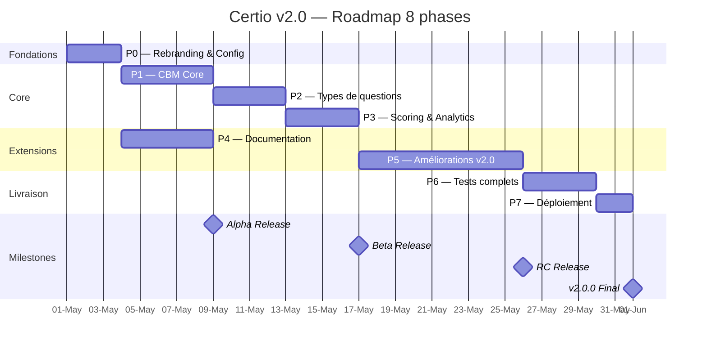
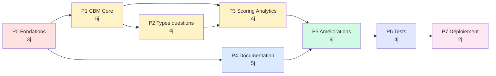

# 📅 Planning détaillé — Certio v2.0

> **Plan de réalisation en 8 phases pour VS Code + Assistant IA**

| Champ | Valeur |
|---|---|
| **Livrable** | 2/5 |
| **Version** | 1.0 |
| **Auteur** | Mohamed EL AFRIT |
| **Contact** | mohamed@elafrit.com |
| **Licence** | CC BY-NC-SA 4.0 |

---

## Sommaire

1. [Vue d'ensemble](#1-vue-densemble)
2. [Diagramme de Gantt](#2-diagramme-de-gantt-mermaid)
3. [Stratégie Git](#3-stratégie-git)
4. [Phase 0 — Fondations & Rebranding](#phase-0--fondations--rebranding)
5. [Phase 1 — CBM Core](#phase-1--cbm-core)
6. [Phase 2 — Types de questions étendus](#phase-2--types-de-questions-étendus)
7. [Phase 3 — Scoring avancé & Analytics](#phase-3--scoring-avancé--analytics)
8. [Phase 4 — Documentation interactive](#phase-4--documentation-interactive)
9. [Phase 5 — Améliorations v2.0](#phase-5--améliorations-v20)
10. [Phase 6 — Tests complets](#phase-6--tests-complets)
11. [Phase 7 — Migration & Déploiement](#phase-7--migration--déploiement)
12. [Checkpoints de validation](#12-checkpoints-de-validation)
13. [Gestion des imprévus](#13-gestion-des-imprévus)

---

## 1. Vue d'ensemble

### 1.1 Principes directeurs du planning

1. **Phases indépendantes autant que possible** — chaque phase peut être testée en isolation
2. **Livraison incrémentale** — chaque phase produit un livrable utilisable
3. **Tests en continu** — on ne cumule pas les tests en fin de projet
4. **Git-flow strict** — une branche par phase, merge via PR avec review (auto-review OK en solo)
5. **Prompts IA autosuffisants** — chaque phase a un prompt VS Code complet
6. **Checkpoints de validation** — pas de passage à la phase suivante si critères non validés

### 1.2 Résumé des 8 phases

| Phase | Nom | Durée (IA) | Dépendances | Sortie |
|:-:|---|:-:|---|---|
| **P0** | Fondations & Rebranding | 3j | — | `v2.0.0-alpha` |
| **P1** | CBM Core | 5j | P0 | `v2.0.0-alpha.1` |
| **P2** | Types de questions | 4j | P1 | `v2.0.0-alpha.2` |
| **P3** | Scoring & Analytics | 4j | P1, P2 | `v2.0.0-beta.1` |
| **P4** | Documentation interactive | 5j | P0 | `v2.0.0-beta.2` |
| **P5** | Améliorations v2.0 | 9j | P0-P3 | `v2.0.0-rc.1` |
| **P6** | Tests complets | 4j | P0-P5 | `v2.0.0-rc.2` |
| **P7** | Migration & Déploiement | 2j | P0-P6 | `v2.0.0` |
| **TOTAL** | | **36 jours** | | Release v2.0.0 |

### 1.3 Timeline proposée (exemple sur 4 mois)

En supposant **2 jours actifs par semaine** (5h/jour) :

| Mois | Phases | Fin prévue |
|---|---|---|
| **Mois 1** (Mai 2026) | P0, P1 début | mi-juin |
| **Mois 2** (Juin 2026) | P1 fin, P2, P3 | fin juin |
| **Mois 3** (Juillet 2026) | P4, P5 | fin juillet |
| **Mois 4** (Août 2026) | P6, P7 + release | début septembre |

En supposant **4 jours actifs par semaine** (plein temps) :
→ **Release en 8-10 semaines** (2-2.5 mois)

### 1.4 Métriques globales

- **Code ajouté** : ~15 000 lignes (PHP + JS + JSON)
- **Tests ajoutés** : ~250 nouveaux tests
- **Fichiers nouveaux** : ~80
- **Fichiers modifiés** : ~40
- **Documentation** : +8 000 lignes markdown

---

## 2. Diagramme de Gantt (Mermaid)



### 📊 Diagramme de dépendances



**Chemin critique** : P0 → P1 → P2 → P3 → P5 → P6 → P7 (31 jours)

Les phases **P4 (Documentation)** peut être faite **en parallèle de P1-P3** si tu as du temps séparé (ex: week-end).

---

## 3. Stratégie Git

### 3.1 Branches

```
main (production, v1.0)
  └── develop (intégration v2.0)
        ├── feat/p0-fondations
        ├── feat/p1-cbm-core
        ├── feat/p2-question-types
        ├── feat/p3-scoring-analytics
        ├── feat/p4-documentation
        ├── feat/p5-ameliorations
        ├── feat/p6-tests-complets
        └── release/v2.0.0
```

### 3.2 Workflow par phase

```bash
# Début de phase
git checkout develop
git pull origin develop
git checkout -b feat/pX-nom-phase

# Pendant la phase : commits fréquents
git add .
git commit -m "feat(cbm): add CbmManager with scoring matrix"

# Fin de phase : merge vers develop
git checkout develop
git merge --no-ff feat/pX-nom-phase
git tag v2.0.0-alpha.X
git push origin develop --tags

# Release finale
git checkout main
git merge --no-ff develop
git tag v2.0.0
git push origin main --tags
```

### 3.3 Convention de commits (Conventional Commits)

```
feat(scope): nouvelle fonctionnalité
fix(scope): correction de bug
docs(scope): documentation
test(scope): tests
refactor(scope): refactoring
style(scope): formatage (pas de changement fonctionnel)
perf(scope): amélioration performance
chore(scope): maintenance
```

**Scopes suggérés** : `cbm`, `workspace`, `community`, `docs`, `auth`, `import`, `export`, `i18n`, `pwa`, `branding`, `migration`.

### 3.4 Tags de release

- `v2.0.0-alpha.0` → après P0 (fondations seulement, inutilisable fonctionnellement)
- `v2.0.0-alpha.1` → après P1 (CBM core fonctionnel)
- `v2.0.0-alpha.2` → après P2 (types de questions)
- `v2.0.0-beta.1` → après P3 (scoring complet, testable par testeurs)
- `v2.0.0-beta.2` → après P4 (documentation OK)
- `v2.0.0-rc.1` → après P5 (toutes features OK)
- `v2.0.0-rc.2` → après P6 (tests OK)
- `v2.0.0` → après P7 (production-ready)

---

## Phase 0 — Fondations & Rebranding

### 🎯 Objectifs

1. Rebranding complet IPSSI → Certio (centralisé via config)
2. Mise en place de l'architecture v2 (nouveaux managers skeleton)
3. Nouveaux schémas JSON v2 (Examen, Question, Passage, Workspace, Community)
4. Configuration i18n (structure de base)
5. Setup PWA (manifest + service worker)

### ⏱️ Durée

**3 jours** (18-22h de dev avec IA assist)

### 📋 Tâches détaillées

#### Jour 1 (6h) — Rebranding
- [ ] Créer `backend/config/branding.php` avec variables centralisées
- [ ] Créer `frontend/assets/branding.js` avec window.BRANDING
- [ ] Remplacer toutes les occurrences "IPSSI" dans code source
- [ ] Remplacer dans les emails (templates HTML)
- [ ] Remplacer dans la documentation existante
- [ ] Remplacer dans les QCM existants (corrections pages)
- [ ] Créer placeholder logo SVG (`/assets/img/logo.svg`)
- [ ] Créer placeholder favicon
- [ ] Définir palette de couleurs (5 couleurs)
- [ ] Mettre à jour copyright partout (Mohamed EL AFRIT)
- [ ] Mettre à jour email partout (mohamed@elafrit.com)

#### Jour 2 (6h) — Schémas v2 + Managers skeleton
- [ ] Créer `backend/lib/CbmManager.php` (skeleton vide)
- [ ] Créer `backend/lib/WorkspaceManager.php` (skeleton)
- [ ] Créer `backend/lib/TotpManager.php` (skeleton)
- [ ] Créer `backend/lib/SsoManager.php` (skeleton)
- [ ] Créer `backend/lib/CommunityBankManager.php` (skeleton)
- [ ] Créer `backend/lib/ImportManager.php` (skeleton)
- [ ] Créer `backend/lib/ExportManager.php` (skeleton)
- [ ] Créer `backend/lib/DocumentationManager.php` (skeleton)
- [ ] Créer `backend/lib/I18nManager.php` (skeleton)
- [ ] Créer `backend/lib/AntiCheatAnalyzer.php` (skeleton)
- [ ] Créer `backend/lib/AuditLogger.php` (skeleton)
- [ ] Créer `backend/lib/BrandingManager.php`
- [ ] Documenter schémas v2 dans `docs/SCHEMAS_V2.md`

#### Jour 3 (6h) — i18n + PWA + Config
- [ ] Créer structure `/frontend/assets/i18n/` avec `fr.json` et `en.json`
- [ ] Implémenter `I18nManager` basique (traductions au runtime)
- [ ] Créer `/manifest.json` PWA
- [ ] Créer `/service-worker.js` basique
- [ ] Configurer `icons/` (72, 96, 128, 144, 152, 192, 384, 512)
- [ ] Mettre à jour `index.html` de chaque page avec manifest + SW registration
- [ ] Créer `scripts/migrate-v1-to-v2.php` skeleton (sans logique encore)
- [ ] Créer `data/workspaces/`, `data/community/`, `data/audit/` dossiers
- [ ] Créer workspace par défaut : WKS-DEFAULT

### 📦 Livrables Phase 0

- ✅ Code rebrandé Certio
- ✅ Config branding centralisée (2 fichiers)
- ✅ 13 nouveaux managers (skeleton vide mais structurés)
- ✅ Schémas v2 documentés
- ✅ i18n FR/EN de base (50+ clés)
- ✅ PWA manifest + service worker minimal
- ✅ Structure dossiers v2 en place

### ✅ Definition of Done Phase 0

- [ ] `grep -ri "ipssi" --include="*.php" --include="*.js" --include="*.html"` → aucun résultat
- [ ] `php -l` sur tous les managers → 0 erreur
- [ ] Page d'accueil affiche "Certio" partout
- [ ] Tous les 389 tests v1 passent toujours
- [ ] `php backend/tests/run_all.php` → OK
- [ ] Documentation existante à jour

### 🎯 Critères d'acceptation utilisateur

- [ ] Je peux remplacer "Certio" par "AcuScore" en modifiant **2 fichiers** et le nom change partout
- [ ] Les emails envoyés ont "Certio" comme expéditeur
- [ ] Le PDF de correction a le logo Certio

---

## Phase 1 — CBM Core

### 🎯 Objectifs

1. Implémenter le CbmManager complet (scoring, validation, presets)
2. UI de configuration CBM côté prof (création examen)
3. UI de saisie certitude côté étudiant (pendant passage)
4. Calcul et affichage des scores CBM
5. Sauvegarde presets CBM personnels du prof

### ⏱️ Durée

**5 jours** (30-34h avec IA)

### 📋 Tâches détaillées

#### Jour 1 (6h) — CbmManager core
- [ ] Implémenter `CbmManager::createMatrix($levels, $scoring)` 
- [ ] Implémenter `CbmManager::validateMatrix($matrix)`
- [ ] Implémenter `CbmManager::calculateScore($answer, $matrix)`
- [ ] Implémenter `CbmManager::calibration($passages)` (over/underconfidence)
- [ ] Tests unitaires `test_cbm_manager.php` (30+ tests)

#### Jour 2 (6h) — Presets + API endpoint
- [ ] Implémenter `CbmManager::savePreset($userId, $matrix, $name)`
- [ ] Implémenter `CbmManager::listPresets($userId)`
- [ ] Implémenter `CbmManager::deletePreset($userId, $presetId)`
- [ ] Implémenter `CbmManager::importFromJson($json)` / `exportToJson($matrix)`
- [ ] Créer endpoint `backend/api/cbm.php`
  - `GET /api/cbm/presets` — liste presets du prof
  - `POST /api/cbm/presets` — créer/sauvegarder preset
  - `PUT /api/cbm/presets/{id}` — modifier preset
  - `DELETE /api/cbm/presets/{id}` — supprimer preset
  - `POST /api/cbm/validate` — valider une matrice
  - `POST /api/cbm/import` — importer JSON
- [ ] Tests intégration API CBM

#### Jour 3 (6h) — UI Config prof
- [ ] Créer composant `<CbmMatrixEditor>` React
  - Input : nombre de niveaux (2-10)
  - Pour chaque niveau : label + value %
  - Pour chaque niveau : score si juste + score si faux
  - Prévisualisation table de scoring
  - Boutons : Save as preset, Load preset, Import, Export
- [ ] Intégrer dans page création/édition examen
- [ ] Toggle "Activer CBM" sur examen
- [ ] Validation front (contraintes cohérence)

#### Jour 4 (6h) — UI Étudiant
- [ ] Créer composant `<CbmCertaintyInput>` React
  - Affiche la certitude demandée après sélection d'une réponse
  - Radio buttons ou slider selon config
  - Labels personnalisés (depuis matrice)
  - Animation d'intro au 1er usage
- [ ] Intégrer dans page passage.html
- [ ] Mini-tuto onboarding (modal première fois)
- [ ] Persist certitude dans `passage.answers[qId].cbm_level_id`

#### Jour 5 (6h) — Affichage scores & Correction
- [ ] Score final calculé avec CBM à la soumission
- [ ] Page correction enrichie : score CBM + calibration de l'étudiant
- [ ] Graphe "Mes scores CBM par question"
- [ ] Indicateur "Vous êtes overconfident sur X questions, underconfident sur Y"
- [ ] Email de confirmation inclut le score CBM
- [ ] Tests E2E : passer un examen CBM end-to-end

### 📦 Livrables Phase 1

- ✅ CbmManager complet + 30+ tests
- ✅ API `/api/cbm` fonctionnelle
- ✅ UI prof création CBM (matrice paramétrable)
- ✅ UI étudiant saisie certitude
- ✅ Calcul score CBM + calibration
- ✅ Presets prof (save/load/import/export)
- ✅ Mini-tutoriel étudiant
- ✅ Email correction enrichi

### ✅ Definition of Done Phase 1

- [ ] Un prof peut créer une matrice CBM 3 niveaux en < 2min
- [ ] Un étudiant voit la demande de certitude après sa réponse
- [ ] Le score final intègre le CBM correctement
- [ ] Tests CBM Manager > 90% couverture
- [ ] 0 régression sur v1 (examens sans CBM)

### 🎯 Critères d'acceptation utilisateur

- [ ] Un prof peut :
  - Activer/désactiver CBM par examen
  - Définir sa propre matrice (2-10 niveaux)
  - Sauvegarder et réutiliser des presets
  - Exporter/importer une matrice en JSON
- [ ] Un étudiant :
  - Voit un mini-tuto CBM au 1er passage CBM
  - Saisit sa certitude après chaque réponse
  - Voit son score CBM dans la correction
  - Comprend s'il est over/underconfident

---

## Phase 2 — Types de questions étendus

### 🎯 Objectifs

1. Supporter 7 types de questions (V/F, QCM N radio, QCM N checkbox)
2. Créer `QuestionTypeResolver` pour logique unifiée
3. UI de création question adaptive selon type
4. UI de réponse étudiant adaptive selon type
5. Migration questions v1 → v2

### ⏱️ Durée

**4 jours** (24-28h avec IA)

### 📋 Tâches détaillées

#### Jour 1 (6h) — Schéma + QuestionTypeResolver
- [ ] Étendre schéma Question v2 avec `type`, `subtype_config`, `options[]` avec `is_correct`
- [ ] Implémenter `QuestionTypeResolver::getType($question)`
- [ ] Implémenter `QuestionTypeResolver::validateAnswer($question, $answer)`
- [ ] Implémenter `QuestionTypeResolver::isCorrect($question, $answer)`
- [ ] Gérer les 7 types :
  - `true_false` (2 opts, 1 correcte)
  - `mcq_single_4` (4 opts, 1 correcte)
  - `mcq_single_5` (5 opts, 1 correcte)
  - `mcq_single_n` (N opts, 1 correcte)
  - `mcq_multiple_4` (4 opts, N correctes)
  - `mcq_multiple_5` (5 opts, N correctes)
  - `mcq_multiple_n` (N opts, M correctes)
- [ ] Tests `test_question_type_resolver.php` (40+ tests)

#### Jour 2 (6h) — UI Création question (prof)
- [ ] Refactor composant `<QuestionEditor>` React
- [ ] Sélecteur de type en haut : Vrai/Faux · QCM 4 · QCM 5 · QCM N · QCM 4 multi · QCM 5 multi · QCM N multi
- [ ] Selon le type :
  - Nombre d'options : fixe ou configurable
  - Pour chaque option : texte + checkbox/radio "est correcte"
  - Pour `mcq_multiple` : support plusieurs "correctes"
- [ ] Validation :
  - V/F : exactement 2 options, exactement 1 correcte
  - mcq_single : N options, exactement 1 correcte
  - mcq_multiple : N options, ≥ 1 correcte
- [ ] Preview live de la question

#### Jour 3 (6h) — UI Réponse étudiant
- [ ] Refactor composant `<QuestionRenderer>` React
- [ ] Selon type :
  - `true_false` : 2 boutons radio Vrai/Faux
  - `mcq_single_*` : radio buttons
  - `mcq_multiple_*` : checkboxes
- [ ] Shuffle options si activé
- [ ] Accessibilité : navigation clavier, aria-labels
- [ ] Save réponse : single value ou array selon type

#### Jour 4 (6h) — Migration + Tests
- [ ] Écrire migration questions v1 → v2 dans `migrate-v1-to-v2.php`
  - Mapping type v1 (présumé `mcq_single_4`) → v2 `type: "mcq_single_4"`
  - Convertir `correct_index` vers `options[].is_correct: true`
- [ ] Dry-run test migration sur backup
- [ ] Tests intégration types de questions (E2E complet avec passage)
- [ ] Mise à jour doc `docs/QUESTION_TYPES.md`

### 📦 Livrables Phase 2

- ✅ 7 types de questions supportés
- ✅ QuestionTypeResolver + 40+ tests
- ✅ UI création adaptive
- ✅ UI réponse adaptive
- ✅ Migration questions v1 → v2
- ✅ Doc QUESTION_TYPES.md

### ✅ Definition of Done Phase 2

- [ ] Un prof peut créer une question de chaque type en < 3min
- [ ] Un étudiant peut répondre à chaque type correctement
- [ ] Migration v1 → v2 passe sur les 320 questions banque sans erreur
- [ ] 0 régression sur questions v1

### 🎯 Critères d'acceptation utilisateur

- [ ] Création question :
  - Choix du type clair et rapide
  - Validation visuelle immédiate
  - Preview fidèle
- [ ] Réponse étudiant :
  - UI claire (radio vs checkbox bien différencié)
  - Feedback visuel sur sélection
  - Accessible au clavier

---

## Phase 3 — Scoring avancé & Analytics

### 🎯 Objectifs

1. Scoring multi-réponses (tout ou rien, proportionnel, proportionnel normalisé)
2. Combinaison CBM + multi-réponses
3. Analytics prof enrichi (radar, calibration, distracteurs)
4. Dashboard étudiant (historique + progression)
5. Export results avec colonnes CBM

### ⏱️ Durée

**4 jours** (24-28h avec IA)

### 📋 Tâches détaillées

#### Jour 1 (6h) — Scoring multi-réponses
- [ ] Implémenter dans `QuestionTypeResolver::calculateScore($question, $answer, $mode)`
- [ ] 3 modes :
  - `all_or_nothing` : score = (tout juste ? 1 : 0)
  - `proportional_strict` : score = bonnes - fausses (clamped 0-total)
  - `proportional_normalized` : score = max(0, (bonnes - fausses) / total_correctes)
- [ ] Config sur examen : `scoring.multi_answer_mode`
- [ ] Tests unitaires (20+)

#### Jour 2 (6h) — Combinaison CBM + Multi-réponses
- [ ] Logique : score_base × multiplicateur_CBM
  - score_base calculé via multi-response scoring
  - multiplicateur appliqué selon certitude déclarée
- [ ] Edge case : que faire si réponse partiellement juste + certitude haute ?
  - → multiplier score_base par factor (par défaut : si ≥ 50% juste = bon, sinon faux)
- [ ] UI explique la logique au prof (tooltip + exemples)
- [ ] Tests scoring combiné (30+)

#### Jour 3 (6h) — Analytics prof enrichis
- [ ] Nouveau endpoint `/api/analytics/cbm-calibration/{examenId}` 
- [ ] Nouveau endpoint `/api/analytics/distractors/{examenId}` (distracteurs les plus choisis)
- [ ] Composant React `<CbmCalibrationChart>` (scatter plot certitude vs réussite)
- [ ] Composant React `<DistractorsAnalysis>` (bar chart)
- [ ] Composant React `<StudentRadar>` (radar par thème/chapitre)
- [ ] Tableau détaillé par question avec colonnes CBM

#### Jour 4 (6h) — Dashboard étudiant + Exports
- [ ] Page `/etudiant/dashboard.html` (nouvelle)
  - Liste de tous ses passages
  - Graphe progression dans le temps
  - Calibration CBM globale
  - Thèmes forts / faibles
- [ ] Export enrichi :
  - CSV : colonnes `cbm_level`, `cbm_score`, `calibration`
  - Excel multi-feuilles : `Résumé`, `Détail par question`, `CBM Analysis`
- [ ] Tests exports (10+)

### 📦 Livrables Phase 3

- ✅ Scoring multi-réponses (3 modes)
- ✅ Combinaison CBM + multi-réponses
- ✅ 3 nouveaux endpoints analytics
- ✅ 5 nouveaux composants React analytics
- ✅ Dashboard étudiant
- ✅ Exports CSV/Excel enrichis

### ✅ Definition of Done Phase 3

- [ ] Un examen complexe (CBM + multi-réponses) scoré correctement
- [ ] Prof voit la calibration CBM de chaque étudiant
- [ ] Étudiant a un dashboard personnel
- [ ] Export Excel contient bien les colonnes CBM
- [ ] Tests > 85% couverture

---

## Phase 4 — Documentation interactive

### 🎯 Objectifs

1. Infrastructure Markdown + marked.js (parsing côté client)
2. Navigation auto depuis structure dossier
3. RBAC : admin voit tout, prof partial, étudiant minimal
4. Placeholders 4 familles avec prompts IA documentés
5. Recherche basique + TOC auto

### ⏱️ Durée

**5 jours** (30-34h avec IA)

### 📋 Tâches détaillées

#### Jour 1 (6h) — Infrastructure
- [ ] Implémenter `DocumentationManager` :
  - `listDocs($role)` : retourne structure arbre filtrée par rôle
  - `getDoc($path)` : retourne contenu markdown
  - `checkAccess($path, $role)` : RBAC
  - `search($query, $role)` : recherche full-text basique
- [ ] Endpoint `/api/docs` (GET list, GET content, POST search)
- [ ] Dossiers : `/docs-interactive/admin/`, `/prof/`, `/etudiant/`, `/shared/`

#### Jour 2 (6h) — UI React Docs
- [ ] Page `/frontend/admin/docs.html` (et prof/etudiant)
- [ ] Composant `<DocsViewer>` React
  - Sidebar gauche : navigation arborescente
  - Zone centrale : contenu markdown parsé
  - TOC droite : table des matières auto
  - Barre de recherche en haut
- [ ] Intégration marked.js via CDN
- [ ] Support KaTeX dans markdown (`$math$`)
- [ ] Support code highlighting (highlight.js)

#### Jour 3 (6h) — Placeholders + Prompts
- [ ] Implémenter système de placeholders custom dans markdown :
  ```md
  :::diagram
  type: mermaid
  description: "Architecture globale"
  prompt: "[prompt IA]"
  file: "architecture.mmd"
  :::
  ```
- [ ] 4 types de placeholders :
  - `:::diagram` (Mermaid/PlantUML)
  - `:::image` (captures, GIFs)
  - `:::video` (embed)
  - `:::interactive` (quiz, démos)
- [ ] Parser custom + rendu React
- [ ] Fallback si asset manquant : afficher prompt IA pour générer

#### Jour 4 (6h) — Contenu initial
- [ ] Écrire 20+ pages markdown réparties :
  - Admin (8 pages) : Dashboard, Comptes, Workspaces, Backups, Monitoring, Audit, Settings, Community
  - Prof (10 pages) : Guide démarrage, Banque questions, Création examens, CBM, Distribution, Passages, Analytics, Export, FAQ, Advanced
  - Étudiant (4 pages) : Comment passer un examen, Comprendre CBM, Consulter correction, FAQ
  - Shared (5 pages) : Glossaire, Support, Licences, Privacy, About
- [ ] Chaque page avec placeholders IA pour contenus à générer

#### Jour 5 (6h) — Recherche + Finitions
- [ ] Implémenter recherche full-text (côté serveur, simple)
- [ ] Highlighting des résultats
- [ ] Breadcrumbs navigation
- [ ] Bouton "Modifier cette page" (pour admin, lien vers édition markdown)
- [ ] Responsive mobile
- [ ] Tests E2E navigation docs

### 📦 Livrables Phase 4

- ✅ DocumentationManager + endpoint `/api/docs`
- ✅ UI React docs (admin/prof/étudiant avec RBAC)
- ✅ 4 types de placeholders + prompts IA
- ✅ 20+ pages markdown initiales
- ✅ Recherche full-text basique
- ✅ TOC auto, breadcrumbs, responsive

### ✅ Definition of Done Phase 4

- [ ] Un admin accède à toute la doc
- [ ] Un prof voit prof + étudiant mais pas admin
- [ ] Un étudiant voit uniquement la partie étudiant
- [ ] Recherche trouve "CBM" dans les pages pertinentes
- [ ] Mermaid diagrams rendus correctement
- [ ] Placeholders affichent prompt IA si asset absent

### 🎯 Critères d'acceptation utilisateur

- [ ] Navigation intuitive, pas besoin de tutoriel
- [ ] Contenus utiles et à jour
- [ ] Accessible en < 2 clics depuis dashboard

---

## Phase 5 — Améliorations v2.0

### 🎯 Objectifs

Implémenter les 5 grandes améliorations v2.0 :
1. 🔐 Sécurité avancée (2FA, audit, anti-triche)
2. 🏫 Workspaces multi-tenant + SSO
3. 📤 Intégrations LMS (import/export)
4. 🌍 Accessibilité + i18n + PWA
5. 🌐 Banque communautaire

### ⏱️ Durée

**9 jours** (54-60h avec IA — phase la plus longue)

### 📋 Sous-phases (recommandées)

#### 5A — Sécurité avancée (2 jours)

**Jour 1 :**
- [ ] TotpManager complet (OTPHP ou implém native)
  - `generateSecret()`, `generateQrCode()`, `validate($code, $secret)`
- [ ] UI activation 2FA (admin/prof) : page settings
- [ ] Endpoint `/api/auth/2fa/*`
- [ ] Tests 2FA (15+)

**Jour 2 :**
- [ ] AuditLogger complet avec persistance JSON
- [ ] Middleware injection auto log pour chaque action sensible
- [ ] Page admin `/admin/audit.html` (consultation logs)
- [ ] Filtres : user, date, action, IP
- [ ] AntiCheatAnalyzer : score confiance = f(focus_loss, copy_paste, devtools, fingerprint)

#### 5B — Workspaces multi-tenant + SSO (2 jours)

**Jour 3 :**
- [ ] WorkspaceManager complet
- [ ] Endpoint `/api/workspaces` (CRUD, admin only)
- [ ] Scope automatique : chaque query filtre par `workspace_id`
- [ ] Migration : tous les examens v1 → workspace "DEFAULT"
- [ ] Tests workspace isolation (20+)

**Jour 4 :**
- [ ] SsoManager Google OAuth 2.0
- [ ] SsoManager Microsoft OAuth 2.0
- [ ] Flow login SSO (redirect + callback)
- [ ] Association compte SSO ↔ compte local
- [ ] UI connexion avec boutons "Sign in with Google/Microsoft"
- [ ] Tests SSO (mocked)

#### 5C — Intégrations LMS (2 jours)

**Jour 5 :**
- [ ] ImportManager :
  - Parser Moodle XML format
  - Parser Word .docx (mammoth ou custom)
  - Parser Excel .xlsx (SheetJS)
- [ ] UI upload + preview + validation + import batch
- [ ] Tests imports sur fichiers sample

**Jour 6 :**
- [ ] ExportManager :
  - Générateur SCORM 1.2 zip
  - Générateur SCORM 2004 zip
  - Endpoint xAPI statements
- [ ] LTI 1.3 endpoint (minimal)
- [ ] Swagger/OpenAPI doc générée depuis annotations PHP
- [ ] Swagger UI servie à `/api/docs-api`

#### 5D — Accessibilité + i18n + PWA (1 jour)

**Jour 7 :**
- [ ] Audit accessibilité complet avec axe-core
- [ ] Corrections : aria-labels, roles, navigation clavier
- [ ] Contraste vérifié (outil WCAG)
- [ ] i18n extension : toutes les strings externalisées
- [ ] Traduction EN complète
- [ ] PWA : service worker complet (cache strategy)
- [ ] PWA : mode hors-ligne passage en cours
- [ ] Test installation sur mobile

#### 5E — Banque communautaire (2 jours)

**Jour 8 :**
- [ ] CommunityBankManager complet
  - `publish($questionId, $license)`
  - `fork($communityId, $targetWorkspaceId)`
  - `vote($communityId, $stars)`
  - `flag($communityId, $reason)`
  - `listPublic($filters)`
- [ ] Endpoint `/api/community/*`
- [ ] Tests community (20+)

**Jour 9 :**
- [ ] UI publier question (dans editor question)
- [ ] UI banque communautaire admin (browse, search, filter)
- [ ] UI fork d'une question communautaire
- [ ] UI modération (super-admin)
- [ ] Seed 100 questions communautaires (initiales)
- [ ] Stats anonymisées

### 📦 Livrables Phase 5

- ✅ 2FA complète
- ✅ Audit log + UI
- ✅ Anti-triche enrichi
- ✅ Multi-tenant workspaces
- ✅ SSO Google + Microsoft
- ✅ Import Moodle/Word/Excel
- ✅ Export SCORM/xAPI
- ✅ LTI 1.3 + Swagger API
- ✅ WCAG AA complet
- ✅ i18n FR/EN
- ✅ PWA fonctionnelle
- ✅ Banque communautaire complète

### ✅ Definition of Done Phase 5

- [ ] axe-core audit : 0 erreur bloquante
- [ ] Lighthouse PWA : score 100
- [ ] Lighthouse Accessibility : ≥ 95
- [ ] Tests nouveaux managers > 85% couverture
- [ ] Import Moodle : fichier sample OK
- [ ] Export SCORM : importable dans Moodle de test

---

## Phase 6 — Tests complets

### 🎯 Objectifs

1. Compléter les tests manquants (couverture ≥ 85%)
2. Tests E2E complets des workflows critiques
3. Tests de charge (performance)
4. Tests de sécurité (OWASP)
5. Tests d'accessibilité automatisés

### ⏱️ Durée

**4 jours** (24-28h avec IA)

### 📋 Tâches détaillées

#### Jour 1 — Tests unitaires manquants
- [ ] Auditer la couverture actuelle via `php backend/tests/coverage.php`
- [ ] Identifier les managers < 85% couverture
- [ ] Ajouter tests manquants
- [ ] Target : 85%+ global

#### Jour 2 — Tests E2E
- [ ] Workflow 1 : Prof crée examen CBM multi-réponses → étudiant passe → résultats
- [ ] Workflow 2 : Import Moodle → utilisation dans examen → export SCORM
- [ ] Workflow 3 : Inscription SSO → workspace → création compte prof
- [ ] Workflow 4 : Publish question communautaire → fork par autre prof
- [ ] Workflow 5 : 2FA activation → login avec 2FA → action sensible

#### Jour 3 — Tests sécurité + charge
- [ ] OWASP Top 10 review :
  - Injection (SQL N/A, JSON injection test)
  - Broken authentication
  - Sensitive data exposure
  - XXE (N/A sans XML)
  - Broken access control
  - Security misconfiguration
  - XSS tests
  - Insecure deserialization
  - Known vulnerabilities
  - Insufficient logging
- [ ] Tests de charge avec `ab` (Apache Bench) :
  - 100 requêtes/sec sur `/api/passages/answer` pendant 60s
  - 50 passages simultanés
- [ ] Tests rate limiting par rôle

#### Jour 4 — Accessibilité + Régression
- [ ] axe-core automatisé via Puppeteer
- [ ] Tests responsive : 320px, 768px, 1024px, 1920px
- [ ] Tests avec lecteurs d'écran (NVDA sur Windows)
- [ ] Régression finale : tous les 389 tests v1 + ~250 nouveaux tests v2

### 📦 Livrables Phase 6

- ✅ Couverture ≥ 85%
- ✅ 5 workflows E2E automatisés
- ✅ Rapport sécurité OWASP
- ✅ Rapport perf/charge
- ✅ Audit accessibilité axe-core
- ✅ ~630 tests total passant

### ✅ Definition of Done Phase 6

- [ ] `php backend/tests/run_all.php` : 100% pass
- [ ] `coverage.php` : ≥ 85% global
- [ ] Aucune faille OWASP critique
- [ ] 0 erreur axe-core bloquante
- [ ] Charge 100 req/s tenue < 200ms

---

## Phase 7 — Migration & Déploiement

### 🎯 Objectifs

1. Finaliser le script de migration v1 → v2
2. Tester migration sur copie de prod
3. Déployer v2.0 en production
4. Migrer les données réelles
5. Release notes + communication

### ⏱️ Durée

**2 jours** (12-16h avec IA)

### 📋 Tâches détaillées

#### Jour 1 — Migration script finalisé
- [ ] `migrate-v1-to-v2.php` finalisé :
  - Dry-run mode
  - Backup automatique avant
  - Logs détaillés
  - Rollback possible
  - Validation post-migration
- [ ] Test sur copie de prod (import backup actuel)
- [ ] Temps de migration mesuré
- [ ] Release notes détaillées (CHANGELOG_V2.md)

#### Jour 2 — Déploiement production
- [ ] Tag `v2.0.0-rc.2` → préparation release
- [ ] Backup complet prod v1
- [ ] Déploiement v2.0 en production (OVH VPS)
  - Pull du tag v2.0.0
  - Composer si besoin (non obligatoire)
  - Migration données via script
  - Validation smoke tests
- [ ] Tag `v2.0.0` final
- [ ] Mise à jour DNS si besoin (certio.app)
- [ ] Communication : email aux utilisateurs v1, post blog
- [ ] Plan de surveillance post-déploiement (48h)

### 📦 Livrables Phase 7

- ✅ `migrate-v1-to-v2.php` production-ready
- ✅ Release v2.0.0 déployée
- ✅ Données migrées sans perte
- ✅ Release notes + CHANGELOG
- ✅ Email annonce
- ✅ Plan monitoring post-release

### ✅ Definition of Done Phase 7 (= Release v2.0)

- [ ] Prod v2.0.0 accessible
- [ ] Tous les utilisateurs v1 peuvent se connecter
- [ ] Tous les examens v1 consultables en v2
- [ ] Nouveaux workflows v2 fonctionnels
- [ ] Monitoring actif, alertes OK
- [ ] Documentation complète publiée

---

## 12. Checkpoints de validation

### 🏁 Fin de Phase 0 — Checkpoint 1

**Tu ne passes à P1 que si** :
- [ ] Rebranding complet (0 "IPSSI")
- [ ] Config branding modifiable en 2 fichiers
- [ ] Tous les 389 tests v1 passent
- [ ] Structure managers v2 en place

### 🏁 Fin de Phase 1 — Checkpoint 2

**Tu ne passes à P2 que si** :
- [ ] CBM matrix customizable fonctionne
- [ ] Test E2E passage CBM OK
- [ ] Calibration calculée correctement

### 🏁 Fin de Phase 3 — Checkpoint 3 (Beta)

**Tu peux proposer aux testeurs pilotes si** :
- [ ] Tous workflows fonctionnels
- [ ] Documentation minimum (guides étudiants)
- [ ] Pas de régression v1

### 🏁 Fin de Phase 6 — Checkpoint 4 (RC)

**Tu peux release candidate si** :
- [ ] Couverture ≥ 85%
- [ ] 0 bug critique
- [ ] Accessibilité WCAG AA validée
- [ ] Perf acceptable

### 🏁 Fin de Phase 7 — Release v2.0.0

**Tu es en prod si** :
- [ ] Migration données sans perte
- [ ] Utilisateurs v1 peuvent se connecter
- [ ] Nouveautés v2 fonctionnelles
- [ ] Monitoring vert

---

## 13. Gestion des imprévus

### 13.1 Si une phase prend plus de temps

**Option A** : décaler les phases suivantes (timeline glisse)
**Option B** : réduire le scope de la phase en cours (backlog v2.1)
**Option C** : faire en parallèle la doc (P4) pendant les phases 1-3

### 13.2 Si un prompt IA ne fonctionne pas bien

**Solutions** :
- Découper en sous-tâches plus petites
- Donner plus de contexte (copier-coller fichiers existants)
- Changer d'IA (Claude Code ↔ Cursor ↔ Copilot)
- Faire manuellement les 20% complexes

### 13.3 Si un bug critique apparaît en test

**Protocole** :
1. STOP phase actuelle
2. Créer hotfix branche
3. Corriger + tester
4. Merge dans develop
5. Reprendre phase

### 13.4 Si motivation chute

**Anti-abandon** :
- Célébrer chaque tag alpha/beta/rc (screenshot, post social)
- Réduire tâche du jour (faire 1 petite chose au lieu de rien)
- Demander feedback à un pair
- Revenir à la vision produit (cadrage)

---

## Annexes

### A. Dépendances externes à installer

Aucune dépendance Composer obligatoire. Optionnel :
- `otphp/otphp` pour 2FA (Phase 5) ou implémenter soi-même
- Libs front via CDN : `marked.js`, `highlight.js`, `DOMPurify`

### B. Outils recommandés

- **VS Code** + extensions : PHP Intelephense, ESLint, Prettier, Mermaid Preview
- **Claude Code** ou **Cursor** ou **GitHub Copilot** pour assistance
- **Postman/Insomnia** pour tests API
- **BrowserStack** ou **Playwright** pour tests cross-browser
- **Lighthouse** (Chrome DevTools) pour perf/a11y
- **axe DevTools** pour accessibilité

### C. Fichiers de référence à garder ouverts

Dans VS Code, garder toujours ces fichiers en onglets :
- `examens/docs/ARCHITECTURE.md`
- `examens/docs/SCHEMAS_V2.md` (à créer Phase 0)
- `examens/docs/certio_v2/01_NOTE_DE_CADRAGE.md`
- `examens/docs/certio_v2/02_PLANNING.md` (ce fichier)
- Le prompt de la phase en cours

---

## Conclusion

Ce planning en 8 phases est **réaliste, incrémental et faisable** en ~36 jours avec assistance IA. Chaque phase produit un livrable testable et apporte de la valeur.

**Le prochain livrable (3/5)** te fournira les **prompts VS Code optimisés** pour lancer les phases 0 à 4 (partie 1).

---

© 2026 Mohamed EL AFRIT — mohamed@elafrit.com  
Certio v2.0 — CC BY-NC-SA 4.0
