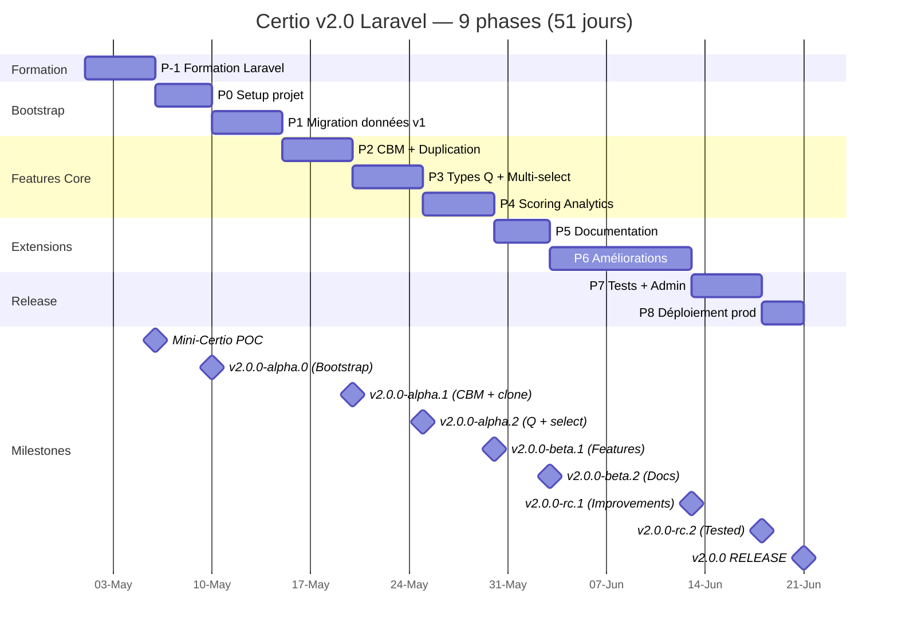

# 📅 Planning détaillé révisé — Certio v2.0 Laravel

> **Plan de réalisation en 9 phases pour VS Code + Assistant IA**  
> **Stack : Laravel 11 + Vue 3 + Inertia + SQLite**

| Champ | Valeur |
|---|---|
| **Livrable** | B/4 (révisé Laravel) |
| **Version** | 2.1 (avec ajouts multi-select + duplication) |
| **Durée totale** | 51.5 jours avec IA assist |
| **Période** | Mai → Septembre 2026 |
| **Auteur** | Mohamed EL AFRIT |
| **Contact** | mohamed@elafrit.com |
| **Licence** | CC BY-NC-SA 4.0 |

---

## Sommaire

1. [Vue d'ensemble](#1-vue-densemble)
2. [Diagramme de Gantt](#2-diagramme-de-gantt-mermaid)
3. [Stratégie Git Laravel](#3-stratégie-git-laravel)
4. [Phase P-1 — Formation Laravel](#phase-p-1--formation-laravel)
5. [Phase P0 — Bootstrap projet Laravel](#phase-p0--bootstrap-projet-laravel)
6. [Phase P1 — Migration données v1 → v2](#phase-p1--migration-données-v1--v2)
7. [Phase P2 — CBM Core + Duplication examen](#phase-p2--cbm-core--duplication-examen)
8. [Phase P3 — Types questions + Multi-select](#phase-p3--types-questions--multi-select)
9. [Phase P4 — Scoring & Analytics](#phase-p4--scoring--analytics)
10. [Phase P5 — Documentation interactive](#phase-p5--documentation-interactive)
11. [Phase P6 — Améliorations v2.0](#phase-p6--améliorations-v20)
12. [Phase P7 — Tests complets + Admin Filament](#phase-p7--tests-complets--admin-filament)
13. [Phase P8 — Migration données + Déploiement](#phase-p8--migration-données--déploiement)
14. [Checkpoints de validation](#14-checkpoints-de-validation)
15. [Gestion des imprévus](#15-gestion-des-imprévus)

---

## 1. Vue d'ensemble

### 1.1 Principes directeurs

1. **Phases autonomes** : chaque phase est testable en isolation
2. **Livraison incrémentale** : tags alpha/beta/rc réguliers
3. **Tests en continu** : Pest pour chaque feature
4. **Git-flow strict** : `feat/pX-nom` → `develop` → `main`
5. **Prompts VS Code autosuffisants** : un par phase
6. **Checkpoints de validation** : gates entre phases
7. **Respect philosophie Laravel** : conventions over configuration

### 1.2 Résumé des 9 phases

| Phase | Nom | Durée | Livrable | Ajouts v2.0 |
|:-:|---|:-:|---|---|
| **P-1** | Formation Laravel + POC | 5j | Mini-Certio fonctionnel | — |
| **P0** | Setup projet Laravel | 4j | Certio skeleton | — |
| **P1** | Migration données v1 | 5j | Données migrées | — |
| **P2** | CBM Core | 5j | `v2.0.0-alpha.1` | 🆕 Duplication examen (+0.5j) |
| **P3** | Types questions étendus | 5j | `v2.0.0-alpha.2` | 🆕 Multi-select (+1j) |
| **P4** | Scoring & Analytics | 5j | `v2.0.0-beta.1` | — |
| **P5** | Documentation interactive | 4j | `v2.0.0-beta.2` | — |
| **P6** | Améliorations v2.0 | 10j | `v2.0.0-rc.1` | — |
| **P7** | Tests + Admin Filament | 5j | `v2.0.0-rc.2` | — |
| **P8** | Migration + Déploiement | 3j | `v2.0.0` 🎉 | — |
| **TOTAL** | | **51j** | | **+1.5j** d'ajouts |

### 1.3 Timeline proposée (2-3 jours actifs/semaine)

| Mois | Phases | Output majeur |
|---|---|---|
| **Mai 2026** | P-1 Formation + P0 Setup | Laravel skeleton + 1 POC |
| **Juin 2026** | P1 Migration + P2 CBM | `v2.0.0-alpha.1` — CBM fonctionnel |
| **Juillet 2026** | P3 Questions + P4 Analytics | `v2.0.0-beta.1` — features core |
| **Août 2026** | P5 Docs + P6 Améliorations | `v2.0.0-rc.1` — feature complete |
| **Septembre 2026** | P7 Tests + P8 Déploiement | **`v2.0.0` PROD** 🎉 |

En mode plein temps (5j/semaine) : **10-11 semaines** (2.5 mois).

### 1.4 Métriques globales attendues

- **LOC** : ~20 000 lignes (PHP + Vue + JSON configs)
- **Tests Pest** : ~300 tests
- **Migrations** : 15-20 tables
- **Vue components** : 50+
- **API endpoints** : 30+
- **Packages Composer** : 15 (Laravel + Spatie + autres)
- **Packages NPM** : 10 (Vue + Inertia + libs)

---

## 2. Diagramme de Gantt Mermaid



### Diagramme de dépendances

```mermaid
flowchart LR
    P_1[P-1 Formation<br/>5j] --> P0[P0 Setup<br/>4j]
    P0 --> P1[P1 Migration<br/>5j]
    P1 --> P2[P2 CBM + Clone<br/>5j]
    P2 --> P3[P3 Types + Multi<br/>5j]
    P3 --> P4[P4 Analytics<br/>5j]
    P4 --> P5[P5 Documentation<br/>4j]
    P4 --> P6[P6 Améliorations<br/>10j]
    P5 --> P6
    P6 --> P7[P7 Tests + Admin<br/>5j]
    P7 --> P8[P8 Déploiement<br/>3j]
    
    style P_1 fill:#FEF3C7
    style P0 fill:#FEE2E2
    style P1 fill:#FEE2E2
    style P2 fill:#D1FAE5
    style P3 fill:#D1FAE5
    style P4 fill:#D1FAE5
    style P5 fill:#DBEAFE
    style P6 fill:#DBEAFE
    style P7 fill:#E0E7FF
    style P8 fill:#FCE7F3
```



**Chemin critique** : P-1 → P0 → P1 → P2 → P3 → P4 → P6 → P7 → P8 (51 jours)

**Parallélisable** : P5 (Documentation) peut se faire pendant P4 ou P6 si temps libre.

---

## 3. Stratégie Git Laravel

### 3.1 Structure du repo

**Nouveau repo** : `github.com/melafrit/certio`

```
certio/  (nouveau repo Laravel, distinct de maths_IA_niveau_1)
├── main              (production, v2.0.0)
├── develop           (intégration v2.0)
├── feat/p-1-formation-poc
├── feat/p0-bootstrap
├── feat/p1-data-migration
├── feat/p2-cbm-core-clone
├── feat/p3-question-types-multi-select
├── feat/p4-scoring-analytics
├── feat/p5-documentation
├── feat/p6-ameliorations
├── feat/p7-tests-admin-filament
├── release/v2.0.0
└── hotfix/* (si besoin post-release)
```

### 3.2 Workflow par phase

```bash
# Début de phase
git checkout develop
git pull origin develop
git checkout -b feat/pX-nom-phase

# Pendant la phase : commits fréquents (1-2 par jour minimum)
git add .
git commit -m "feat(cbm): add CbmScoringService::calculateScore"
git commit -m "test(cbm): add 15 tests for scoring service"
git push -u origin feat/pX-nom-phase

# Fin de phase : créer PR vers develop
# GitHub Pull Request avec template
# Merge après self-review

git checkout develop
git pull origin develop
git tag v2.0.0-alpha.X  # selon phase
git push origin develop --tags
```

### 3.3 Convention de commits

Conventional Commits adapté Laravel :

```
feat(cbm): add CbmScoringService
fix(exam): handle null cbm_matrix in score calculation  
test(cbm): add unit tests for matrix validation
refactor(question): extract QuestionTypeResolver
perf(query): add indexes on exam_question table
docs(api): document /api/exams/{id}/clone endpoint
chore(deps): update laravel/fortify to v1.x
style(pint): apply Laravel Pint formatting
```

**Scopes Laravel suggérés** :
`cbm`, `exam`, `question`, `passage`, `workspace`, `auth`, `sso`, `community`, `analytics`, `docs`, `i18n`, `pwa`, `lms`, `migration`, `test`, `deps`.

### 3.4 Tags de release

- `v2.0.0-alpha.0` → après P0 (Bootstrap, Laravel skeleton)
- `v2.0.0-alpha.1` → après P2 (CBM fonctionnel + duplication)
- `v2.0.0-alpha.2` → après P3 (Types questions + multi-select)
- `v2.0.0-beta.1` → après P4 (Analytics OK, testable par pilotes)
- `v2.0.0-beta.2` → après P5 (Docs OK)
- `v2.0.0-rc.1` → après P6 (Toutes features OK)
- `v2.0.0-rc.2` → après P7 (Tests OK)
- `v2.0.0` → après P8 (Production release) 🎉

---

## Phase P-1 — Formation Laravel

### 🎯 Objectifs

1. Se familiariser avec Laravel 11, Eloquent, Inertia, Vue 3
2. Construire un POC "Mini-Certio" en 5 jours
3. Valider que tu es à l'aise avec la stack avant le vrai projet

### ⏱️ Durée

**5 jours** (25-30h de formation + pratique)

### 📋 Programme jour par jour

#### Jour 1 (5h) — Fondamentaux Laravel

**Matin (2h) : Installation + Premier projet**
- Installer PHP 8.3 + Composer + Node.js (si pas fait)
- Installer Laravel Herd (recommandé) ou Valet/Sail
- `composer create-project laravel/laravel test-app`
- Tour de la structure Laravel
- Routes, Controllers, Blade basics
- ✅ Hands-on : créer une page `/hello` qui affiche "Hello Laravel"

**Après-midi (3h) : Routing + Blade**
- Routes web vs API
- Route parameters + route model binding
- Controllers (invokable, resource)
- Blade : syntax, layouts, components
- Middleware
- ✅ Hands-on : petit CRUD articles simple (pas de BDD encore, array en mémoire)

**Resources** :
- [Laravel Bootcamp](https://bootcamp.laravel.com/) — 1ère partie
- [Laracasts Free "Laravel 11 From Scratch"](https://laracasts.com/series/laravel-11-from-scratch)

#### Jour 2 (5h) — Eloquent ORM + Base de données

**Matin (2h) : Migrations + Models**
- Migrations : create, alter, drop
- Schema builder
- Models Eloquent : basics
- Relations : hasMany, belongsTo, belongsToMany
- ✅ Hands-on : migration + model `Post` + relation avec `Comment`

**Après-midi (3h) : Queries + Eager loading**
- Query Builder vs Eloquent
- `with()` pour éviter N+1
- Scopes locaux
- Accessors + Mutators + Casts
- Factories + Seeders
- ✅ Hands-on : seeder 50 posts avec commentaires + queries complexes

**Resources** :
- [Eloquent docs](https://laravel.com/docs/eloquent)
- [Laracasts "Eloquent Techniques"](https://laracasts.com/series/eloquent-techniques)

#### Jour 3 (5h) — Auth + Security + Validation

**Matin (2h) : Laravel Breeze**
- `composer require laravel/breeze --dev`
- `php artisan breeze:install`
- Choix : Blade vs Inertia+Vue vs Livewire (tu choisis Inertia+Vue)
- Voir le code généré (super tuto)

**Après-midi (3h) : FormRequests + Policies + Middleware**
- FormRequests pour validation
- Policies + Gates pour autorisation
- Middleware custom
- ✅ Hands-on : protéger les routes par rôle

**Resources** :
- [Laravel Breeze docs](https://laravel.com/docs/starter-kits#laravel-breeze)
- [Authorization docs](https://laravel.com/docs/authorization)

#### Jour 4 (6h) — Inertia.js + Vue 3 + Tailwind

**Matin (3h) : Inertia basics**
- Concept Inertia (pas d'API REST séparée)
- Première page Vue via Inertia
- Shared data + Flash messages
- Navigation : `<Link>` component
- Props depuis controllers
- ✅ Hands-on : convertir une page Blade en Vue

**Après-midi (3h) : Vue 3 Composition API**
- `<script setup>` syntax
- ref, reactive, computed, watch
- Composables (useApi, useForm Inertia)
- Forms avec validation
- Tailwind CSS basics
- ✅ Hands-on : form création article avec validation

**Resources** :
- [Inertia docs](https://inertiajs.com/)
- [Vue 3 docs](https://vuejs.org/)
- [Tailwind docs](https://tailwindcss.com/)

#### Jour 5 (5h) — Tests Pest + DevX

**Matin (2h) : Pest**
- Installation Pest
- Feature tests vs Unit tests
- Assertions expressives Pest
- Database testing (RefreshDatabase trait)
- ✅ Hands-on : 10 tests sur le CRUD articles

**Après-midi (3h) : DevX tools + POC Mini-Certio**
- Laravel Telescope (debug dev)
- Laravel Debugbar
- Laravel Tinker
- Démarrer le **POC Mini-Certio** :
  - Auth avec Breeze Inertia+Vue
  - Model `Exam` + `Question`
  - 1 controller, 1 page d'accueil, 1 form création examen
  - 3 tests Pest qui passent

**Resources** :
- [Pest docs](https://pestphp.com/)
- [Telescope](https://laravel.com/docs/telescope)

### 📦 Livrables Phase P-1

- ✅ Environnement dev Laravel fonctionnel
- ✅ Compréhension de : routing, Eloquent, auth, Inertia, Vue 3, tests Pest
- ✅ POC "Mini-Certio" sur GitHub public (même incomplet)
- ✅ Confiance pour démarrer Certio réel

### ✅ Critères d'acceptation

- [ ] `php artisan serve` fonctionne
- [ ] `npm run dev` compile et hot-reload
- [ ] Tu peux créer un CRUD complet en autonomie en < 2h
- [ ] Tu peux écrire un test Pest simple
- [ ] Tu comprends la structure d'un projet Laravel
- [ ] POC Mini-Certio pushé sur ton GitHub

### 🎯 Validation personnelle

Teste-toi : **peux-tu expliquer à un collègue en 10 min ce que sont Laravel, Eloquent, Inertia et Pest ?** Si oui, tu es prêt pour P0.

---

## Phase P0 — Bootstrap projet Laravel

### 🎯 Objectifs

1. Créer le vrai projet Certio Laravel (distinct du POC)
2. Installer tous les packages Laravel requis
3. Configurer SQLite + branding centralisé
4. Setup CI/CD GitHub Actions
5. Créer l'arborescence complète
6. Premier deploy sur VPS de staging

### ⏱️ Durée

**4 jours** (20-24h avec IA assist)

### 📋 Tâches

#### Jour 1 (6h) — Installation + Structure

- [ ] `composer create-project laravel/laravel certio "^11.0"`
- [ ] `cd certio && git init && git remote add origin`
- [ ] Configurer `.env` pour SQLite : `DB_CONNECTION=sqlite`
- [ ] Installer packages Laravel core :
  ```bash
  composer require laravel/fortify laravel/socialite laravel/sanctum laravel/scout
  composer require --dev pestphp/pest pestphp/pest-plugin-laravel
  composer require --dev larastan/larastan laravel/pint
  composer require --dev barryvdh/laravel-debugbar
  ```
- [ ] Installer packages Spatie :
  ```bash
  composer require spatie/laravel-permission spatie/laravel-activitylog
  composer require spatie/laravel-backup spatie/browsershot
  composer require spatie/laravel-query-builder
  ```
- [ ] Installer Maatwebsite/Excel :
  ```bash
  composer require maatwebsite/excel
  ```
- [ ] Installer Filament (admin panel) :
  ```bash
  composer require filament/filament
  ```
- [ ] `php artisan vendor:publish` pour packages qui en ont besoin

#### Jour 2 (6h) — Frontend + Branding

- [ ] Installer Inertia + Vue 3 via Breeze :
  ```bash
  composer require laravel/breeze --dev
  php artisan breeze:install vue --pest
  npm install
  npm run dev
  ```
- [ ] Installer Tailwind (inclus via Breeze) + configuration custom
- [ ] Installer packages NPM :
  ```bash
  npm install @inertiajs/vue3 marked dompurify chart.js vue-chartjs
  npm install katex
  ```
- [ ] Créer `config/branding.php` (Certio, colors, email)
- [ ] Créer `resources/js/branding.js` (équivalent frontend)
- [ ] Créer logo SVG placeholder `/public/assets/img/logo.svg`
- [ ] Créer favicon + icons PWA (192, 512)
- [ ] Créer `/public/manifest.json` (PWA)
- [ ] Créer `/public/service-worker.js` (cache minimal)

#### Jour 3 (6h) — i18n + PWA + CI/CD

- [ ] Créer `resources/lang/fr.json` + `en.json` avec ~50 clés de base
- [ ] Configurer `vue-i18n` dans `resources/js/app.js`
- [ ] Enregistrer le Service Worker dans `resources/views/app.blade.php`
- [ ] Setup CI/CD GitHub Actions :
  ```yaml
  # .github/workflows/tests.yml
  name: Tests
  on: [push, pull_request]
  jobs:
    test:
      runs-on: ubuntu-latest
      steps:
        - uses: actions/checkout@v4
        - uses: shivammathur/setup-php@v2
          with: {php-version: '8.3'}
        - run: composer install
        - run: npm install && npm run build
        - run: php artisan test
  ```
- [ ] Créer `.github/workflows/lint.yml` (Pint + Larastan)
- [ ] Setup Laravel Pint : `vendor/bin/pint --test`
- [ ] Setup Larastan niveau 5 (progression à niveau 8 plus tard)
- [ ] Créer `README.md` initial Certio

#### Jour 4 (6h) — Setup VPS staging + Premier deploy

- [ ] SSH sur VPS Ubuntu
- [ ] Installer Nginx + PHP 8.3-FPM + SQLite :
  ```bash
  sudo apt update && sudo apt install nginx php8.3-fpm php8.3-sqlite3 php8.3-xml php8.3-mbstring composer
  ```
- [ ] Configurer Nginx pour Laravel :
  ```nginx
  server {
    listen 80;
    server_name staging.certio.app;
    root /var/www/certio/public;
    index index.php;
    location / { try_files $uri $uri/ /index.php?$query_string; }
    location ~ \.php$ {
      include snippets/fastcgi-php.conf;
      fastcgi_pass unix:/var/run/php/php8.3-fpm.sock;
    }
  }
  ```
- [ ] Clone repo sur VPS
- [ ] `composer install --no-dev --optimize-autoloader`
- [ ] `npm install && npm run build`
- [ ] `php artisan migrate --seed`
- [ ] `php artisan storage:link`
- [ ] `php artisan optimize`
- [ ] Let's Encrypt SSL via Certbot
- [ ] Tester : `https://staging.certio.app` → page Laravel default OK
- [ ] Installer Deployer pour déploiements futurs
- [ ] Tag `v2.0.0-alpha.0`

### 📦 Livrables Phase P0

- ✅ Projet Laravel Certio initialisé
- ✅ Tous les packages installés et configurés
- ✅ Branding Certio partout (config centralisée)
- ✅ Inertia + Vue 3 + Tailwind fonctionnels
- ✅ CI/CD GitHub Actions (tests + lint automatiques)
- ✅ Staging VPS accessible
- ✅ PWA manifest + service worker minimal
- ✅ i18n FR/EN de base

### ✅ Definition of Done P0

- [ ] `composer validate` → OK
- [ ] `php artisan test` → tests Breeze passent
- [ ] `npm run build` → succès
- [ ] `vendor/bin/pint --test` → code style OK
- [ ] `phpstan analyse` → niveau 5 OK
- [ ] Page d'accueil affiche "Certio" avec logo
- [ ] `https://staging.certio.app` accessible en HTTPS
- [ ] GitHub Actions green sur push
- [ ] Tag `v2.0.0-alpha.0` créé

---

## Phase P1 — Migration données v1 → v2

### 🎯 Objectifs

1. Créer toutes les migrations Eloquent (schema SQL)
2. Créer tous les Models Eloquent avec relations
3. Créer les Seeders + Factories
4. Implémenter l'Artisan command de migration depuis v1
5. Tester la migration sur copie des données v1 réelles

### ⏱️ Durée

**5 jours** (25-30h avec IA)

### 📋 Tâches

#### Jour 1 (6h) — Migrations SQL

Créer toutes les migrations :
- [ ] `workspaces` (multi-tenant)
- [ ] Étendre `users` (workspace_id, ai_api_keys, totp_secret, etc.)
- [ ] `exams`
- [ ] `questions`
- [ ] `exam_question` (pivot)
- [ ] `passages`
- [ ] `cbm_presets`
- [ ] `community_questions`
- [ ] `community_question_ratings`
- [ ] `community_question_flags`
- [ ] Créer les indexes appropriés
- [ ] Activer les foreign key constraints SQLite
- [ ] Créer FTS5 virtual table pour recherche :
  ```php
  DB::statement("
    CREATE VIRTUAL TABLE questions_fts USING fts5(
      statement, explanation, tags, content='questions'
    )
  ");
  ```

#### Jour 2 (6h) — Models Eloquent

Créer tous les models avec :
- Casts (enums, arrays JSON)
- Relations (hasMany, belongsTo, belongsToMany)
- Scopes (published, active, byWorkspace)
- Accessors/Mutators (si besoin)
- Traits (SoftDeletes, HasUuid, BelongsToWorkspace)

Models à créer :
- [ ] `User` (étendu)
- [ ] `Workspace`
- [ ] `Exam`
- [ ] `Question`
- [ ] `Passage`
- [ ] `CbmPreset`
- [ ] `CommunityQuestion`
- [ ] `CommunityQuestionRating`
- [ ] `CommunityQuestionFlag`

#### Jour 3 (6h) — Enums + Traits + Factories

Enums PHP 8.1+ :
- [ ] `QuestionType`
- [ ] `ExamStatus`
- [ ] `PassageStatus`
- [ ] `Visibility`
- [ ] `License` (CC-BY, etc.)
- [ ] `ReviewStatus`

Traits réutilisables :
- [ ] `HasUuid` (génère UUID sur création)
- [ ] `BelongsToWorkspace` (scope auto)

Factories Pest-compatible :
- [ ] `UserFactory`
- [ ] `WorkspaceFactory`
- [ ] `ExamFactory`
- [ ] `QuestionFactory`
- [ ] `PassageFactory`

Seeders :
- [ ] `DatabaseSeeder`
- [ ] `DefaultWorkspaceSeeder`
- [ ] `TestUsersSeeder` (admin + 2 profs + 5 étudiants)

#### Jour 4 (6h) — Artisan command migration v1 → v2

Créer `app/Console/Commands/MigrateFromV1.php` :

```php
class MigrateFromV1 extends Command
{
    protected $signature = 'certio:migrate-from-v1 
                          {--source= : Path to v1 data directory}
                          {--dry-run : Validate without writing}
                          {--rollback : Restore from backup}';
    
    public function handle(): int
    {
        // 1. Backup pre-migration
        $this->createBackup();
        
        // 2. Validate source
        $this->validateSource($this->option('source'));
        
        // 3. Migrate in order (respecting foreign keys)
        $this->migrateUsers();
        $this->migrateWorkspaceDefault();
        $this->migrateQuestions();
        $this->migrateExams();
        $this->migrateExamQuestions();
        $this->migratePassages();
        $this->migrateCbmPresets();
        
        // 4. Validate post-migration
        $this->validateIntegrity();
        
        // 5. Report
        $this->printReport();
        
        return self::SUCCESS;
    }
    
    private function migrateUsers(): void { /* ... */ }
    private function migrateQuestions(): void { /* ... */ }
    // etc.
}
```

Tests à écrire :
- `tests/Feature/MigrationV1Test.php`
- Fixtures : copie de data/ v1 dans `tests/fixtures/v1/`

#### Jour 5 (6h) — Tests + Dry run sur prod copy

- [ ] Télécharger backup v1 prod en local
- [ ] Extraire dans `/tmp/certio-v1-copy/`
- [ ] Exécuter `php artisan certio:migrate-from-v1 --source=/tmp/certio-v1-copy --dry-run`
- [ ] Vérifier rapport (counts, erreurs)
- [ ] Exécuter migration réelle en local
- [ ] Vérifier via Tinker :
  ```php
  php artisan tinker
  >>> Exam::count()       // doit matcher count v1
  >>> Question::count()
  >>> Passage::count()
  ```
- [ ] Tester Models : relations, scopes, accessors
- [ ] Tag `v2.0.0-alpha.1-dataonly`

### 📦 Livrables P1

- ✅ 15 migrations complètes
- ✅ 9 models Eloquent + relations
- ✅ 6 enums + 2 traits
- ✅ Factories + Seeders
- ✅ Artisan command `certio:migrate-from-v1`
- ✅ Migration testée sur copie prod v1
- ✅ 30+ tests Pest passent

### ✅ Definition of Done P1

- [ ] `php artisan migrate:fresh --seed` → OK
- [ ] Toutes relations fonctionnent (tinker)
- [ ] Migration dry-run sur copie v1 → 0 erreur
- [ ] Migration réelle → counts cohérents
- [ ] Pest tests > 85% coverage sur Models
- [ ] Aucun warning Larastan niveau 5

---

## Phase P2 — CBM Core + Duplication examen

### 🎯 Objectifs

1. Implémenter le CBM 100% paramétrable (service + UI)
2. UI prof : éditeur de matrice CBM + presets
3. UI étudiant : saisie certitude après réponse
4. Calcul scores CBM + calibration
5. 🆕 **Duplication d'examen** avec options

### ⏱️ Durée

**5 jours** (25-30h avec IA) — 4.5j CBM + 0.5j duplication

### 📋 Tâches

#### Jour 1 (6h) — CbmScoringService

Implémenter `app/Services/CbmScoringService.php` :

```php
class CbmScoringService
{
    public function createMatrix(array $levels, array $scoring): array;
    public function validateMatrix(array $matrix): array;  // ['valid' => bool, 'errors' => []]
    public function calculateScore(bool $isCorrect, int $cbmLevelId, array $matrix): float;
    public function calculateCalibration(Collection $passages): array;
    public function getDefaultMatrix(): array;
}
```

Tests Pest :
```php
it('validates a valid 3-level matrix')
    ->expect(fn() => $service->validateMatrix($validMatrix))
    ->toHaveKey('valid', true);

it('calculates correct score when certain and correct')
    ->expect($service->calculateScore(true, 3, $matrix))
    ->toBe(3.0);
```

#### Jour 2 (6h) — CbmPreset CRUD + API

Actions :
- [ ] `app/Actions/Cbm/SavePreset.php`
- [ ] `app/Actions/Cbm/ListPresets.php`  
- [ ] `app/Actions/Cbm/DeletePreset.php`

Controllers Inertia :
- [ ] `ProfPresetController` (index, store, update, destroy)

Routes :
- [ ] `resources/cbm-presets` (RESTful)

Policies :
- [ ] `CbmPresetPolicy` (owner can edit/delete)

#### Jour 3 (6h) — UI Vue : CbmMatrixEditor

Composant `resources/js/Components/CbmMatrixEditor.vue` :

```vue
<script setup>
import { ref, computed, watch } from 'vue'
import { useForm, router } from '@inertiajs/vue3'

const props = defineProps({
  modelValue: Object,
  presets: Array,
})
const emit = defineEmits(['update:modelValue', 'save-preset'])

const matrix = ref(props.modelValue || getDefault())
const selectedPresetId = ref('')

function addLevel() { /* ... */ }
function removeLevel(id) { /* ... */ }
function updateLevel(id, field, value) { /* ... */ }
function updateScoring(levelId, field, value) { /* ... */ }
function loadPreset(id) { /* ... */ }
function savePreset() { 
  const name = prompt('Nom du preset ?')
  emit('save-preset', { name, matrix: matrix.value })
}
function exportJson() {
  const json = JSON.stringify(matrix.value, null, 2)
  downloadFile('cbm-matrix.json', json)
}
function importJson(file) { /* ... */ }

watch(matrix, (val) => emit('update:modelValue', val), { deep: true })
</script>

<template>
  <div class="cbm-matrix-editor">
    <!-- Actions bar -->
    <div class="flex gap-2 mb-4">
      <select v-model="selectedPresetId" @change="loadPreset(selectedPresetId)">
        <option value="">Charger un preset…</option>
        <option v-for="p in presets" :key="p.id" :value="p.id">{{ p.name }}</option>
      </select>
      <Button @click="savePreset">💾 Enregistrer</Button>
      <Button @click="exportJson">📤 Exporter</Button>
      <label class="btn">
        📥 Importer
        <input type="file" accept=".json" @change="importJson($event.target.files[0])" />
      </label>
    </div>
    
    <!-- Table des niveaux -->
    <table class="min-w-full">
      <thead>
        <tr>
          <th>#</th>
          <th>Libellé</th>
          <th>Valeur %</th>
          <th>Score si juste</th>
          <th>Score si faux</th>
          <th></th>
        </tr>
      </thead>
      <tbody>
        <tr v-for="(level, idx) in matrix.levels" :key="level.id">
          <td>{{ idx + 1 }}</td>
          <td>
            <input v-model="level.label" class="input" />
          </td>
          <td>
            <input type="number" v-model.number="level.value" min="0" max="100" class="input w-20" />
          </td>
          <td>
            <input 
              type="number" 
              :value="getScoring(level.id).correct"
              @input="updateScoring(level.id, 'correct', $event.target.value)"
              class="input w-20" 
            />
          </td>
          <td>
            <input 
              type="number" 
              :value="getScoring(level.id).incorrect"
              @input="updateScoring(level.id, 'incorrect', $event.target.value)"
              class="input w-20" 
            />
          </td>
          <td>
            <button 
              @click="removeLevel(level.id)" 
              :disabled="matrix.levels.length <= 2"
              class="btn-danger"
            >🗑️</button>
          </td>
        </tr>
      </tbody>
    </table>
    
    <button 
      @click="addLevel" 
      :disabled="matrix.levels.length >= 10" 
      class="btn-primary mt-2"
    >
      + Ajouter un niveau
    </button>
    
    <CbmMatrixPreview :matrix="matrix" class="mt-6" />
  </div>
</template>
```

#### Jour 4 (6h) — UI étudiant + Calcul scores

- [ ] Composant `<CbmCertaintyInput>` pour saisie certitude
- [ ] Composant `<CbmScoreBreakdown>` pour correction
- [ ] Composant `<CbmCalibrationChart>` (scatter plot)
- [ ] Mini-tutoriel onboarding (modal 1ère fois)
- [ ] Intégration dans `resources/js/Pages/Student/Passage.vue`
- [ ] Appel service scoring dans `SubmitPassage` action

#### Jour 5 (6h) — 🆕 Duplication examen + Tests E2E

**Duplication examen (0.5j)** :

Action `app/Actions/Exam/CloneExam.php` :
```php
class CloneExam
{
    public function execute(Exam $original, User $user, array $options = []): Exam
    {
        return DB::transaction(function () use ($original, $user, $options) {
            $clone = $original->replicate();
            $clone->title = $original->title . ' (copie)';
            $clone->status = ExamStatus::Draft;
            $clone->access_code = null;
            $clone->creator_id = $user->id;
            
            if (!($options['clone_cbm'] ?? true)) {
                $clone->cbm_enabled = false;
                $clone->cbm_matrix = null;
            }
            
            if (!($options['clone_anti_cheat'] ?? true)) {
                $clone->anti_cheat_config = null;
            }
            
            $clone->save();
            
            // Clone questions relationship
            foreach ($original->questions as $q) {
                $clone->questions()->attach($q->id, [
                    'weight' => $q->pivot->weight,
                    'order' => $q->pivot->order,
                ]);
            }
            
            activity()->causedBy($user)
                ->performedOn($clone)
                ->withProperties(['cloned_from' => $original->id])
                ->log('exam.cloned');
            
            return $clone;
        });
    }
}
```

Controller method `ExamController@clone` :
```php
public function clone(Exam $exam, CloneExamRequest $request, CloneExam $action)
{
    Gate::authorize('clone', $exam);
    $clone = $action->execute($exam, auth()->user(), $request->validated());
    return redirect()->route('exams.edit', $clone)
        ->with('success', 'Examen dupliqué avec succès');
}
```

UI bouton dans `Pages/Prof/Exams/Index.vue` :
```vue
<Button @click="openCloneModal(exam)">📋 Dupliquer</Button>

<Modal v-if="cloneModal" @close="cloneModal = false">
  <h3>Dupliquer "{{ cloneModal.title }}"</h3>
  <label><input type="checkbox" v-model="cloneOptions.clone_cbm" /> Inclure config CBM</label>
  <label><input type="checkbox" v-model="cloneOptions.clone_anti_cheat" /> Inclure anti-triche</label>
  <Button @click="confirmClone">Dupliquer</Button>
</Modal>
```

Tests :
- `it('clones an exam with questions')`
- `it('generates new access_code on clone')`
- `it('can opt-out CBM on clone')`
- `it('creates activity log for clone')`

**Tests E2E CBM (2.5h)** :
- Workflow complet prof crée examen CBM → étudiant passe → résultats

### 📦 Livrables P2

- ✅ CbmScoringService complet (15+ méthodes, 30+ tests)
- ✅ CbmPreset CRUD + UI
- ✅ UI prof : CbmMatrixEditor
- ✅ UI étudiant : CbmCertaintyInput
- ✅ Score CBM calculé correctement
- ✅ Calibration over/underconfidence
- ✅ 🆕 Duplication examen avec options
- ✅ Tag `v2.0.0-alpha.1`

### ✅ Definition of Done P2

- [ ] Un prof peut créer matrice 3 niveaux en < 2min
- [ ] Un étudiant voit demande certitude après réponse
- [ ] Score CBM correct dans correction
- [ ] Calibration calculée
- [ ] Duplication examen fonctionne avec options
- [ ] Tests Pest > 90% sur CbmScoringService
- [ ] 0 régression sur examens non-CBM

---

## Phase P3 — Types questions étendus + Multi-select

### 🎯 Objectifs

1. 7 types de questions supportés
2. UI création question adaptive
3. UI réponse étudiant adaptive
4. 🆕 **Multi-select rapide de questions** pour examen
5. Bulk actions sur questions

### ⏱️ Durée

**5 jours** (25-30h) — 4j types + 1j multi-select

### 📋 Tâches

#### Jour 1 (6h) — QuestionTypeResolver + Enum

Enum `app/Enums/QuestionType.php` :
```php
enum QuestionType: string
{
    case TrueFalse = 'true_false';
    case McqSingle4 = 'mcq_single_4';
    case McqSingle5 = 'mcq_single_5';
    case McqSingleN = 'mcq_single_n';
    case McqMultiple4 = 'mcq_multiple_4';
    case McqMultiple5 = 'mcq_multiple_5';
    case McqMultipleN = 'mcq_multiple_n';
    
    public function isMultiple(): bool
    {
        return str_starts_with($this->value, 'mcq_multiple');
    }
    
    public function defaultOptionsCount(): int
    {
        return match(true) {
            $this === self::TrueFalse => 2,
            str_ends_with($this->value, '_4') => 4,
            str_ends_with($this->value, '_5') => 5,
            default => 4,
        };
    }
}
```

Service `QuestionTypeResolver` avec méthodes de validation, check correctness, etc.

Tests Pest (40+ tests).

#### Jour 2 (6h) — UI QuestionEditor adaptive

Composant `resources/js/Components/QuestionEditor.vue` :
- Sélecteur type
- Sub-config dynamique (num_options pour _n)
- Options adaptives (radio vs checkbox)
- Preview live
- Validation contraintes

#### Jour 3 (6h) — UI QuestionRenderer + Migration v1

- [ ] Composant `<QuestionRenderer>` pour étudiant
- [ ] Gestion shuffle options
- [ ] Accessibilité (aria-*)
- [ ] Migration questions v1 → v2 dans artisan command P1
- [ ] Tests intégration avec les 7 types

#### Jour 4 (6h) — 🆕 Multi-select rapide questions

**Composant** `resources/js/Components/QuestionBulkSelector.vue` :

```vue
<script setup>
import { ref, computed, watch } from 'vue'
import { router, useForm } from '@inertiajs/vue3'

const props = defineProps({
  questions: Array,
  examId: Number,
  alreadyAttached: Array, // IDs déjà dans l'examen
})

// État
const selectedIds = ref([])
const filters = ref({
  module: '',
  chapitre: '',
  difficulty: '',
  type: '',
  search: '',
})
const sortBy = ref('module')

// Filtrage réactif
const filteredQuestions = computed(() => {
  return props.questions.filter(q => {
    if (props.alreadyAttached.includes(q.id)) return false
    if (filters.value.module && q.module !== filters.value.module) return false
    if (filters.value.chapitre && q.chapitre !== filters.value.chapitre) return false
    if (filters.value.difficulty && q.difficulty !== filters.value.difficulty) return false
    if (filters.value.type && q.type !== filters.value.type) return false
    if (filters.value.search) {
      const s = filters.value.search.toLowerCase()
      return q.statement.toLowerCase().includes(s) ||
             q.tags?.some(t => t.toLowerCase().includes(s))
    }
    return true
  }).sort((a, b) => {
    return a[sortBy.value].localeCompare(b[sortBy.value])
  })
})

// Facettes dynamiques (pour filtres)
const availableModules = computed(() => 
  [...new Set(props.questions.map(q => q.module).filter(Boolean))]
)
const availableChapitres = computed(() =>
  [...new Set(
    props.questions
      .filter(q => !filters.value.module || q.module === filters.value.module)
      .map(q => q.chapitre)
      .filter(Boolean)
  )]
)

// Actions bulk
function toggleAll() {
  if (selectedIds.value.length === filteredQuestions.value.length) {
    selectedIds.value = []
  } else {
    selectedIds.value = filteredQuestions.value.map(q => q.id)
  }
}

function shiftClickSelect(index) {
  // TODO: sélection range avec shift-click
}

function addSelectedToExam() {
  if (selectedIds.value.length === 0) return
  
  router.post(
    route('exams.questions.bulk-attach', props.examId),
    { question_ids: selectedIds.value },
    {
      preserveScroll: true,
      onSuccess: () => {
        selectedIds.value = []
        toast.success(`${selectedIds.value.length} question(s) ajoutée(s)`)
      },
    }
  )
}

function bulkDuplicate() { /* ... */ }
function bulkExport() { /* ... */ }
function bulkDelete() { /* ... */ }

// Keyboard shortcuts
useEventListener('keydown', (e) => {
  if (e.ctrlKey && e.key === 'a') {
    e.preventDefault()
    toggleAll()
  }
  if (e.key === 'Escape') {
    selectedIds.value = []
  }
})
</script>

<template>
  <div class="question-bulk-selector">
    <!-- Filtres -->
    <div class="filters grid grid-cols-5 gap-2 mb-4">
      <input 
        v-model="filters.search" 
        placeholder="🔍 Rechercher..." 
        class="input col-span-2"
      />
      <select v-model="filters.module" class="input">
        <option value="">Tous modules</option>
        <option v-for="m in availableModules" :key="m" :value="m">{{ m }}</option>
      </select>
      <select v-model="filters.chapitre" class="input">
        <option value="">Tous chapitres</option>
        <option v-for="c in availableChapitres" :key="c" :value="c">{{ c }}</option>
      </select>
      <select v-model="filters.difficulty" class="input">
        <option value="">Toute difficulté</option>
        <option value="easy">🟢 Facile</option>
        <option value="medium">🟡 Moyen</option>
        <option value="hard">🔴 Difficile</option>
      </select>
    </div>
    
    <!-- Barre d'actions -->
    <div class="actions-bar flex items-center justify-between mb-3 p-2 bg-gray-50 rounded">
      <div class="flex items-center gap-3">
        <label>
          <input 
            type="checkbox" 
            :checked="selectedIds.length === filteredQuestions.length"
            :indeterminate="selectedIds.length > 0 && selectedIds.length < filteredQuestions.length"
            @change="toggleAll"
          />
          <span class="ml-2">
            {{ selectedIds.length }} / {{ filteredQuestions.length }} sélectionnée(s)
          </span>
        </label>
        
        <select v-model="sortBy" class="input text-sm">
          <option value="module">Tri : Module</option>
          <option value="difficulty">Tri : Difficulté</option>
          <option value="created_at">Tri : Date création</option>
        </select>
      </div>
      
      <div class="flex gap-2" v-if="selectedIds.length > 0">
        <Button @click="addSelectedToExam" variant="primary">
          ➕ Ajouter {{ selectedIds.length }} à l'examen
        </Button>
        <Dropdown>
          <template #trigger>
            <Button variant="secondary">Actions ⌄</Button>
          </template>
          <DropdownItem @click="bulkDuplicate">📋 Dupliquer</DropdownItem>
          <DropdownItem @click="bulkExport">📤 Exporter</DropdownItem>
          <DropdownItem @click="bulkDelete" variant="danger">🗑️ Supprimer</DropdownItem>
        </Dropdown>
      </div>
    </div>
    
    <!-- Info shortcuts clavier -->
    <p class="text-xs text-gray-500 mb-2">
      💡 Raccourcis : <kbd>Ctrl+A</kbd> tout sélectionner, <kbd>Esc</kbd> désélectionner
    </p>
    
    <!-- Liste des questions -->
    <div class="questions-list border rounded">
      <div 
        v-for="(q, idx) in filteredQuestions" 
        :key="q.id"
        class="question-row flex items-center p-3 border-b hover:bg-blue-50 cursor-pointer"
        :class="{ 'bg-blue-100': selectedIds.includes(q.id) }"
        @click="toggleQuestion(q.id)"
      >
        <input 
          type="checkbox" 
          :checked="selectedIds.includes(q.id)"
          @click.stop="toggleQuestion(q.id)"
          class="mr-3"
        />
        <div class="flex-1">
          <div class="flex items-center gap-2 mb-1">
            <TypeBadge :type="q.type" />
            <DifficultyBadge :difficulty="q.difficulty" />
            <span v-if="q.module" class="text-xs text-gray-600">{{ q.module }}</span>
          </div>
          <p class="text-sm" v-html="truncate(q.statement, 150)"></p>
          <div class="mt-1 flex gap-1">
            <Tag v-for="t in q.tags" :key="t">{{ t }}</Tag>
          </div>
        </div>
        <div class="ml-3">
          <button @click.stop="previewQuestion(q)" class="text-blue-600">👁️</button>
        </div>
      </div>
      
      <div v-if="filteredQuestions.length === 0" class="p-8 text-center text-gray-500">
        Aucune question ne correspond aux filtres
      </div>
    </div>
    
    <!-- Pagination si > 50 -->
    <Pagination v-if="filteredQuestions.length > 50" />
  </div>
</template>
```

**Backend** Action `app/Actions/Exam/AttachQuestionsBulk.php` :

```php
class AttachQuestionsBulk
{
    public function execute(Exam $exam, array $questionIds): int
    {
        return DB::transaction(function () use ($exam, $questionIds) {
            // Vérifier que les questions appartiennent au même workspace
            $validQuestions = Question::whereIn('id', $questionIds)
                ->where('workspace_id', $exam->workspace_id)
                ->pluck('id')
                ->toArray();
            
            if (count($validQuestions) !== count($questionIds)) {
                throw new \Exception('Some questions are not accessible');
            }
            
            $currentOrder = $exam->questions()->max('pivot_order') ?? 0;
            
            $attachData = [];
            foreach ($validQuestions as $i => $qId) {
                $attachData[$qId] = [
                    'order' => $currentOrder + $i + 1,
                    'weight' => 1.0,
                ];
            }
            
            $exam->questions()->attach($attachData);
            
            activity()->causedBy(auth()->user())
                ->performedOn($exam)
                ->withProperties(['attached_question_ids' => $validQuestions])
                ->log('exam.questions_bulk_attached');
            
            return count($validQuestions);
        });
    }
}
```

**Controller route** :
```php
Route::post('/exams/{exam}/questions/bulk-attach', [ExamController::class, 'bulkAttach'])
    ->name('exams.questions.bulk-attach');
```

**Tests** :
- `it('attaches multiple questions to exam at once')`
- `it('prevents attaching questions from other workspaces')`
- `it('logs activity for bulk attach')`
- `it('handles duplicates correctly')`

#### Jour 5 (6h) — Tests + Polish

- [ ] Tests E2E avec les 7 types
- [ ] Tests multi-select (UI + backend)
- [ ] Fix bugs découverts
- [ ] Documentation `docs/QUESTION_TYPES.md`
- [ ] Tag `v2.0.0-alpha.2`

### 📦 Livrables P3

- ✅ 7 types questions supportés
- ✅ QuestionTypeResolver complet
- ✅ UI adaptive (création + réponse)
- ✅ 🆕 Multi-select rapide avec filtres
- ✅ 🆕 Bulk actions (add, duplicate, export, delete)
- ✅ 🆕 Keyboard shortcuts
- ✅ Migration questions v1 → v2 testée
- ✅ Tag `v2.0.0-alpha.2`

### ✅ Definition of Done P3

- [ ] Un prof peut créer chaque type en < 3min
- [ ] Un étudiant répond correctement à chaque type
- [ ] Multi-select fonctionne avec 100+ questions
- [ ] Shift-click pour range selection OK
- [ ] Ctrl+A sélectionne tout
- [ ] Filtres combinables (module + chapitre + difficulté)
- [ ] Tests Pest > 85% coverage

---

## Phase P4 — Scoring & Analytics

### 🎯 Objectifs

1. 3 modes scoring multi-réponses
2. Combinaison CBM + multi
3. Analytics prof enrichi (calibration, distracteurs)
4. Dashboard étudiant personnel
5. Exports CSV/Excel avec colonnes CBM

### ⏱️ Durée

**5 jours** (25-30h)

### 📋 Tâches (résumé)

#### Jour 1 — Scoring multi-réponses
- Implémenter `ScoringService` avec 3 modes
- Tests Pest (20+)

#### Jour 2 — Combinaison CBM + multi
- Logique dans `SubmitPassage` action
- Tests edge cases (30+)

#### Jour 3 — Analytics enrichis
- Endpoints : `/analytics/cbm-calibration`, `/analytics/distractors`, `/analytics/student-radar`
- Laravel Scout + FTS5 pour recherche

#### Jour 4 — Dashboard étudiant
- Page `/student/dashboard`
- Composants : historique, progression, calibration

#### Jour 5 — Exports + Tests
- Laravel Excel (Maatwebsite) avec colonnes CBM
- Tests exports
- Tag `v2.0.0-beta.1` 🎉

### 📦 Livrables P4
- ✅ Scoring complet
- ✅ Analytics avancés
- ✅ Dashboard étudiant
- ✅ Exports CSV/Excel/PDF
- ✅ Tag `v2.0.0-beta.1`

---

## Phase P5 — Documentation interactive

### 🎯 Objectifs

1. Infrastructure Markdown via Blade + Inertia
2. RBAC (admin/prof/étudiant)
3. Placeholders 4 familles
4. Recherche full-text via Scout/FTS5
5. 20+ pages markdown initiales

### ⏱️ Durée

**4 jours** (20-24h)

### 📋 Tâches principales

#### Jour 1 — DocumentationService
- Service + routes
- RBAC via Policies
- Markdown parsing via `commonmark/commonmark`

#### Jour 2 — UI DocsViewer
- Page Inertia + Vue 3
- Sidebar navigation
- TOC auto
- Recherche

#### Jour 3 — Placeholders custom
- Parser `:::diagram`, `:::image`, `:::video`, `:::interactive`
- Support Mermaid
- Fallback avec prompts IA

#### Jour 4 — Contenu + Polish
- 20+ pages markdown
- Tag `v2.0.0-beta.2`

---

## Phase P6 — Améliorations v2.0

### 🎯 Objectifs

5 sous-phases en 10 jours :
- **P6A** : Sécurité (2FA + Audit + Anti-cheat) — 2j
- **P6B** : Multi-tenant + SSO — 2j
- **P6C** : Intégrations LMS — 2j
- **P6D** : A11y + i18n + PWA — 1j
- **P6E** : Banque communautaire — 3j

### 📋 Points clés spécifiques Laravel

**P6A** — Utiliser Fortify (2FA natif) + Spatie ActivityLog (audit) → 50% moins de code vs natif
**P6B** — Socialite (SSO en 30min) + middleware workspace scope
**P6C** — Maatwebsite/Excel pour imports, package SCORM custom
**P6D** — Vue-i18n + Service Worker + axe-core
**P6E** — CommunityQuestion Model + Policy + UI Vue

### ⏱️ Durée : **10 jours**

### 📦 Livrables
- ✅ 2FA fonctionnel via Fortify
- ✅ Audit log via Spatie
- ✅ Multi-tenant + SSO Google/Microsoft
- ✅ Imports Moodle/Word/Excel
- ✅ Export SCORM/xAPI
- ✅ WCAG AA + i18n + PWA
- ✅ Banque communautaire complète
- ✅ Tag `v2.0.0-rc.1`

---

## Phase P7 — Tests complets + Admin Filament

### 🎯 Objectifs

1. Couverture tests ≥ 85%
2. 5 workflows E2E
3. OWASP Top 10 audit
4. Tests de charge
5. Admin panel Filament (bonus Laravel !)

### ⏱️ Durée

**5 jours** (25-30h)

### 📋 Tâches

#### Jour 1-2 — Tests manquants
- Coverage Pest
- Tests sécurité

#### Jour 3 — E2E + Charge
- Dusk tests (Pest extension)
- Tests charge avec `k6` ou `ab`

#### Jour 4 — 🎁 Admin Filament

Admin panel pro avec Filament :
```bash
php artisan filament:install --panels
php artisan make:filament-resource Exam
php artisan make:filament-resource User
php artisan make:filament-resource Workspace
```

Génère admin CRUD complet en 30 min par resource !

#### Jour 5 — Polish + Tag
- axe-core final
- Lighthouse audit
- Tag `v2.0.0-rc.2`

### 📦 Livrables
- ✅ 85%+ coverage
- ✅ 5 E2E tests
- ✅ OWASP audit OK
- ✅ Admin Filament fonctionnel
- ✅ Tag `v2.0.0-rc.2`

---

## Phase P8 — Migration données + Déploiement

### 🎯 Objectifs

1. Migration finale données v1 → Laravel v2
2. Déploiement production
3. Switch DNS
4. Communication utilisateurs

### ⏱️ Durée

**3 jours** (15-18h)

### 📋 Tâches

#### Jour 1 — Migration finale
- Backup prod v1 complet
- Test migration sur staging
- Exécution migration prod

#### Jour 2 — Déploiement Laravel prod
- Server config (Nginx, PHP-FPM, Supervisor for queues)
- Deploy via Deployer ou Git
- SSL Let's Encrypt
- Monitoring actif

#### Jour 3 — Switch + Communication
- DNS switch : `certio.app` → Laravel v2
- Archive v1 sur `v1.certio.app`
- Email annonce utilisateurs
- Post LinkedIn
- Tag final `v2.0.0` 🎉

### 📦 Livrables
- ✅ v2.0.0 en production
- ✅ Données migrées sans perte
- ✅ Communication envoyée
- ✅ Tag `v2.0.0` 🎉

---

## 14. Checkpoints de validation

### 🏁 Fin P-1 — Checkpoint Formation
**Tu ne passes à P0 que si** :
- [ ] POC Mini-Certio fonctionne
- [ ] Tu comprends tous les concepts Laravel
- [ ] Tu peux faire un CRUD en autonomie

### 🏁 Fin P2 — Checkpoint CBM
**Tu peux montrer à un pilote si** :
- [ ] CBM paramétrable fonctionne end-to-end
- [ ] Duplication examen OK
- [ ] Tests Pest > 85%

### 🏁 Fin P4 — Checkpoint Beta
**Pilotes peuvent tester si** :
- [ ] Toutes features core fonctionnelles
- [ ] Multi-select utilisable
- [ ] Analytics affichées

### 🏁 Fin P6 — Checkpoint RC
**Release candidate si** :
- [ ] Sécurité complète
- [ ] Multi-tenant OK
- [ ] Imports/Exports LMS OK
- [ ] Community fonctionnelle

### 🏁 Fin P7 — Checkpoint Tests
**Release autorisée si** :
- [ ] Coverage ≥ 85%
- [ ] 0 vulnérabilité critique
- [ ] Admin Filament OK

### 🏁 Fin P8 — Production
**Release v2.0 réussie si** :
- [ ] Migration sans perte
- [ ] Users v1 peuvent se connecter
- [ ] Monitoring vert 48h

---

## 15. Gestion des imprévus

### Scénario 1 : Retard dans une phase
- **Option A** : Glisser les phases suivantes
- **Option B** : Réduire scope de la phase courante (move to v2.1)
- **Option C** : Skip documentation temporairement

### Scénario 2 : Problème technique
- **Laravel spécifique** → Laracasts Discord, Stack Overflow
- **Inertia spécifique** → GitHub Discussions Inertia
- **SQLite spécifique** → benchmarks + optimisations

### Scénario 3 : Découverte feature oubliée
- **Mineure** : backlog v2.1
- **Majeure** : scope review → décision go/no-go

### Scénario 4 : Motivation baisse
- **Court terme** : célébrer mini-wins (screenshot, tweet)
- **Moyen terme** : pair programming avec un ami
- **Long terme** : feedback utilisateurs early

---

## Conclusion

Ce planning révisé en **9 phases (51 jours)** te permet de livrer Certio v2.0 Laravel en ~4-5 mois calendaires.

**Ajouts v2.0 confirmés** :
- ✅ Multi-select rapide de questions (P3)
- ✅ Duplication d'examen (P2)

**Reporté en v2.1** :
- 🔜 Générateur IA (BYOK + Pay-per-Use)
- 🔜 Autres améliorations

**Prochain livrable (C)** : Prompts VS Code Laravel Phases P-1 à P4.

---

© 2026 Mohamed EL AFRIT — mohamed@elafrit.com  
Certio v2.0 Laravel — CC BY-NC-SA 4.0
