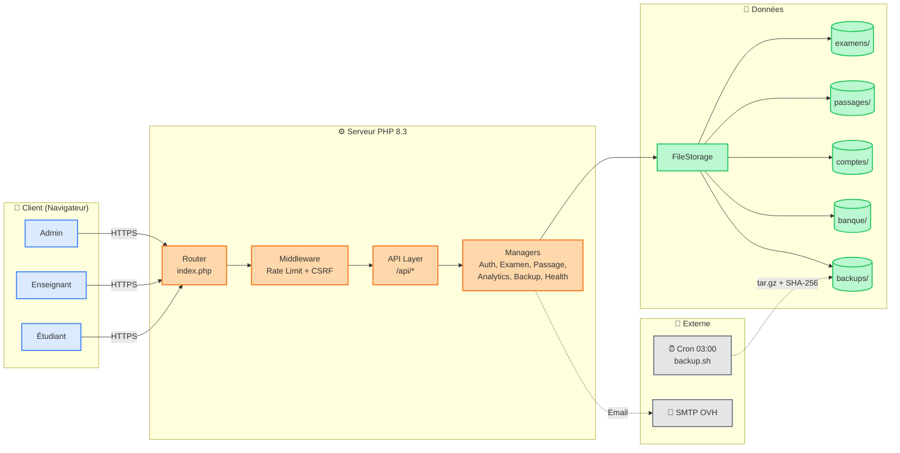
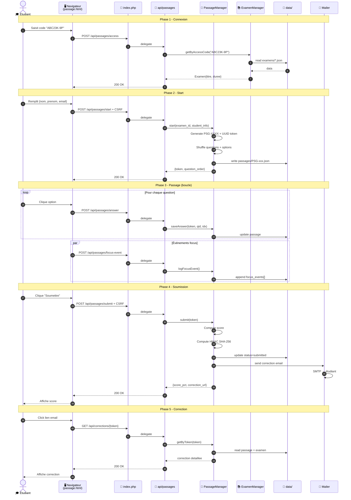
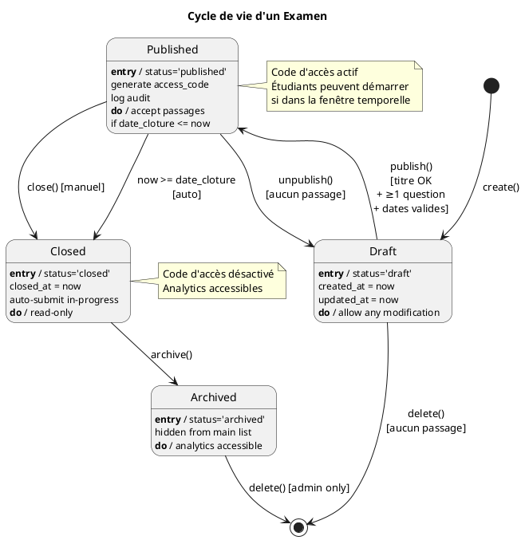
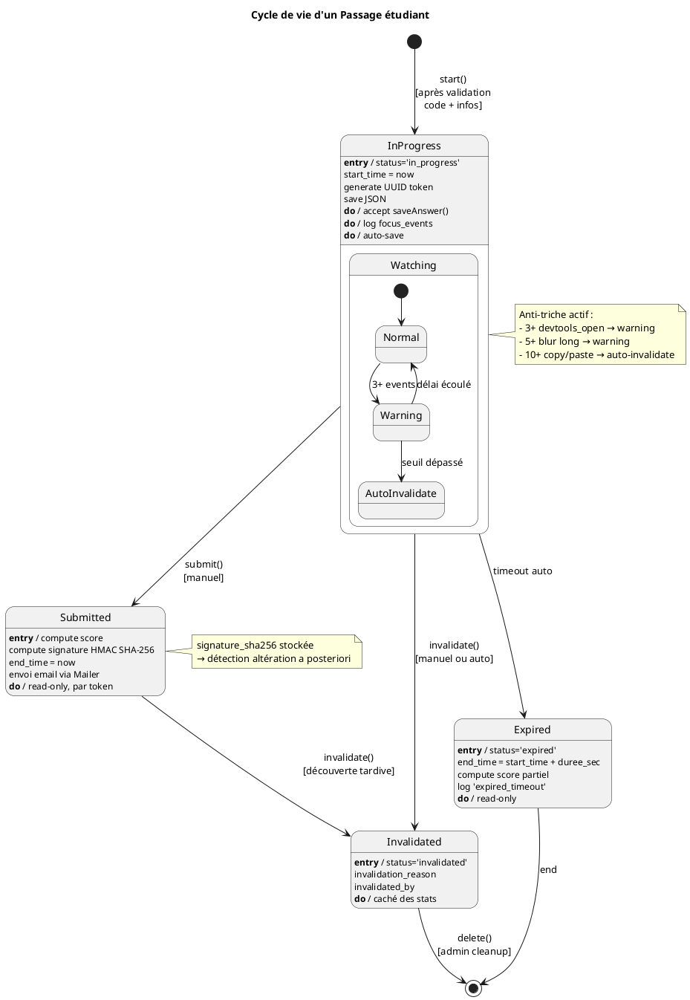
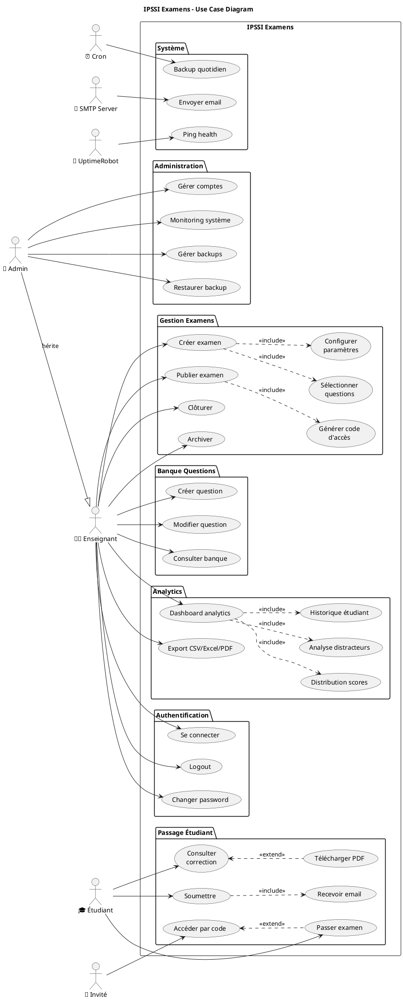
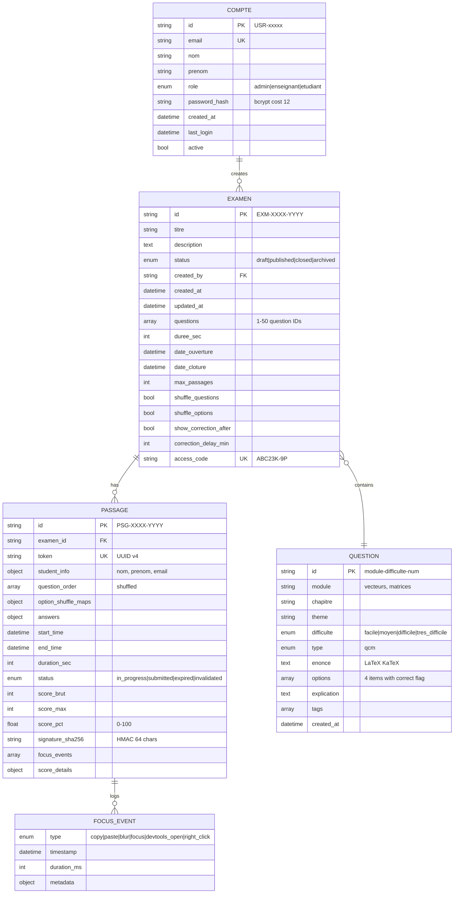
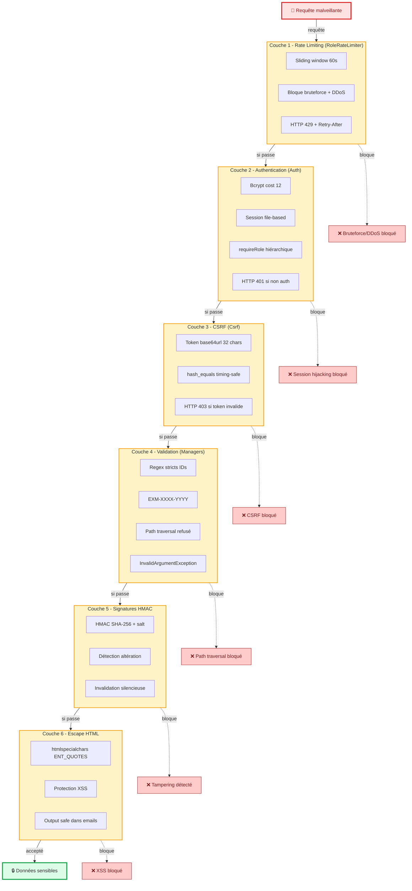
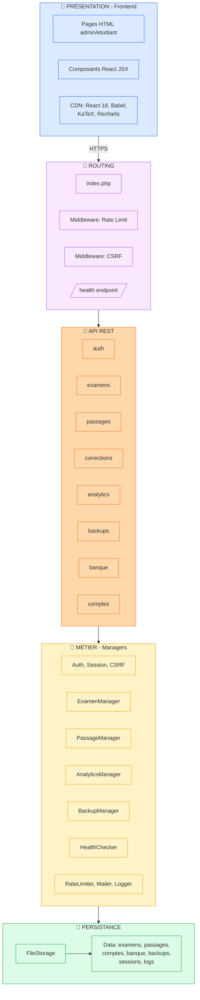
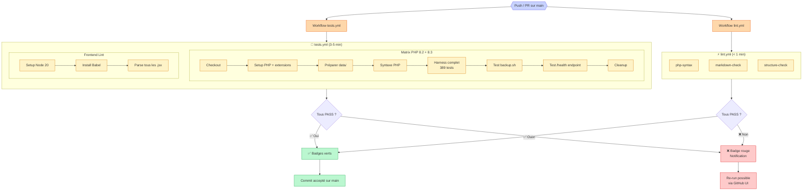
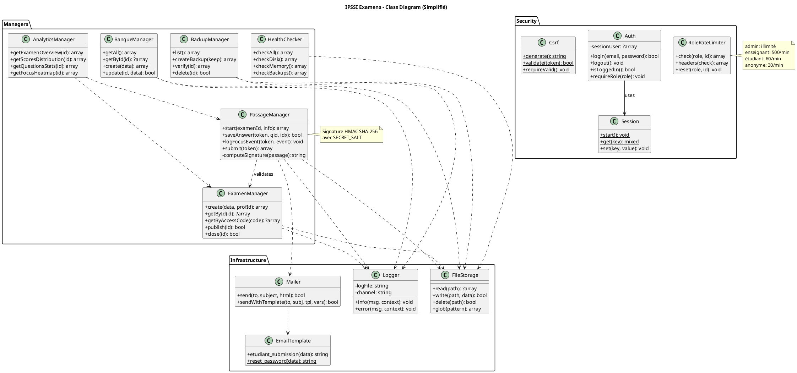

# 🎨 Exemples de diagrammes pré-générés

> Quelques exemples de diagrammes **directement utilisables**, générés à partir
> des prompts du fichier `PROMPTS_CHATGPT.md`. À copier-coller dans mermaid.live
> ou plantuml.com pour rendu immédiat.

---

## 1. Architecture globale (Mermaid)

**Rendu** : copier le code ci-dessous sur https://mermaid.live/



---

## 2. Séquence — Passage étudiant (Mermaid)

**Rendu** : https://mermaid.live/



---

## 3. Diagramme d'états — Examen (PlantUML)

**Rendu** : http://www.plantuml.com/plantuml/



---

## 4. Diagramme d'états — Passage (PlantUML)

**Rendu** : http://www.plantuml.com/plantuml/



---

## 5. Diagramme de cas d'utilisation (PlantUML)

**Rendu** : http://www.plantuml.com/plantuml/



---

## 6. ERD — Modèle de données (Mermaid)

**Rendu** : https://mermaid.live/



---

## 7. Architecture sécurité 6 couches (Mermaid)

**Rendu** : https://mermaid.live/



---

## 8. Architecture en couches (Mermaid) - Simplifiée

**Rendu** : https://mermaid.live/



---

## 9. Pipeline CI/CD (Mermaid)

**Rendu** : https://mermaid.live/



---

## 10. Diagramme de classes simplifié (PlantUML)

**Rendu** : http://www.plantuml.com/plantuml/



---

## 🔧 Comment utiliser ces exemples

### Méthode 1 — Rendu en ligne (le plus simple)

1. **Mermaid** :
   - Ouvrir https://mermaid.live/
   - Copier le code Mermaid (entre les ```` ```mermaid ```` et ```` ``` ````)
   - Coller dans l'éditeur de gauche
   - Voir le rendu à droite
   - Export PNG/SVG via le bouton "Actions" en haut

2. **PlantUML** :
   - Ouvrir http://www.plantuml.com/plantuml/
   - Copier le code (entre `@startuml` et `@enduml`)
   - Coller dans l'éditeur
   - Le rendu apparaît à droite
   - URL permanente partageable

### Méthode 2 — Dans votre repo GitHub

GitHub **rend nativement** les diagrammes Mermaid dans les fichiers `.md` !

Exemple dans votre `README.md` :
````markdown
## Architecture


````

### Méthode 3 — Dans VS Code

Installer les extensions :
- **Mermaid Preview** (par Matt Bierner)
- **PlantUML** (par jebbs)

Puis :
- Ouvrir un fichier `.md` avec code Mermaid → voir le preview en temps réel
- Pour PlantUML : créer un `.puml`, Alt+D pour preview

### Méthode 4 — Export images

Pour intégrer dans des slides ou PDF :

**Mermaid** :
- https://mermaid.live/ → bouton "Actions" → "Download PNG" ou "Download SVG"

**PlantUML** :
- http://www.plantuml.com/plantuml/ → le lien URL contient le diagramme encodé
- Clic droit sur l'image → "Enregistrer l'image"

---

## 📚 Utilisation recommandée

Chaque exemple ci-dessus correspond à **un prompt spécifique** du fichier
`PROMPTS_CHATGPT.md`. Vous pouvez :

1. **Utiliser directement** ces exemples tels quels (les modifier pour votre contexte)
2. **Régénérer via ChatGPT** avec les prompts pour des variantes personnalisées
3. **Mixer** : commencer par ces exemples et les enrichir avec ChatGPT

---

## 🎯 Ressources

- **Mermaid Live Editor** : https://mermaid.live/
- **PlantUML Online** : http://www.plantuml.com/plantuml/
- **Draw.io / diagrams.net** : https://app.diagrams.net/ (pour des schémas complexes)
- **Excalidraw** : https://excalidraw.com/ (style dessin à main levée, import Mermaid)

---

© 2026 Mohamed EL AFRIT — IPSSI — CC BY-NC-SA 4.0
