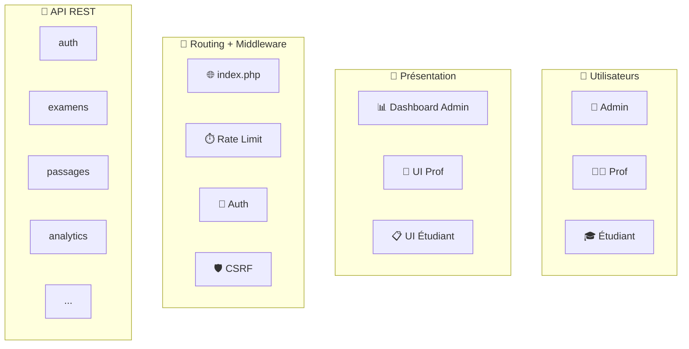

# 🏛️ Prompt 01 — Architecture globale haut niveau

## 📖 Description et contexte

Ce prompt génère un **diagramme d'architecture globale** de la plateforme IPSSI Examens montrant **tous les composants majeurs** et leurs interactions à haut niveau.

### Ce qui est généré
- Les 3 types d'utilisateurs (Admin, Prof, Étudiant)
- Les couches : présentation, routing, API, métier, persistance
- Les 17 managers groupés par domaine
- Les services externes (SMTP, cron, GitHub CI)
- Les flux principaux avec protocoles

### Quand utiliser ce prompt
- **Document d'introduction** pour nouveaux développeurs
- **Présentation technique** à un client/équipe
- **Slide d'architecture** dans une doc exécutive
- **README du projet** (vue d'ensemble)

### Niveau de détail
**Haut niveau** (~25-30 nœuds max) — vue synthétique, pas les détails d'implémentation.

### Outil recommandé
**Mermaid** via [mermaid.live](https://mermaid.live/) pour rendu rapide et intégration markdown.

---

## 🤖 Outils IA supportés

| Outil | Qualité | Remarques |
|---|:-:|---|
| **ChatGPT-4 / GPT-4o** | ⭐⭐⭐⭐⭐ | Meilleur choix, Mermaid parfait |
| **Claude 3.5/4 Sonnet** | ⭐⭐⭐⭐⭐ | Structure logique excellente |
| **Claude Opus 4** | ⭐⭐⭐⭐⭐ | Qualité supérieure avec réflexion |
| **Gemini 2.0 Pro** | ⭐⭐⭐⭐ | Bon résultat, parfois moins précis |
| **Gemini 2.0 Flash** | ⭐⭐⭐ | Correct, rapide |
| **Gemini NanoBanana** | ⭐⭐ | Plutôt pour image, code limité |

---

## 📋 Version pour ChatGPT-4 / GPT-4o

```
Tu es un architecte logiciel senior spécialisé en applications web éducatives.

CONTEXTE :
Je développe "IPSSI Examens", une plateforme web d'examens QCM en ligne pour l'école IPSSI.
- Backend : PHP 8.3 natif (aucune dépendance Composer)
- Frontend : React 18 via CDN + Babel Standalone (pas de bundler)
- Persistance : fichiers JSON (pas de SQL)
- Hébergement : compatible OVH mutualisé ou VPS
- Utilisateurs : Administrateurs, Enseignants (profs), Étudiants

COMPOSANTS PRINCIPAUX :
- 17 Managers PHP (Auth, ExamenManager, PassageManager, AnalyticsManager, BackupManager, HealthChecker, RateLimiter, Mailer, etc.)
- 8 endpoints API REST (/api/auth, /api/examens, /api/passages, /api/analytics, /api/banque, /api/corrections, /api/backups, /api/health)
- 320 questions dans la banque
- Dashboard admin, prof et étudiant séparés
- Système d'anti-triche (détection focus, copy/paste, devtools)
- Sécurité multicouche : bcrypt, CSRF, HMAC signatures, rate limiting par rôle

OBJECTIF :
Génère un diagramme d'architecture globale haut niveau au format Mermaid (syntaxe graph TB ou flowchart).

ÉLÉMENTS À INCLURE :
1. Couche utilisateur : 3 types d'acteurs (Admin, Prof, Étudiant) avec leurs navigateurs
2. Couche présentation : pages HTML + composants React avec leurs rôles
3. Couche routing : index.php avec ses middlewares (rate limit, auth, CSRF)
4. Couche API : les 8 endpoints avec leurs fonctions principales
5. Couche métier : les 17 managers regroupés par domaine (auth, data, ops, monitoring)
6. Couche persistance : FileStorage + structure de data/ (examens, passages, comptes, banque, sessions, backups, logs)
7. Services externes : SMTP, cron, GitHub Actions CI

FORMAT DE SORTIE :
- Code Mermaid complet et valide
- Utiliser des subgraphs pour grouper les couches
- Couleurs sémantiques : rouge pour sécurité, bleu pour API, vert pour métier, jaune pour data
- Ajouter des emoji pour les différents composants (🔐 🌐 ⚙️ 💾)
- Flèches étiquetées avec les protocoles (HTTPS, JSON, fs.read)

CRITÈRES DE QUALITÉ :
- Lisible et pas trop chargé (max 25-30 nœuds)
- Groupement logique clair par subgraph
- Toutes les flèches vont dans un sens cohérent (top-down ou left-right)
- Le code doit être directement utilisable sur mermaid.live sans erreur

Génère le code Mermaid maintenant.
```

---

## 📋 Version pour Claude (3.5/4 Sonnet, Opus)

Claude bénéficie d'une structuration XML pour optimiser la génération :

```
<role>
Tu es un architecte logiciel senior expert en diagrammes Mermaid et documentation d'architectures modernes.
</role>

<task>
Génère un diagramme d'architecture globale au format Mermaid pour la plateforme IPSSI Examens.
</task>

<project_context>
  <name>IPSSI Examens</name>
  <description>Plateforme web d'examens QCM en ligne pour l'école IPSSI</description>
  
  <stack>
    <backend>PHP 8.3 natif (pas de Composer)</backend>
    <frontend>React 18 CDN + Babel Standalone</frontend>
    <persistence>JSON files</persistence>
    <hosting>OVH mutualisé ou VPS</hosting>
  </stack>
  
  <components>
    <managers count="17">
      Auth, Session, Csrf, Logger, Response, FileStorage,
      BanqueManager, ExamenManager, PassageManager, AnalyticsManager,
      BackupManager, HealthChecker, RateLimiter, RoleRateLimiter,
      Mailer, EmailTemplate
    </managers>
    <apis count="9">auth, banque, comptes, examens, passages, corrections, analytics, backups, health</apis>
    <users>Admin, Prof, Étudiant</users>
    <external>SMTP, Cron, GitHub Actions</external>
  </components>
  
  <security_layers>
    1. Rate limiting par rôle
    2. Auth (bcrypt + sessions)
    3. CSRF tokens
    4. Validation IDs (regex)
    5. Signatures HMAC SHA-256
    6. Escape HTML output
  </security_layers>
</project_context>

<requirements>
  <diagram_type>Mermaid flowchart TB (top-bottom)</diagram_type>
  <layers_to_show>
    <layer name="Users">3 acteurs avec leurs navigateurs</layer>
    <layer name="Presentation">Pages HTML + React</layer>
    <layer name="Routing">index.php + middlewares</layer>
    <layer name="API">8 endpoints REST</layer>
    <layer name="Business">17 managers groupés par domaine</layer>
    <layer name="Persistence">FileStorage + data/ structure</layer>
    <layer name="External">SMTP, Cron, CI</layer>
  </layers_to_show>
  
  <style>
    <emojis>Use semantic emojis for components (🔐 🌐 ⚙️ 💾)</emojis>
    <colors>
      - red: security
      - blue: API
      - green: business logic
      - yellow: data
    </colors>
    <subgraphs>Group each layer in a subgraph</subgraphs>
    <labels>Label all arrows with protocols (HTTPS, JSON, fs.read)</labels>
  </style>
  
  <constraints>
    <max_nodes>30</max_nodes>
    <direction>Top-down flow (user → storage)</direction>
    <validity>Code must work directly on mermaid.live</validity>
  </constraints>
</requirements>

<output>
  Provide:
  1. The complete Mermaid code in a ```mermaid``` block
  2. A brief explanation (2-3 lines) of your representation choices
  3. Any optional improvements the user might consider
</output>
```

---

## 📋 Version pour Gemini Pro / 2.0 Flash

Gemini préfère des prompts plus directs et structurés en listes :

```
Objectif : Diagramme d'architecture globale au format Mermaid.

Projet : IPSSI Examens
- Plateforme web d'examens QCM en ligne
- Backend PHP 8.3 natif (pas de Composer)
- Frontend React 18 CDN (pas de bundler)
- Data : JSON files
- Hébergement OVH

Composants à représenter :

1. Utilisateurs (3) :
   - Administrateur
   - Enseignant (prof)
   - Étudiant

2. Présentation (HTML + React) :
   - admin/banque.html, examens.html, analytics.html, monitoring.html
   - etudiant/passage.html, correction.html

3. Routing (index.php) avec middlewares :
   - Rate limiting par rôle
   - Auth check
   - CSRF check

4. API REST (9) :
   - /api/auth, /api/examens, /api/passages, /api/banque
   - /api/corrections, /api/analytics, /api/backups, /api/comptes
   - /api/health

5. Managers (17) groupés :
   - Sécurité : Auth, Session, Csrf
   - Infra : Logger, Response, FileStorage
   - Data : BanqueManager, ExamenManager, PassageManager
   - Analytics : AnalyticsManager
   - Ops : BackupManager, HealthChecker
   - Rate limit : RateLimiter, RoleRateLimiter
   - Email : Mailer, EmailTemplate

6. Persistance (data/) :
   - examens/, passages/, comptes/, banque/
   - sessions/, backups/, logs/, _ratelimit/

7. Externe :
   - SMTP (emails)
   - Cron (backups auto)
   - GitHub Actions (CI/CD)

Règles de génération :
- Format : flowchart TB en Mermaid
- 25-30 nœuds maximum
- Subgraphs pour grouper par couche
- Emojis sur les composants
- Couleurs : rouge=sécu, bleu=API, vert=métier, jaune=data
- Flèches avec labels (HTTPS, JSON, etc.)
- Code directement utilisable sur mermaid.live

Fournis uniquement le code Mermaid complet.
```

---

## 📋 Version pour Gemini NanoBanana (visuel)

Gemini NanoBanana est le modèle de génération d'images de Google. Utiliser cette version pour un **schéma visuel stylisé** plutôt qu'un diagramme technique :

```
Generate a modern flat-design architecture diagram for a web exam platform called "IPSSI Examens".

Style:
- Landscape 16:9 orientation
- Clean, professional, corporate look (AWS/Azure architecture diagrams style)
- Color palette: soft blue, green, orange, with gray backgrounds
- Isometric or semi-3D elements
- Clean typography

Layout (left to right):

1. LEFT SIDE - Users (3 figures):
   - Administrator (with crown icon)
   - Teacher (with book icon)
   - Student (with graduation cap)
   Each with a laptop/device

2. CENTER - Server cluster:
   - Large box labeled "IPSSI Examens Server"
   - Inside: Web Server (Nginx/Apache) → PHP 8.3 Engine → Application Layer
   - 17 service badges arranged in a grid (Auth, Mailer, Analytics, Backup, etc.)
   - Security shield icon on top
   
3. BOTTOM CENTER - Data layer:
   - Document/JSON file icons
   - Labels: Exams, Passages, Users, Questions, Backups, Logs

4. RIGHT SIDE - External services:
   - Email/SMTP icon
   - Cron clock icon
   - GitHub logo (CI/CD)
   - OVH cloud logo

5. Flowing connections:
   - Arrows between components
   - Subtle labels (HTTPS, JSON, SMTP)
   - Dotted lines for monitoring

Text:
- Title at top: "IPSSI Examens — Architecture Overview"
- Subtitle: "Web Platform for Online Exams · v1.0"
- Footer: "© 2026 Mohamed EL AFRIT — IPSSI"

Technical requirements:
- High resolution (at least 1920x1080)
- All text readable
- Professional enough for a client presentation
```

---

## 📋 Version alternative pour DALL-E 3 (via ChatGPT Plus)

```
Create a high-quality isometric architecture diagram for "IPSSI Examens", a web-based exam platform.

Composition:
- Three user personas on the left (admin with crown, teacher, student)
- A central server illustration with glowing cubes representing microservices
- Data storage visualization (stacked documents) at the bottom
- External cloud services on the right (email, git, cron)
- Elegant flowing connections between all elements

Art style:
- Modern flat design with subtle gradients
- Professional color palette: deep blue, mint green, warm orange
- Isometric 3D perspective (30° angle)
- Light gray background with grid pattern
- Clean sans-serif typography

Labels:
- Services: "Auth", "Exams API", "Analytics", "Backups", "Monitoring"
- Data: "JSON Files", "Backups", "Logs"
- External: "SMTP", "GitHub CI", "Cron Jobs"
- Title: "IPSSI Examens - Architecture"

Technical:
- Wide format 16:9
- High resolution, suitable for presentations
- No text errors, all labels clearly readable
```

---

## 🎨 Rendu final

### Via Mermaid (code généré par ChatGPT/Claude/Gemini)

1. Copier le code Mermaid généré
2. Aller sur https://mermaid.live/
3. Coller dans l'éditeur
4. Voir l'aperçu en direct
5. **Export** :
   - PNG (meilleur pour docs)
   - SVG (meilleur pour édition)
   - PDF

### Via image (DALL-E/NanoBanana)

- Sauvegarder directement l'image générée
- Éditer si besoin avec Figma/Photoshop/Pixelmator
- Insérer dans présentations ou docs

### Intégration dans la doc du projet

Pour insérer dans `docs/ARCHITECTURE.md` :

```markdown
## Architecture globale

\`\`\`mermaid
[coller le code ici]
\`\`\`
```

Les plateformes comme GitHub, GitLab, Notion, Obsidian rendent Mermaid nativement.

---

## 💡 Conseils d'amélioration

### Si le diagramme est trop chargé
Demander à l'IA : *"Simplifie ce diagramme à 15 nœuds maximum, en gardant uniquement les éléments les plus importants."*

### Si manque de détails
Demander : *"Produis une version plus détaillée avec les sous-composants de chaque manager."*

### Pour obtenir plusieurs variantes
Demander : *"Génère 3 variantes : une simple (15 nœuds), une standard (25 nœuds), une détaillée (35 nœuds)."*

### Pour adapter au public
- **Pour un développeur** : version standard
- **Pour un client** : ajouter "style business, minimal technical jargon"
- **Pour un manager** : ajouter "focus on business value, user journey"

---

## 🎯 Exemple de sortie attendue

Le code Mermaid généré devrait ressembler à :



---

## 📞 Support

Pour améliorer ce prompt ou signaler un problème :
- **Email** : m.elafrit@ecole-ipssi.net
- **Issues** : https://github.com/melafrit/maths_IA_niveau_1/issues

---

© 2026 Mohamed EL AFRIT — IPSSI — CC BY-NC-SA 4.0
