# 🏛️ Prompt 02 — Architecture en couches détaillée

## 📖 Description et contexte

Ce prompt génère un diagramme **d'architecture en couches** (Layered Architecture) avec les 5 couches strictes de la plateforme et le respect des dépendances descendantes.

### Ce qui est généré
- 5 couches : Présentation, Routing, API, Métier, Persistance
- Composants par couche avec responsabilités
- Flèches de dépendance UNIQUEMENT entre couches adjacentes
- Protocoles de communication entre couches

### Quand utiliser ce prompt
- Documentation **technique détaillée**
- Introduction pour un **développeur junior** qui rejoint le projet
- Démontrer le **respect des bonnes pratiques** architecturales
- Section "Architecture" dans une documentation professionnelle

### Différence avec le prompt 01
- **01 (Architecture globale)** : vue synthétique multi-composants
- **02 (Architecture en couches)** : focus sur la structuration verticale, respect strict des layers

### Outil recommandé
**Mermaid** via [mermaid.live](https://mermaid.live/)

---

## 🤖 Outils IA supportés

| Outil | Qualité | Remarques |
|---|:-:|---|
| **ChatGPT-4 / GPT-4o** | ⭐⭐⭐⭐⭐ | Respect strict des layers |
| **Claude 3.5/4 Sonnet** | ⭐⭐⭐⭐⭐ | Excellent pour structures strictes |
| **Claude Opus 4** | ⭐⭐⭐⭐⭐ | Qualité maximale |
| **Gemini 2.0 Pro** | ⭐⭐⭐⭐ | Correct |
| **Gemini 2.0 Flash** | ⭐⭐⭐ | Parfois confond les layers |

---

## 📋 Version pour ChatGPT-4 / GPT-4o

```
Tu es un architecte logiciel qui documente des applications enterprise.

CONTEXTE :
Plateforme IPSSI Examens — architecture en 5 couches strictes :
1. PRÉSENTATION : HTML + React 18 (CDN) + KaTeX pour les maths + Recharts pour graphiques
2. ROUTING : backend/public/index.php (dispatch + middlewares)
3. API : 8 modules REST (backend/api/*.php)
4. MÉTIER : 17 Managers (backend/lib/*.php)
5. PERSISTANCE : FileStorage → data/*.json

CHAQUE COUCHE CONTIENT :
- Couche 1 : banque.html, examens.html, analytics.html, monitoring.html, passage.html, correction.html + 50+ composants React
- Couche 2 : Router, CSRF middleware, Rate limit middleware (RoleRateLimiter), Auth middleware
- Couche 3 : auth.php, banque.php, comptes.php, examens.php, passages.php, corrections.php, analytics.php, backups.php, health.php
- Couche 4 : Auth, Session, Csrf, Logger, Response, FileStorage, BanqueManager, ExamenManager, PassageManager, AnalyticsManager, BackupManager, HealthChecker, RateLimiter, RoleRateLimiter, EmailTemplate, Mailer
- Couche 5 : JSON files dans data/examens/, data/passages/, data/comptes/, data/banque/, data/sessions/, data/backups/, data/logs/, data/_ratelimit/

OBJECTIF :
Génère un diagramme d'architecture en couches (layered architecture) au format Mermaid.

SPÉCIFICATIONS :
- Format : flowchart TB (top-bottom)
- 5 subgraphs clairement délimités (une couche = un subgraph)
- Chaque couche doit montrer SES composants principaux (pas tous, sélectionner les + importants)
- Flèches verticales UNIQUEMENT entre couches adjacentes (respect strict des layers)
- Protocole de communication entre couches indiqué sur les flèches :
  - Navigateur ↔ Routing : HTTPS + Session Cookie
  - Routing → API : require_once
  - API → Métier : new Manager()
  - Métier → Persistance : FileStorage::read/write

ÉLÉMENTS DÉCORATIFS :
- Couleurs par couche (présentation=bleu clair, routing=violet, API=orange, métier=vert, persistance=gris)
- Badge de responsabilité sous chaque nom de couche (ex: "🎨 UI/UX", "🚦 Dispatch", "🌐 REST", "⚙️ Business", "💾 Storage")
- Nombre de composants par couche

FORMAT DE SORTIE :
Code Mermaid complet, commenté, prêt à copier-coller.

CRITÈRES :
- Respect strict de l'architecture en couches (pas de flèches qui sautent des niveaux)
- Lisible même avec 20+ composants
- Inclure un titre : "IPSSI Examens — Architecture en couches"

Génère le code Mermaid maintenant.
```

---

## 📋 Version pour Claude (3.5/4 Sonnet, Opus)

```
<role>
Tu es un architecte logiciel senior expert en architectures layered et diagrammes Mermaid.
</role>

<project>
  <n>IPSSI Examens</n>
  <architecture_style>Layered Architecture (5 layers)</architecture_style>
</project>

<layers>
  <layer id="1" name="Présentation">
    <responsibility>UI/UX, rendu React, interactions utilisateur</responsibility>
    <technologies>HTML, React 18 CDN, Babel Standalone, KaTeX, Recharts</technologies>
    <components>
      banque.html, examens.html, analytics.html, monitoring.html,
      passage.html, correction.html, 50+ React components
    </components>
  </layer>
  
  <layer id="2" name="Routing">
    <responsibility>Dispatch requêtes, middleware enforcement</responsibility>
    <technologies>PHP native, regex routing</technologies>
    <components>
      Router (index.php), RateLimitMiddleware, AuthMiddleware, CSRFMiddleware
    </components>
  </layer>
  
  <layer id="3" name="API">
    <responsibility>Exposition REST, validation, serialization JSON</responsibility>
    <technologies>PHP 8.3 strict types</technologies>
    <components>
      auth.php, banque.php, comptes.php, examens.php,
      passages.php, corrections.php, analytics.php, backups.php, health.php
    </components>
  </layer>
  
  <layer id="4" name="Métier (Business Logic)">
    <responsibility>Règles métier, validation domain, orchestration</responsibility>
    <technologies>PHP 8.3, Managers pattern</technologies>
    <components>
      Auth, Session, Csrf, Logger, Response, FileStorage,
      BanqueManager, ExamenManager, PassageManager, AnalyticsManager,
      BackupManager, HealthChecker, RateLimiter, RoleRateLimiter,
      Mailer, EmailTemplate
    </components>
  </layer>
  
  <layer id="5" name="Persistance">
    <responsibility>Stockage physique, I/O fichiers</responsibility>
    <technologies>JSON files, native PHP file I/O</technologies>
    <components>
      data/examens/, data/passages/, data/comptes/, data/banque/,
      data/sessions/, data/backups/, data/logs/, data/_ratelimit/
    </components>
  </layer>
</layers>

<inter_layer_protocols>
  <connection from="User Browser" to="Presentation">HTTP/HTTPS</connection>
  <connection from="Presentation" to="Routing">AJAX / fetch()</connection>
  <connection from="Routing" to="API">PHP require_once (file include)</connection>
  <connection from="API" to="Business">new Manager() (instantiation)</connection>
  <connection from="Business" to="Persistence">FileStorage::read/write</connection>
</inter_layer_protocols>

<requirements>
  <format>Mermaid flowchart TB</format>
  <layout>Strict vertical layers (top to bottom)</layout>
  <rules>
    - Pas de flèches qui sautent des couches
    - Communication UNIQUEMENT entre couches adjacentes
    - Chaque couche dans un subgraph avec son responsabilité
  </rules>
  
  <styling>
    <colors>
      - Layer 1 (Présentation): #E3F2FD (bleu clair)
      - Layer 2 (Routing): #F3E5F5 (violet clair)
      - Layer 3 (API): #FFF3E0 (orange clair)
      - Layer 4 (Business): #E8F5E9 (vert clair)
      - Layer 5 (Persistance): #ECEFF1 (gris clair)
    </colors>
    <badges>
      - Layer 1: 🎨 UI/UX
      - Layer 2: 🚦 Dispatch
      - Layer 3: 🌐 REST
      - Layer 4: ⚙️ Business
      - Layer 5: 💾 Storage
    </badges>
  </styling>
</requirements>

<o>
Provide:
1. Title: "IPSSI Examens — Architecture en couches"
2. Complete Mermaid code in a ```mermaid``` block
3. Brief explanation (3-4 lines) justifying the strict layering approach
4. Mention the benefits: testability, separation of concerns, etc.
</o>
```

---

## 📋 Version pour Gemini Pro / 2.0 Flash

```
Génère un diagramme d'architecture en couches au format Mermaid.

Projet : IPSSI Examens (plateforme d'examens web)

5 COUCHES À REPRÉSENTER (de haut en bas) :

COUCHE 1 - PRÉSENTATION (🎨 UI/UX)
- Technologie : React 18 CDN, KaTeX, Recharts
- Composants : banque.html, examens.html, analytics.html, monitoring.html, passage.html, correction.html
- Couleur : bleu clair (#E3F2FD)

COUCHE 2 - ROUTING (🚦 Dispatch)
- Technologie : PHP router avec middlewares
- Composants : Router (index.php), RateLimitMiddleware, AuthMiddleware, CSRFMiddleware
- Couleur : violet clair (#F3E5F5)

COUCHE 3 - API (🌐 REST)
- Technologie : PHP endpoints
- Composants : auth.php, examens.php, passages.php, analytics.php, backups.php, banque.php, corrections.php, comptes.php, health.php
- Couleur : orange clair (#FFF3E0)

COUCHE 4 - MÉTIER (⚙️ Business Logic)
- Technologie : PHP Managers
- Composants : Auth, Session, Csrf, Logger, FileStorage, ExamenManager, PassageManager, BanqueManager, AnalyticsManager, BackupManager, HealthChecker, RateLimiter, RoleRateLimiter, Mailer, EmailTemplate, Response
- Couleur : vert clair (#E8F5E9)

COUCHE 5 - PERSISTANCE (💾 Storage)
- Technologie : JSON files
- Composants : data/examens/, data/passages/, data/comptes/, data/banque/, data/sessions/, data/backups/, data/logs/, data/_ratelimit/
- Couleur : gris clair (#ECEFF1)

PROTOCOLES entre couches :
- User → L1 : HTTPS
- L1 → L2 : AJAX fetch()
- L2 → L3 : require_once
- L3 → L4 : new Manager()
- L4 → L5 : FileStorage::read/write

RÈGLES STRICTES :
1. Format : flowchart TB
2. 5 subgraphs (un par couche)
3. Flèches UNIQUEMENT entre couches adjacentes (pas de skip)
4. Chaque flèche a un label avec le protocole
5. Couleurs par couche
6. Titre : "IPSSI Examens — Architecture en couches"

Génère uniquement le code Mermaid valide.
```

---

## 📋 Version courte / Prompting rapide

Pour IA avec contexte déjà défini (après meta-prompt) :

```
Génère le diagramme d'architecture en couches au format Mermaid.

5 couches strictes top-down :
1. Présentation (React + HTML)
2. Routing (index.php + middlewares)
3. API (9 endpoints REST)
4. Métier (17 managers)
5. Persistance (JSON files)

Règles : flowchart TB, 1 subgraph par couche, flèches entre couches adjacentes UNIQUEMENT, couleurs par couche, protocoles sur les flèches.
```

---

## 🎨 Rendu final

### Workflow recommandé

1. **Générer** le code avec l'IA de votre choix
2. **Copier** le bloc Mermaid
3. **Coller** sur https://mermaid.live/
4. **Vérifier** que les 5 couches sont bien séparées
5. **Exporter** en SVG ou PNG

### Points à vérifier

- [ ] 5 couches clairement délimitées
- [ ] Pas de flèche qui saute un niveau
- [ ] Couleurs différentes par couche
- [ ] Protocoles lisibles sur les flèches
- [ ] Titre présent

### Intégration dans la doc

Dans `docs/ARCHITECTURE.md`, section "Architecture en couches" :

````markdown
### Architecture en couches

L'application suit une architecture **layered stricte** où chaque couche 
ne peut communiquer qu'avec sa voisine directe.

```mermaid
[coller le code ici]
```

**Avantages** :
- 🧪 **Testabilité** : chaque couche testable indépendamment
- 🔒 **Sécurité** : les middlewares en couche 2 protègent tout ce qui suit
- 🔄 **Maintenance** : changer une couche n'affecte pas les autres
- 📦 **Modularité** : on pourrait remplacer FileStorage par MySQL en ne touchant que la L5
````

---

## 💡 Variations possibles

### Version "simplifiée" (pour client non-technique)
Demander : *"Simplifie ce diagramme en 3 couches : Frontend, Backend, Data. Pas plus de 10 nœuds au total."*

### Version "avec métriques"
Demander : *"Ajoute pour chaque couche : le nombre de composants, le nombre de tests, et une métrique de performance typique."*

### Version "avec sécurité explicite"
Demander : *"Mets en évidence les couches de sécurité : rate limit (couche 2), auth (couche 2-4), HMAC signatures (couche 4), chiffrement (couche 5)."*

---

## 🎯 Exemple de sortie attendue

```mermaid
graph TB
    User["👥 Utilisateurs<br/>Admin · Prof · Étudiant"]
    
    subgraph L1["🎨 Présentation — UI/UX"]
        P1[banque.html]
        P2[examens.html]
        P3[analytics.html]
        P4[passage.html]
    end
    
    subgraph L2["🚦 Routing — Dispatch"]
        R1[index.php]
        R2[RateLimit MW]
        R3[Auth MW]
        R4[CSRF MW]
    end
    
    subgraph L3["🌐 API — REST"]
        A1[auth.php]
        A2[examens.php]
        A3[passages.php]
        A4[...]
    end
    
    subgraph L4["⚙️ Métier — Business"]
        B1[Auth Manager]
        B2[ExamenManager]
        B3[PassageManager]
        B4[17 managers]
    end
    
    subgraph L5["💾 Persistance — Storage"]
        S1[data/examens/]
        S2[data/passages/]
        S3[data/comptes/]
        S4[data/banque/]
    end
    
    User -->|HTTPS| L1
    L1 -->|AJAX fetch| L2
    L2 -->|require_once| L3
    L3 -->|new Manager| L4
    L4 -->|FileStorage| L5
    
    style L1 fill:#E3F2FD
    style L2 fill:#F3E5F5
    style L3 fill:#FFF3E0
    style L4 fill:#E8F5E9
    style L5 fill:#ECEFF1
```



---

## 📞 Support

- **Email** : m.elafrit@ecole-ipssi.net
- **Issues** : https://github.com/melafrit/maths_IA_niveau_1/issues

---

© 2026 Mohamed EL AFRIT — IPSSI — CC BY-NC-SA 4.0
