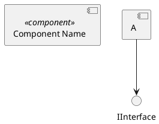

# 📐 Prompt 06 — Diagramme de composants UML

## 📖 Description et contexte

Ce prompt génère un **diagramme de composants UML 2.5** montrant les 30 composants logiques du système avec leurs interfaces provided/required (lollipops).

### Ce qui est généré
- 30 composants (UI, middleware, API, services, storage, externes)
- Interfaces fournies (provided) et requises (required)
- Dépendances entre composants
- Systèmes externes (SMTP, GitHub, Cron)

### Quand utiliser ce prompt
- Documentation pour **architectes**
- Vue **modulaire** avant refactoring
- Design review ou **due diligence** technique
- Planification d'**extension** du système

### Outil recommandé
**PlantUML** pour rendu UML officiel, **Mermaid** pour compatibilité GitHub.

---

## 🤖 Outils IA supportés

| Outil | Qualité | Notes |
|---|:-:|---|
| **ChatGPT-4 / GPT-4o** | ⭐⭐⭐⭐⭐ | Excellent avec les lollipops UML |
| **Claude Opus 4** | ⭐⭐⭐⭐⭐ | Syntaxe UML précise |
| **Claude 3.5 Sonnet** | ⭐⭐⭐⭐ | Bon pour structuration |
| **Gemini 2.0 Pro** | ⭐⭐⭐⭐ | Correct |

---

## 📋 Version pour ChatGPT-4 / GPT-4o

```
Tu es un architecte senior qui documente des systèmes en UML 2.5.

CONTEXTE :
Plateforme IPSSI Examens organisée en composants logiques :

COMPOSANTS FRONTEND :
1. <<component>> AdminUI
   - Interfaces fournies : visualisation admin
   - Interfaces requises : AuthAPI, ExamensAPI, BanqueAPI, AnalyticsAPI, BackupsAPI, HealthAPI
   - Sous-composants : banque.html, examens.html, analytics.html, monitoring.html
2. <<component>> StudentUI
   - Sous-composants : passage.html, correction.html
   - Interfaces requises : PassagesAPI, CorrectionsAPI

COMPOSANTS BACKEND — API :
3. <<component>> HealthEndpoint (/api/health)
4. <<component>> AuthAPI (/api/auth)
5. <<component>> ExamensAPI (/api/examens)
6. <<component>> PassagesAPI (/api/passages)
7. <<component>> CorrectionsAPI (/api/corrections)
8. <<component>> BanqueAPI (/api/banque)
9. <<component>> AnalyticsAPI (/api/analytics)
10. <<component>> BackupsAPI (/api/backups)
11. <<component>> ComptesAPI (/api/comptes)

COMPOSANTS MIDDLEWARE :
12. <<component>> Router (index.php)
    - Parsing URL, dispatch
13. <<component>> RateLimitMiddleware
    - Utilise RoleRateLimiter
14. <<component>> AuthMiddleware
15. <<component>> CSRFMiddleware

COMPOSANTS MÉTIER (Managers) :
16. <<component>> AuthService (Auth + Session + Csrf + bcrypt)
17. <<component>> ExamenService (ExamenManager)
18. <<component>> PassageService (PassageManager)
19. <<component>> BanqueService (BanqueManager)
20. <<component>> AnalyticsService (AnalyticsManager)
21. <<component>> BackupService (BackupManager + bash scripts)
22. <<component>> HealthService (HealthChecker)
23. <<component>> MailerService (Mailer + EmailTemplate + SMTP)
24. <<component>> LoggerService

COMPOSANTS INFRASTRUCTURE :
25. <<component>> FileStorage (read/write JSON)
26. <<component>> SessionStore (PHP native)
27. <<component>> RateLimitStore (data/_ratelimit/)

SYSTÈMES EXTERNES :
28. <<external>> SMTP Server (OVH Email Pro)
29. <<external>> GitHub Actions (CI)
30. <<external>> Cron daemon

INTERFACES EXPOSÉES (lollipops) :
- REST API via HTTP
- File I/O via FileStorage
- SMTP via Mailer

OBJECTIF :
Génère un diagramme de composants UML au format Mermaid (flowchart LR avec sémantique composant).

ÉLÉMENTS À MONTRER :
- Les 30 composants groupés logiquement
- Interfaces provided/required (utiliser symboles ○) vs ●)
- Dépendances entre composants (flèches)
- Frontières entre zones (présentation / middleware / business / infrastructure / external)

FORMAT :
- Mermaid flowchart LR
- Subgraphs pour chaque zone
- Stéréotypes <<component>>, <<interface>>, <<external>> dans les labels
- Couleurs différentes par zone
- Flèches typées avec ..> pour "depends on"

FOURNIS AUSSI :
Une version PlantUML avec la syntaxe officielle UML :


CRITÈRES :
- Tous les composants majeurs visibles
- Zones clairement délimitées
- Flow évident de UI → API → Service → Storage
- Compatible mermaid.live ET planttext.com

Génère les 2 versions (Mermaid + PlantUML).
```

---

## 📋 Version pour Claude

```
<role>
Expert en UML 2.5 Component Diagrams, avec maîtrise des notations :
- Ports et interfaces (provided ○ / required ●)
- Assembly connectors
- Delegation connectors
- Stéréotypes officiels UML
</role>

<task>
Generate component diagram for IPSSI Examens platform in BOTH Mermaid and PlantUML formats.
</task>

<components>
  <zone name="Frontend UI" count="2">
    - AdminUI (sub: 4 admin pages)
    - StudentUI (sub: 2 student pages)
  </zone>
  
  <zone name="Middleware" count="4">
    - Router (index.php)
    - RateLimitMiddleware
    - AuthMiddleware
    - CSRFMiddleware
  </zone>
  
  <zone name="API Endpoints" count="9">
    - HealthEndpoint, AuthAPI, ExamensAPI, PassagesAPI
    - CorrectionsAPI, BanqueAPI, AnalyticsAPI
    - BackupsAPI, ComptesAPI
  </zone>
  
  <zone name="Business Services" count="9">
    - AuthService, ExamenService, PassageService
    - BanqueService, AnalyticsService
    - BackupService, HealthService
    - MailerService, LoggerService
  </zone>
  
  <zone name="Infrastructure" count="3">
    - FileStorage
    - SessionStore
    - RateLimitStore
  </zone>
  
  <zone name="External Systems" count="3">
    - SMTP (OVH Email Pro) <<external>>
    - GitHub Actions <<external>>
    - Cron daemon <<external>>
  </zone>
</components>

<interfaces>
  <provided>
    - AdminUI provides: WebInterface (HTML)
    - StudentUI provides: WebInterface
    - Each API provides its REST endpoint
    - Services provide their business interfaces
    - FileStorage provides: IStorage
  </provided>
  
  <required>
    - UI requires APIs (via HTTP)
    - APIs require Services (via new)
    - Services require FileStorage (via dependency injection)
    - MailerService requires SMTP external
    - BackupService requires bash scripts
  </required>
</interfaces>

<output>
Provide TWO diagrams:

1. **Mermaid** (flowchart LR with component semantics)
   - Subgraphs per zone
   - Stéréotypes in labels: <<component>>, <<external>>
   - Color coding per zone
   - ..> for "depends on"

2. **PlantUML** (official UML syntax)
   ```plantuml
   @startuml
   package "Frontend" {
     [AdminUI] <<component>>
     [StudentUI] <<component>>
   }
   interface "IAuthAPI" as IAUTH
   [AdminUI] ..> IAUTH : uses
   ...
   @enduml
   ```

For both:
- Logical flow visible: UI → Middleware → API → Service → Storage
- External systems clearly separated
- Title: "IPSSI Examens — Component Diagram"
</output>
```

---

## 📋 Version pour Gemini Pro

```
Diagramme de composants UML pour IPSSI Examens.

30 COMPOSANTS à représenter, groupés en 6 zones :

ZONE 1 - FRONTEND UI :
- AdminUI : banque, examens, analytics, monitoring
- StudentUI : passage, correction

ZONE 2 - MIDDLEWARE (index.php) :
- Router
- RateLimitMiddleware (utilise RoleRateLimiter)
- AuthMiddleware
- CSRFMiddleware

ZONE 3 - API REST (9 endpoints) :
- HealthEndpoint, AuthAPI, ExamensAPI, PassagesAPI
- CorrectionsAPI, BanqueAPI, AnalyticsAPI, BackupsAPI, ComptesAPI

ZONE 4 - BUSINESS SERVICES (9) :
- AuthService, ExamenService, PassageService
- BanqueService, AnalyticsService
- BackupService, HealthService
- MailerService, LoggerService

ZONE 5 - INFRASTRUCTURE (3) :
- FileStorage
- SessionStore
- RateLimitStore

ZONE 6 - EXTERNAL <<external>> (3) :
- SMTP Server
- GitHub Actions
- Cron daemon

FLUX PRINCIPAL :
UI → Middleware → API → Service → FileStorage/External

PRODUIRE 2 VERSIONS :

1. Mermaid flowchart LR :
- 6 subgraphs (un par zone)
- Stéréotypes <<component>>, <<external>> dans labels
- Couleurs par zone
- Flèches ..> pour "depends on"

2. PlantUML :
Syntaxe officielle avec [Component], interface, ..>

Génère les deux codes complets.
```

---

## 🎨 Rendu final

### Outils de rendu

- **Mermaid** : https://mermaid.live/
- **PlantUML** : https://www.planttext.com/ ou https://kroki.io/

### Export

- SVG pour haute qualité
- PNG pour docs Word

### Intégration

Section "Composants" dans `ARCHITECTURE.md` :

````markdown
## Diagramme de composants

### Vue Mermaid (rendu GitHub)

```mermaid
[code]
```

### Vue PlantUML (UML officiel)

```plantuml
[code]
```
````

---

## 💡 Variations

### Version C4 Level 2
*"Produis la version C4 model niveau Container (L2) de ce diagramme."*

### Version focus sécurité
*"Mets en évidence les composants de sécurité avec bordure rouge et stéréotype <<security>>."*

---

© 2026 Mohamed EL AFRIT — IPSSI — CC BY-NC-SA 4.0
