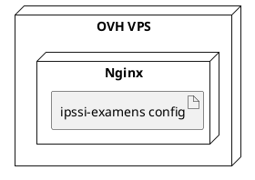
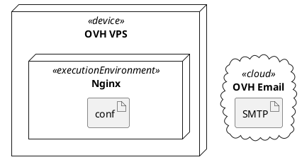

# 📐 Prompt 08 — Diagramme de déploiement UML

## 📖 Description et contexte

Ce prompt génère un **diagramme de déploiement UML 2.5** officiel avec les nœuds physiques (`<<device>>`), environnements d'exécution (`<<executionEnvironment>>`), artifacts, et connexions réseau.

### Ce qui est généré
- Client devices (browsers)
- OVH VPS Server (Ubuntu) avec ses composants
- OVH Cloud services
- GitHub Cloud
- Let's Encrypt
- UptimeRobot
- Toutes les connexions avec protocoles + ports

### Quand utiliser
- **Documentation DevOps** officielle
- **Audit infrastructure**
- Présentation **technique avancée**
- **Compliance** / sécurité

### Différence avec prompt 03
- **03 (Déploiement OVH)** : vue infrastructure générale (flowchart)
- **08 (UML déploiement)** : diagramme UML strict (device/environment/artifact)

### Outil recommandé
**PlantUML** (meilleur pour UML officiel), **Mermaid** en fallback.

---

## 🤖 Outils IA supportés

| Outil | Qualité | Notes |
|---|:-:|---|
| **ChatGPT-4 / GPT-4o** | ⭐⭐⭐⭐⭐ | Excellent PlantUML |
| **Claude Opus 4** | ⭐⭐⭐⭐⭐ | Maîtrise syntaxe UML |
| **Claude 3.5 Sonnet** | ⭐⭐⭐⭐ | Bon |
| **Gemini 2.0 Pro** | ⭐⭐⭐⭐ | Correct |

---

## 📋 Version pour ChatGPT-4 / GPT-4o

```
Tu es un ingénieur DevOps qui produit des diagrammes UML de déploiement.

CONTEXTE :
Déploiement production de la plateforme IPSSI Examens sur OVH VPS Ubuntu 22.04.

NŒUDS PHYSIQUES / LOGIQUES :

1. <<device>> Client Device
   - <<executionEnvironment>> Browser (Chrome/Firefox/Safari)
     * Artifacts déployés : HTML pages, React bundle (via CDN)

2. <<device>> OVH VPS Server (51.75.x.x)
   - OS : Ubuntu 22.04 LTS
   - <<executionEnvironment>> Nginx 1.18
     * Artifacts : sites-available/ipssi-examens
   - <<executionEnvironment>> PHP 8.3 FPM
     * Artifacts : php-fpm.sock socket
   - <<executionEnvironment>> Application
     * Artifacts : examens/ directory (backend/, frontend/, data/)
   - <<executionEnvironment>> Cron daemon
     * Artifacts : backup.sh scheduled 03:00
   - <<executionEnvironment>> Fail2ban
     * Artifacts : jail.local config
   - <<executionEnvironment>> UFW Firewall
     * Artifacts : rules (22, 80, 443)

3. <<cloud>> OVH DNS
   - Artifacts : zone DNS (A, MX, TXT records)

4. <<cloud>> OVH Email Pro
   - SMTP : ssl0.ovh.net:465
   - Mailbox : noreply@examens-ipssi.fr

5. <<cloud>> OVH Object Storage
   - Bucket : ipssi-backups
   - Endpoint : storage.gra.cloud.ovh.net

6. <<cloud>> GitHub Cloud
   - Artifacts : repository maths_IA_niveau_1
   - <<executionEnvironment>> GitHub Actions Runner
     * Workflows : tests.yml, lint.yml

7. <<cloud>> Let's Encrypt
   - Service : ACME challenge via certbot

8. <<cloud>> UptimeRobot
   - Service : HTTP monitoring

CONNEXIONS RÉSEAU :
- Client Browser → DNS (UDP 53 DNS query)
- Client Browser → Nginx (HTTPS 443)
- Nginx → PHP-FPM (unix socket)
- PHP-FPM → Application files (fs read/write)
- PHP-FPM → OVH Email SMTP (TLS 465)
- Cron → backup.sh → Object Storage (HTTPS)
- Certbot → Let's Encrypt (ACME HTTP-01)
- UptimeRobot → Nginx/api/health (HTTPS)
- GitHub Actions → tests (internal)
- Developer SSH → VPS (SSH 22 via key)

OBJECTIF :
Génère un diagramme de déploiement UML au format Mermaid (avec sémantique deployment).

SPÉCIFICATIONS :
- Utiliser flowchart LR avec subgraphs représentant les nœuds physiques
- Emboîter les execution environments dans les devices
- Montrer les artifacts (fichiers, configurations) dans chaque environment
- Annotations sur les flèches :
  - Protocole (HTTPS, TCP, UDP, SSH)
  - Port
  - Direction (→ bidirectionnel si applicable)
- Stéréotypes UML : <<device>>, <<executionEnvironment>>, <<cloud>>, <<artifact>>

ICONES :
- 💻 Client
- 🖥️ Serveur
- ☁️ Cloud services
- 🔒 Sécurité
- 📧 Email
- 🔄 CI/CD

FORMAT :
Code Mermaid avec subgraphs nommés et styles.

FOURNIS AUSSI une version PlantUML utilisant la syntaxe officielle :


CRITÈRES :
- Toutes les connexions réseau visibles avec leur protocole
- Hiérarchie claire des execution environments
- Services externes bien séparés
- Titre : "IPSSI Examens — Deployment Diagram (OVH Production)"

Génère les 2 versions.
```

---

## 📋 Version pour Claude

```
<role>
Architecte DevOps maîtrisant UML 2.5 Deployment Diagrams. Tu produis des diagrammes conformes aux standards OMG avec :
- Nodes (<<device>>, <<executionEnvironment>>)
- Artifacts
- Manifest/deployment relationships
- Communication paths avec protocoles
</role>

<deployment>
  <n>IPSSI Examens Production Deployment on OVH</n>
  
  <nodes>
    <node stereotype="device" name="Client Device">
      <executionEnvironment name="Browser">
        <artifact>HTML pages (from server)</artifact>
        <artifact>React bundle (CDN)</artifact>
      </executionEnvironment>
    </node>
    
    <node stereotype="device" name="OVH VPS Server" ip="51.75.x.x" os="Ubuntu 22.04">
      <executionEnvironment name="Nginx 1.18">
        <artifact>sites-available/ipssi-examens.conf</artifact>
      </executionEnvironment>
      <executionEnvironment name="PHP 8.3 FPM">
        <artifact>php-fpm.sock</artifact>
      </executionEnvironment>
      <executionEnvironment name="Application">
        <artifact>backend/ directory</artifact>
        <artifact>frontend/ directory</artifact>
        <artifact>data/ directory</artifact>
      </executionEnvironment>
      <executionEnvironment name="Cron">
        <artifact>crontab: backup.sh 03:00</artifact>
      </executionEnvironment>
      <executionEnvironment name="Fail2ban">
        <artifact>jail.local</artifact>
      </executionEnvironment>
      <executionEnvironment name="UFW Firewall">
        <artifact>rules: 22, 80, 443</artifact>
      </executionEnvironment>
    </node>
    
    <node stereotype="cloud" name="OVH DNS">
      <artifact>Zone: examens-ipssi.fr</artifact>
      <artifact>Records: A, MX, TXT (SPF/DKIM/DMARC)</artifact>
    </node>
    
    <node stereotype="cloud" name="OVH Email Pro">
      <artifact>SMTP: ssl0.ovh.net:465</artifact>
      <artifact>Mailbox: noreply@examens-ipssi.fr</artifact>
    </node>
    
    <node stereotype="cloud" name="OVH Object Storage">
      <artifact>Bucket: ipssi-backups</artifact>
      <artifact>Endpoint: storage.gra.cloud.ovh.net</artifact>
    </node>
    
    <node stereotype="cloud" name="GitHub Cloud">
      <artifact>Repo: maths_IA_niveau_1</artifact>
      <executionEnvironment name="Actions Runner">
        <artifact>tests.yml</artifact>
        <artifact>lint.yml</artifact>
      </executionEnvironment>
    </node>
    
    <node stereotype="cloud" name="Let's Encrypt" />
    <node stereotype="cloud" name="UptimeRobot" />
  </nodes>
  
  <communication_paths>
    <path from="Browser" to="OVH DNS" protocol="UDP" port="53" />
    <path from="Browser" to="Nginx" protocol="HTTPS" port="443" />
    <path from="Nginx" to="PHP-FPM" protocol="Unix Socket" />
    <path from="PHP-FPM" to="Application" protocol="File I/O" />
    <path from="PHP-FPM" to="OVH SMTP" protocol="TLS" port="465" />
    <path from="Cron" to="Object Storage" protocol="HTTPS/S3 API" port="443" />
    <path from="Certbot" to="Let's Encrypt" protocol="HTTPS (ACME)" port="443" />
    <path from="UptimeRobot" to="Nginx" protocol="HTTPS" port="443" />
    <path from="Developer" to="VPS" protocol="SSH" port="22" />
  </communication_paths>
</deployment>

<requirements>
  <provide>
    1. Mermaid flowchart LR with deployment semantics
    2. PlantUML official deployment diagram syntax
  </provide>
  
  <style>
    Icons: 💻 (client), 🖥️ (server), ☁️ (cloud), 🔒 (security), 📧 (email), 🔄 (CI/CD)
    Colors: security red, app green, cloud blue, infra gray
    Annotations: all arrows labeled with protocol + port
  </style>
  
  <title>IPSSI Examens — Deployment Diagram (OVH Production)</title>
</requirements>
```

---

## 📋 Version pour Gemini Pro

```
Deployment diagram UML (version Mermaid + PlantUML).

Projet : IPSSI Examens sur OVH VPS Ubuntu 22.04.

NŒUDS :

1. <<device>> Client Device
   - <<executionEnvironment>> Browser
   - Artifacts : HTML, React bundle

2. <<device>> OVH VPS Server (Ubuntu 22.04)
   Environnements :
   - Nginx 1.18 (config ipssi-examens.conf)
   - PHP 8.3 FPM (php-fpm.sock)
   - Application (backend/, frontend/, data/)
   - Cron (backup.sh @ 03:00)
   - Fail2ban (jail.local)
   - UFW Firewall (22, 80, 443)

3. <<cloud>> OVH DNS (zone examens-ipssi.fr)
4. <<cloud>> OVH Email Pro (ssl0.ovh.net:465)
5. <<cloud>> OVH Object Storage (s3://ipssi-backups/)
6. <<cloud>> GitHub Cloud + Actions Runner (tests.yml, lint.yml)
7. <<cloud>> Let's Encrypt
8. <<cloud>> UptimeRobot

CONNEXIONS (protocole + port) :
- Browser → DNS : UDP 53
- Browser → Nginx : HTTPS 443
- Nginx → PHP-FPM : Unix Socket
- PHP-FPM → SMTP : TLS 465
- Cron → Object Storage : HTTPS 443
- Certbot → Let's Encrypt : HTTPS 443 (ACME)
- UptimeRobot → Nginx : HTTPS 443
- Dev SSH → VPS : SSH 22

PRODUIRE 2 VERSIONS :

1. Mermaid (flowchart LR) avec subgraphs pour nodes imbriqués, stéréotypes dans labels

2. PlantUML officiel :


Style : icônes (💻🖥️☁️🔒📧🔄), couleurs sémantiques.

Titre : "IPSSI Examens — Deployment Diagram (OVH)"
```

---

## 🎨 Rendu final

### Rendu

- Mermaid : https://mermaid.live/
- PlantUML : https://www.planttext.com/

### Intégration

Section "Déploiement UML" dans `DEPLOIEMENT_OVH.md` ou `ARCHITECTURE.md`.

---

## 💡 Variations

### Version cluster (HA)
*"Anticipe un déploiement avec 2 VPS + load balancer : ajoute les nouveaux nodes et leurs réplications."*

### Version Docker
*"Adapte en supposant que l'app tourne en conteneur Docker : montre l'hôte Docker + conteneurs."*

### Version Kubernetes
*"Adapte pour un cluster K8s : nodes, pods, services, ingress."*

---

© 2026 Mohamed EL AFRIT — IPSSI — CC BY-NC-SA 4.0
