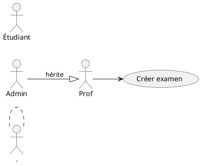
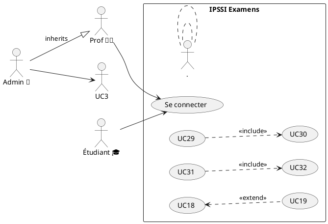
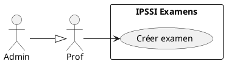

# 🔄 Prompt 09 — Diagramme de cas d'utilisation UML

## 📖 Description et contexte

Ce prompt génère un **diagramme de cas d'utilisation** avec les 3 acteurs principaux (Admin, Prof, Étudiant) + 2 acteurs secondaires (Cron, SMTP) et leurs 28 cas d'utilisation.

### Ce qui est généré
- 3 acteurs principaux + 2 secondaires
- 28 cas d'utilisation groupés par domaine
- Relations `<<include>>`, `<<extend>>`, héritage
- Organisation visuelle claire

### Quand utiliser
- **Début de projet** (spec fonctionnelle)
- Documentation **fonctionnelle** pour non-techniques
- Identifier **rôles et permissions**
- Section "Fonctionnalités" dans guides

### Outil recommandé
**PlantUML** (meilleur support use cases officielle), Mermaid en alternative.

---

## 🤖 Outils IA supportés

| Outil | Qualité | Notes |
|---|:-:|---|
| **ChatGPT-4 / GPT-4o** | ⭐⭐⭐⭐⭐ | Parfait PlantUML |
| **Claude Opus 4** | ⭐⭐⭐⭐⭐ | Maîtrise des relations UML |
| **Claude 3.5 Sonnet** | ⭐⭐⭐⭐⭐ | Excellent |
| **Gemini 2.0 Pro** | ⭐⭐⭐⭐ | Bon |

---

## 📋 Version pour ChatGPT-4 / GPT-4o

```
Tu es un expert UML et en analyse fonctionnelle.

CONTEXTE :
Plateforme IPSSI Examens avec 3 acteurs principaux :
- Administrateur
- Enseignant (Prof)
- Étudiant

Et 2 acteurs secondaires :
- Système Cron (pour backups auto)
- Service Email (SMTP externe)

CAS D'UTILISATION PAR ACTEUR :

👑 ADMINISTRATEUR :
1. Se connecter
2. Changer son mot de passe
3. Gérer les comptes utilisateurs
   - Créer un compte prof
   - Désactiver un compte
   - Réinitialiser un mot de passe
4. Consulter le monitoring système
   - Voir dashboard santé (7 checks)
   - Consulter les logs
5. Gérer les backups
   - Créer un backup manuel
   - Restaurer depuis un backup
   - Vérifier intégrité hash SHA-256
   - Supprimer un backup
6. Accéder à TOUS les examens de tous les profs (vue globale)

👨‍🏫 ENSEIGNANT :
7. Se connecter
8. Gérer la banque de questions
   - Consulter les questions (320 disponibles)
   - Créer une nouvelle question (avec LaTeX KaTeX)
   - Modifier une question
9. Créer un examen
   - Sélectionner questions depuis banque
   - Configurer durée, dates, shuffle
   - Sauvegarder en brouillon
10. Publier un examen
11. Distribuer le code d'accès (via copie/email externe)
12. Suivre les passages en temps réel
13. Consulter les analytics
    - Vue d'ensemble (KPIs)
    - Distribution des scores
    - Stats par question (distracteurs)
    - Historique par étudiant
14. Exporter les résultats
    - CSV
    - Excel (multi-feuilles)
    - PDF (via impression navigateur)
15. Clôturer un examen
16. Archiver un examen
17. Invalider manuellement un passage (fraude avérée)

🎓 ÉTUDIANT :
18. Accéder à l'examen (via code)
19. Saisir ses informations (nom, prénom, email)
20. Passer l'examen
    - Répondre aux questions
    - Auto-save
    - Changer entre questions
    - Marquer pour revoir
21. Soumettre l'examen
22. Recevoir email de confirmation (automatique)
23. Consulter sa correction
    - Voir score
    - Voir bonnes/mauvaises réponses
    - Lire les explications
24. Télécharger sa correction en PDF

🤖 SYSTÈME CRON (acteur secondaire) :
25. Exécuter backup quotidien (03:00)
26. Nettoyer vieux logs / sessions (optionnel)

📧 SERVICE EMAIL (acteur secondaire) :
27. Envoyer email de confirmation à l'étudiant
28. Envoyer email d'alerte admin (si anomalie)

RELATIONS UML À SHOWER :
- <<include>> : "Passer l'examen" includes "Auto-sauvegarde des réponses"
- <<include>> : "Soumettre l'examen" includes "Envoyer email confirmation"
- <<extend>> : "Invalider passage" extends "Suivre passages" (conditionnel)
- <<extend>> : "Alerte anomalie" extends "Suivre passages"
- Héritage acteur : Admin hérite de Enseignant (tous droits prof + admin specifics)

OBJECTIF :
Génère un diagramme de cas d'utilisation UML complet au format Mermaid ET PlantUML.

FORMAT MERMAID :
Utiliser flowchart avec :
- Acteurs comme rectangles stylisés
- Cas d'utilisation comme ellipses (syntaxe (())
- Relations avec flèches étiquetées <<include>>, <<extend>>

FORMAT PLANTUML (préféré pour ce type) :


ORGANISATION :
- 3 colonnes : Admin à gauche, Prof au centre, Étudiant à droite
- Acteurs secondaires (Cron, SMTP) sur les côtés
- Groupement visuel des cas par domaine (Authentification, Banque, Examens, Passages, Analytics, Admin, Étudiant)

CRITÈRES :
- Les 28 cas d'utilisation présents
- Relations UML correctes (<<include>>, <<extend>>, généralisation)
- Acteurs secondaires bien identifiés
- Titre : "IPSSI Examens — Use Cases Diagram"
- Compatible planttext.com (PlantUML) et mermaid.live (Mermaid)

Génère les 2 versions.
```

---

## 📋 Version pour Claude

```
<role>
Expert en UML 2.5 Use Case Diagrams et analyse fonctionnelle. Maîtrise les relations <<include>>, <<extend>>, généralisation d'acteurs, et la syntaxe PlantUML officielle.
</role>

<domain>
IPSSI Examens — Online exam platform
</domain>

<actors>
  <primary>
    <actor name="Administrator" icon="👑" inherits="Enseignant">
      Has all Prof rights + admin-specific features
    </actor>
    <actor name="Enseignant" icon="👨‍🏫">
      Teacher role
    </actor>
    <actor name="Étudiant" icon="🎓">
      Student taking exams
    </actor>
  </primary>
  
  <secondary>
    <actor name="Cron" icon="🤖">Automation daemon</actor>
    <actor name="SMTP Service" icon="📧">External email</actor>
  </secondary>
</actors>

<use_cases domain="Authentication">
  - UC1: Se connecter (all actors)
  - UC2: Changer mot de passe (all actors)
</use_cases>

<use_cases domain="User Management" actor="Admin">
  - UC3: Créer compte prof
  - UC4: Désactiver compte
  - UC5: Reset password d'un user
</use_cases>

<use_cases domain="Monitoring" actor="Admin">
  - UC6: Voir dashboard santé
  - UC7: Consulter logs
</use_cases>

<use_cases domain="Backups" actor="Admin">
  - UC8: Créer backup manuel
  - UC9: Restaurer backup
  - UC10: Vérifier intégrité
  - UC11: Supprimer backup
</use_cases>

<use_cases domain="Question Bank" actor="Prof">
  - UC12: Consulter questions banque
  - UC13: Créer question (LaTeX KaTeX)
  - UC14: Modifier question
</use_cases>

<use_cases domain="Exam Management" actor="Prof">
  - UC15: Créer examen (brouillon)
  - UC16: Publier examen
  - UC17: Distribuer code d'accès
  - UC18: Suivre passages temps réel
    <<extend>> UC19: Invalider passage (si fraude)
  - UC20: Clôturer examen
  - UC21: Archiver examen
</use_cases>

<use_cases domain="Analytics" actor="Prof">
  - UC22: Consulter vue d'ensemble
  - UC23: Distribution scores
  - UC24: Stats par question (distracteurs)
  - UC25: Historique par étudiant
  - UC26: Exporter résultats (CSV/Excel/PDF)
</use_cases>

<use_cases domain="Student Journey" actor="Étudiant">
  - UC27: Accéder examen par code
  - UC28: Saisir infos perso
  - UC29: Passer examen
    <<include>> UC30: Auto-save réponses
  - UC31: Soumettre
    <<include>> UC32: Envoyer email confirmation (via SMTP)
  - UC33: Consulter correction
  - UC34: Télécharger PDF
</use_cases>

<use_cases domain="Automation" actor="Cron">
  - UC35: Backup quotidien 03:00
  - UC36: Cleanup vieux logs (optionnel)
</use_cases>

<o>
Provide TWO versions:

1. **PlantUML** (preferred for UML correctness)


2. **Mermaid** (for GitHub native rendering)

Quality:
- All 34 use cases with IDs
- Correct relationships (generalization, include, extend)
- Logical grouping by domain
- Compatible with planttext.com and mermaid.live

Title: "IPSSI Examens — Use Cases Diagram"
</o>
```

---

## 📋 Version pour Gemini Pro

```
Diagramme Use Cases UML pour IPSSI Examens.

ACTEURS :
- Admin 👑 (hérite de Prof)
- Prof 👨‍🏫
- Étudiant 🎓
- Cron 🤖 (secondaire)
- SMTP 📧 (secondaire)

28 USE CASES PAR DOMAINE :

Auth : Login, ChangePassword
Users (Admin) : CreateProf, DisableAccount, ResetPassword
Monitoring (Admin) : ViewHealth, ViewLogs
Backups (Admin) : CreateBackup, Restore, VerifyHash, DeleteBackup
Banque (Prof) : ListQuestions, CreateQuestion, UpdateQuestion
Examens (Prof) : CreateExam, Publish, DistributeCode, MonitorPassages, Close, Archive
Analytics (Prof) : Overview, Scores, Distractors, StudentHistory, Export
Student : AccessByCode, EnterInfo, TakeExam, Submit, ViewCorrection, DownloadPDF
Cron : DailyBackup (03:00), CleanupLogs
SMTP : SendConfirmationEmail, SendAlertEmail

RELATIONS UML :
- Admin hérite Prof (généralisation)
- TakeExam <<include>> AutoSave
- Submit <<include>> SendEmail
- MonitorPassages <<extend>> InvalidatePassage

PRODUIRE 2 VERSIONS :

1. PlantUML (syntaxe officielle) :


2. Mermaid (pour GitHub) :
Utiliser flowchart avec acteurs rectangulaires + use cases en ellipses.

Organisation : 3 colonnes Admin/Prof/Étudiant.
Titre : "IPSSI Examens - Use Cases"
```

---

## 🎨 Rendu final

### Outils

- **PlantUML** : https://www.planttext.com/ (recommandé)
- **Mermaid** : https://mermaid.live/

### Intégration

Idéal dans :
- `GUIDE_ADMIN.md` → section "Mes privilèges"
- `GUIDE_PROFESSEUR.md` → "Ce que vous pouvez faire"
- `GUIDE_ETUDIANT.md` → "Mon parcours"

````markdown
## Mes cas d'usage

```plantuml
[diagramme généré]
```
````

---

## 💡 Variations

### Version par acteur
*"Produis 3 diagrammes séparés : un pour Admin, un pour Prof, un pour Étudiant, sans les overlaps."*

### Version avec priorité
*"Marque chaque UC avec une priorité MoSCoW (Must/Should/Could/Won't)."*

### Version avec complexité
*"Ajoute pour chaque UC une estimation en story points ou jours-homme."*

---

© 2026 Mohamed EL AFRIT — IPSSI — CC BY-NC-SA 4.0
