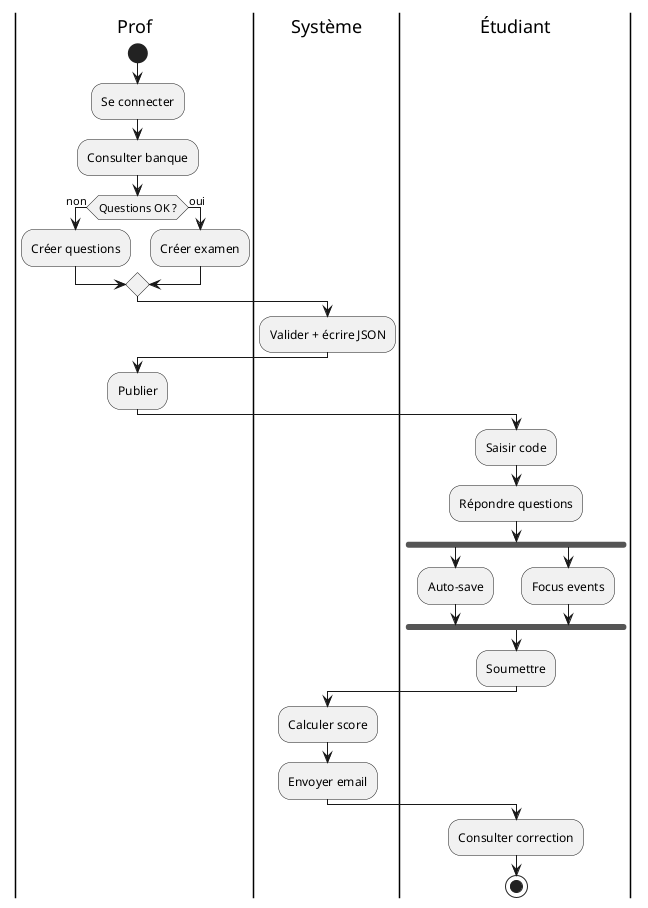
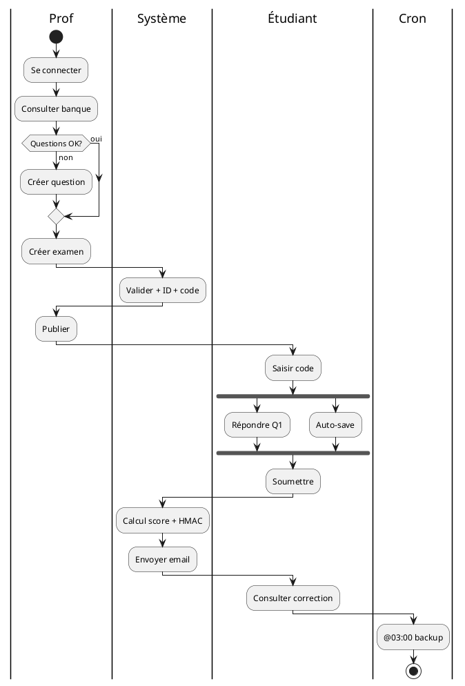

# 🔄 Prompt 11 — Diagramme d'activité UML (swim lanes)

## 📖 Description et contexte

Ce prompt génère un **diagramme d'activité UML** avec **4 swim lanes** (Prof, Système, Étudiant, Cron) couvrant le workflow complet "de la création d'un examen à l'analyse des résultats".

### Ce qui est généré
- 4 swim lanes (partitions) pour chaque acteur
- ~50 activités séquentielles
- Décisions (if/else) avec branches
- Actions parallèles (fork/join) : auto-save + focus events
- Points de synchronisation entre lanes
- Événements (timer expired, focus lost)

### Quand utiliser
- Documentation **processus métier** complet
- Identifier les **responsabilités** par acteur
- Point de départ pour **tests E2E**
- Comprendre les **interactions inter-rôles**

### Outil recommandé
**PlantUML** (meilleur pour swim lanes), Mermaid flowchart en alternative.

---

## 🤖 Outils IA supportés

| Outil | Qualité | Notes |
|---|:-:|---|
| **ChatGPT-4 / GPT-4o** | ⭐⭐⭐⭐⭐ | PlantUML swim lanes parfait |
| **Claude Opus 4** | ⭐⭐⭐⭐⭐ | Workflow complet précis |
| **Claude 3.5 Sonnet** | ⭐⭐⭐⭐ | Bon |
| **Gemini 2.0 Pro** | ⭐⭐⭐⭐ | Correct |

---

## 📋 Version pour ChatGPT-4 / GPT-4o

```
Tu es un expert UML en modélisation de processus métier.

CONTEXTE :
Workflow complet "De la création d'un examen à l'analyse des résultats" dans IPSSI Examens.

Ce workflow implique plusieurs acteurs (swim lanes) :
- Prof
- Système (application)
- Étudiant
- Cron (backup)

ÉTAPES DÉTAILLÉES :

SWIM LANE PROF :
1. Se connecter (login/password)
2. Consulter la banque de questions
3. [DÉCISION] Questions suffisantes ?
   - NON → Créer nouvelles questions → retour étape 2
   - OUI → continuer
4. Créer un nouvel examen (brouillon)
5. Configurer paramètres (titre, durée, dates, shuffle)
6. Sélectionner les questions
7. Preview de l'examen
8. [DÉCISION] Preview OK ?
   - NON → retour étape 5
   - OUI → publier
9. Obtenir le code d'accès
10. Distribuer le code aux étudiants (email externe)
11. (attendre les passages)
12. Suivre passages en temps réel
13. [DÉCISION] Anomalies détectées ?
    - OUI → Review anomalie → [DÉCISION] Fraude ? → OUI: invalider
    - NON → continuer
14. Attendre fin de la période (date_cloture)
15. Clôturer l'examen (manuel ou auto)
16. Consulter analytics
17. Exporter résultats (CSV/Excel/PDF)
18. Archiver l'examen

SWIM LANE SYSTÈME :
19. Valider données examen
20. Générer ID + access_code
21. Écrire JSON dans data/examens/
22. Log de création
23. (en parallèle, pour chaque passage :)
24. Recevoir accès par code
25. Créer passage PSG-xxx + token
26. Shuffle questions si activé
27. Timer démarré
28. [EVENT] Auto-save réponses (chaque clic)
29. [EVENT] Log focus events (copy, blur, etc.)
30. [PARALLEL] Détection expiration timer :
    - Si expiré → auto-submit
31. Calcul score à soumission
32. Signature HMAC
33. Envoi email confirmation
34. Stockage final passage
35. À la clôture : bloquer nouveaux passages
36. (plus tard) Calcul analytics à la volée quand prof consulte

SWIM LANE ÉTUDIANT :
37. Recevoir code d'accès
38. Ouvrir lien
39. Saisir code d'accès
40. Saisir infos personnelles
41. [DÉCISION] Prêt ?
    - NON → annuler (pas de passage créé)
    - OUI → démarrer
42. Répondre aux questions (en parallèle pendant timer)
43. [ACTION CONCURRENT] Navigate entre questions
44. [EVENT] Chaque réponse → auto-save
45. [DÉCISION] Soumettre maintenant ou attendre ?
46. Soumettre OU timer expire
47. Voir écran de confirmation
48. Recevoir email avec lien correction
49. Consulter correction
50. Télécharger PDF
51. (fin)

SWIM LANE CRON :
52. 03:00 : déclencher backup.sh
53. Archiver data/ en tar.gz
54. Calculer SHA-256
55. Rotation (garder 14 derniers)
56. Offsite copy (S3)
57. Log dans backups.log

POINTS DE SYNCHRONISATION :
- Étudiant soumet → Système calcule → Prof voit le résultat en temps réel
- Système publie examen → Étudiant peut accéder (via code)
- Timer expire → Forcer submit

OBJECTIF :
Génère un diagramme d'activité UML au format Mermaid ET PlantUML.

FORMAT MERMAID :
Utiliser flowchart TB avec :
- Début/fin ronds ((START)), ((END))
- Activités rectangulaires arrondies
- Décisions losanges (diamond)
- Swim lanes via subgraphs
- Flèches typées

FORMAT PLANTUML (recommandé pour swim lanes) :


ÉLÉMENTS OBLIGATOIRES :
- Les 4 swim lanes (Prof, Système, Étudiant, Cron)
- Les 57 étapes modélisées (ou regroupées si > 30 nœuds)
- Toutes les décisions (if/else) avec labels clairs
- Actions parallèles (fork/join) pour auto-save + focus events
- Boucles (ex: répondre questions N fois)
- Signal/événement (timer expired)

CRITÈRES :
- Workflow end-to-end complet
- Swim lanes clairement séparées
- Synchronisations entre lanes visibles
- Compatible planttext.com

Génère les 2 versions.
```

---

## 📋 Version pour Claude

```
<role>
Expert UML 2.5 en Activity Diagrams avec swim lanes (partitions). Tu maîtrises :
- Syntaxe PlantUML pour partitions (|Partition|)
- Fork/join pour parallélisme
- Décisions complexes
- Signaux et événements
- Notes temporelles
</role>

<workflow>
  <n>Lifecycle complet : création examen → analyse résultats</n>
  <partitions count="4">Prof, Système, Étudiant, Cron</partitions>
</workflow>

<partition name="Prof" steps="18">
  1. Login
  2. Consulter banque
  3. [if] Questions OK ? → Non: créer question ; Oui: continuer
  4. Créer examen (brouillon)
  5. Configurer (titre, durée, dates, shuffle)
  6. Sélectionner questions
  7. Preview
  8. [if] OK ? → Non: retour 5 ; Oui: publier
  9. Obtenir code d'accès
  10. Distribuer code (external email)
  11-12. Suivre passages temps réel
  13. [if] Anomalie ? → Oui: review + [if] fraude → invalider
  14. Attendre date_cloture
  15. Clôturer (manuel ou auto)
  16. Consulter analytics
  17. Exporter résultats
  18. Archiver
</partition>

<partition name="Système" steps="18">
  19. Valider données examen
  20. Générer ID + access_code
  21. Écrire JSON
  22. Log création
  23. [receive] Accès par code
  24. Créer PSG-xxx + token UUID
  25. Shuffle questions (if config)
  26. [timer] Démarrer timer
  27-29. fork { auto-save ; focus events ; timer monitor }
  30. [if] Timer expired → auto-submit
  31. Calcul score
  32. Signature HMAC SHA-256
  33. Envoi email confirmation
  34. Stockage final
  35. [event] Clôture → bloquer nouveaux passages
  36. [lazy] Calcul analytics à la volée
</partition>

<partition name="Étudiant" steps="14">
  37. Recevoir code (external)
  38. Ouvrir lien
  39. Saisir code
  40. Saisir nom/email
  41. [if] Prêt ? → Non: abandonner ; Oui: démarrer
  42. Boucle : répondre questions
  43. [concurrent] Naviguer entre questions
  44. [event] Chaque réponse déclenche auto-save
  45. [if] Soumettre OU timer expire
  46. Soumettre
  47. Écran confirmation
  48. Recevoir email
  49. Consulter correction
  50. Télécharger PDF
  51. End
</partition>

<partition name="Cron" steps="6">
  52. @03:00 → trigger backup.sh
  53. Archiver data/ en tar.gz
  54. SHA-256 hash
  55. Rotation (keep 14)
  56. rsync offsite → S3
  57. Log dans backups.log
</partition>

<synchronizations>
  - Prof publie → Étudiant peut accéder (via code)
  - Étudiant soumet → Système calcule → Prof voit (temps réel)
  - Timer expire → Système force submit (event-driven)
</synchronizations>

<requirements>
  <format>
    PRIMARY: PlantUML (native swim lanes with |Partition|)
    SECONDARY: Mermaid flowchart TB with subgraphs
  </format>
  
  <plantuml_syntax>
```
@startuml
|Prof|
start
:Login;
if (Questions OK?) then (oui)
  :Créer examen;
else (non)
  :Créer questions;
endif
|Système|
:Valider;
|Étudiant|
fork
  :Action A;
fork again
  :Action B;
end fork
|Cron|
:Backup;
stop
@enduml
```
  </plantuml_syntax>
  
  <style>
    - Colors per partition
    - Timer and event symbols
    - Clear decisions
    - Fork/join for parallelism
  </style>
</requirements>

<o>
1. Complete PlantUML diagram (preferred for swim lanes)
2. Mermaid alternative (flowchart TB with subgraphs)
3. Short reading guide (3-5 lines)
</o>
```

---

## 📋 Version pour Gemini Pro

```
Diagramme d'activité UML PlantUML avec 4 swim lanes pour IPSSI Examens.

WORKFLOW : de la création d'un examen à l'analyse des résultats.

4 SWIM LANES :

|Prof| : login, consulter banque, créer examen, configurer, preview, publier, distribuer code, suivre passages, décision anomalies, clôturer, analytics, export, archiver

|Système| : valider, générer ID+code, écrire JSON, créer passage+token, shuffle, timer, auto-save, focus events, calcul score, signature HMAC, envoi email, stockage

|Étudiant| : recevoir code, ouvrir, saisir code, infos, répondre, auto-save, soumettre (ou timer expire), confirmation, consulter correction, télécharger PDF

|Cron| : @03:00 backup.sh, tar.gz data/, SHA-256, rotation (keep 14), offsite S3, log

DÉCISIONS :
- Questions suffisantes ? (Prof)
- Preview OK ? (Prof)
- Anomalies détectées ? → Fraude ? (Prof)
- Prêt à démarrer ? (Étudiant)
- Timer expiré ? (Système)

ACTIONS PARALLÈLES (fork/join) :
- Auto-save + Focus events + Timer monitoring (Système, pendant passage)
- Navigation questions + Répondre (Étudiant)

SYNCHRONISATIONS :
- Prof publie → Étudiant peut accéder
- Étudiant soumet → Système calcule → Prof voit temps réel
- Timer expire → Force submit

PRODUIRE :

1. PlantUML (syntaxe swim lanes |Partition|) :


2. Mermaid (flowchart TB avec subgraphs pour swim lanes)

Titre : "IPSSI Examens — Workflow complet (Activity Diagram)"
```

---

## 🎨 Rendu final

### Outils

- **PlantUML (recommandé)** : https://www.planttext.com/
- **Mermaid** : https://mermaid.live/

### Intégration

````markdown
## Workflow complet end-to-end

Ce diagramme montre le cycle de vie d'un examen, de sa création par un prof
jusqu'à la consultation des résultats et à la sauvegarde automatique.

```plantuml
[diagramme]
```
````

---

## 💡 Variations

### Version par partition
*"Produis 4 diagrammes séparés, un par partition, pour plus de clarté."*

### Version avec KPIs
*"Ajoute des annotations de durée moyenne par étape : login 2s, créer examen 5min, passage étudiant 30min..."*

### Version gestion d'erreur
*"Ajoute les chemins d'erreur : timeout réseau, session expirée, quota dépassé."*

---

© 2026 Mohamed EL AFRIT — IPSSI — CC BY-NC-SA 4.0
