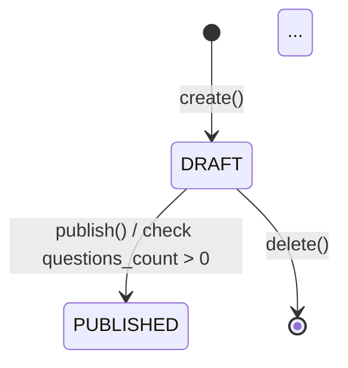
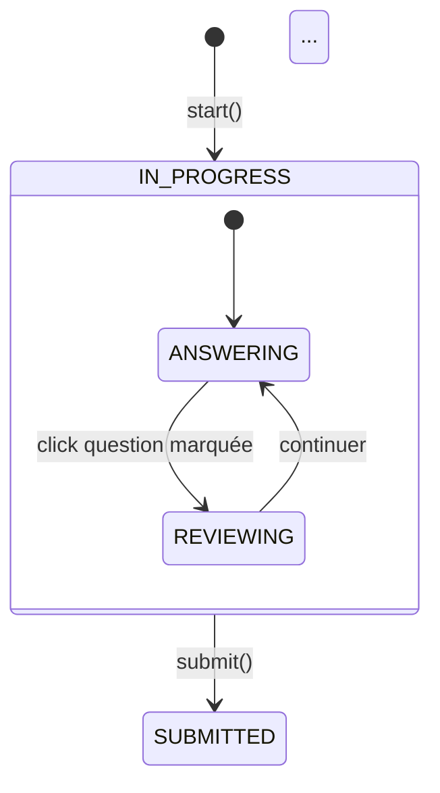
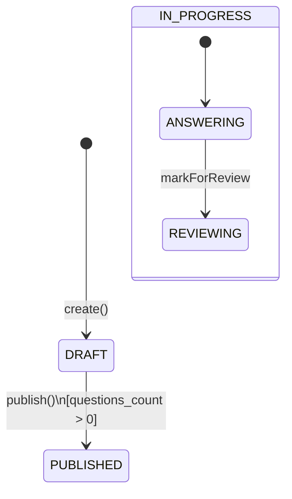
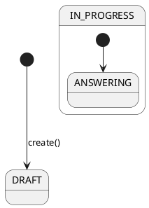
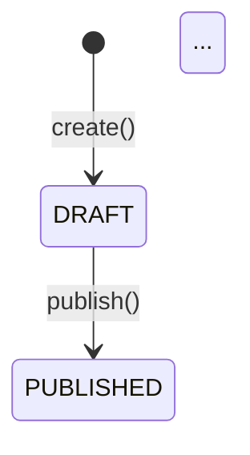
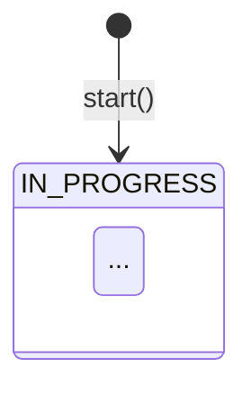
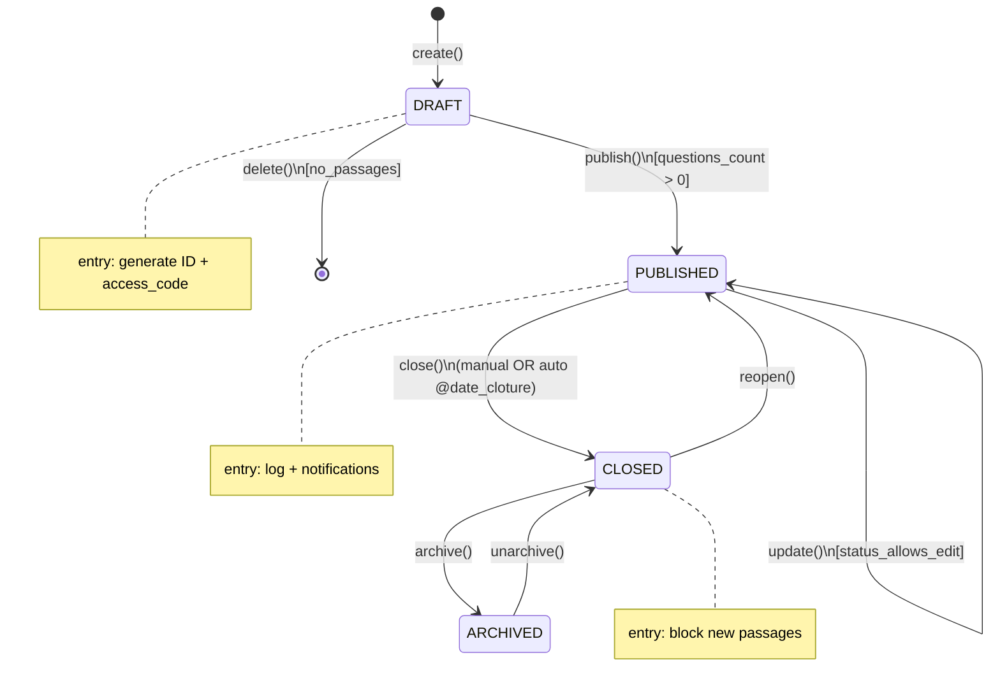

# 🔄 Prompt 12 — Diagramme d'états UML (State Machine)

## 📖 Description et contexte

Ce prompt génère **2 diagrammes d'états UML** (state machines) modélisant le cycle de vie des 2 entités clés du système : **Examen** et **Passage**.

### Ce qui est généré

**Examen** (4 états) :
- `DRAFT` → `PUBLISHED` → `CLOSED` → `ARCHIVED`
- Transitions avec events et guards
- Actions d'entrée par état

**Passage** (4 états + sub-states) :
- `IN_PROGRESS` (avec sub-states : ANSWERING, REVIEWING, AUTO_SAVING)
- `SUBMITTED` / `EXPIRED` / `INVALIDATED`
- Self-loops pour saveAnswer et focusEvent

### Quand utiliser
- Documentation **cycle de vie** des entités
- **Validation** de la logique métier
- Identifier les **transitions valides/invalides**
- Base pour **tests de transitions**

### Outil recommandé
**Mermaid stateDiagram-v2** (excellent support), PlantUML en alternative.

---

## 🤖 Outils IA supportés

| Outil | Qualité | Notes |
|---|:-:|---|
| **ChatGPT-4 / GPT-4o** | ⭐⭐⭐⭐⭐ | stateDiagram-v2 parfait |
| **Claude Opus 4** | ⭐⭐⭐⭐⭐ | Sub-states maîtrisés |
| **Claude 3.5 Sonnet** | ⭐⭐⭐⭐⭐ | Très bon |
| **Gemini 2.0 Pro** | ⭐⭐⭐⭐ | Bon |

---

## 📋 Version pour ChatGPT-4 / GPT-4o

```
Tu es un expert UML en modélisation d'états finis.

CONTEXTE :
La plateforme IPSSI Examens a 2 objets avec des états bien définis :
- Examen
- Passage

CYCLE DE VIE D'UN EXAMEN :

États :
- [*] (initial)
- DRAFT (brouillon)
- PUBLISHED (publié, passages acceptés)
- CLOSED (clôturé, plus de passages)
- ARCHIVED (archivé, masqué de la liste)
- [*] (final, après delete)

Transitions :
- [*] → DRAFT (lors du create())
- DRAFT → PUBLISHED (event: publish, guard: questions_count > 0)
- DRAFT → [*] (event: delete, si pas de passage)
- PUBLISHED → CLOSED (event: close, manuel OU auto si date_cloture atteinte)
- PUBLISHED → PUBLISHED (event: update, guard: status_allows_edit)
- CLOSED → ARCHIVED (event: archive)
- ARCHIVED → CLOSED (event: unarchive, optionnel)
- CLOSED → PUBLISHED (event: reopen, si autorisé)

Actions à l'entrée d'états :
- entry DRAFT : génération ID + access_code
- entry PUBLISHED : log "examen publié", envoi notifications
- entry CLOSED : interdire nouveaux passages, soumettre les en-cours
- entry ARCHIVED : log archivage

CYCLE DE VIE D'UN PASSAGE :

États :
- [*] (initial)
- IN_PROGRESS (en cours)
- SUBMITTED (soumis)
- EXPIRED (timer expiré, auto-submit)
- INVALIDATED (invalidé par prof ou auto-fraude)
- [*] (final)

Transitions :
- [*] → IN_PROGRESS (event: start, action: créer PSG-xxx + token UUID)
- IN_PROGRESS → IN_PROGRESS (event: saveAnswer, selfLoop)
- IN_PROGRESS → IN_PROGRESS (event: focusEvent, selfLoop, action: log)
- IN_PROGRESS → SUBMITTED (event: submit, action: calculScore + signature HMAC + sendEmail)
- IN_PROGRESS → EXPIRED (event: timer_expired, action: auto-submit)
- IN_PROGRESS → INVALIDATED (event: invalidate, guard: anomalies > threshold OR manual)
- EXPIRED → SUBMITTED (auto-transition si besoin, avec résultats partiels)

Actions à l'entrée d'états :
- entry IN_PROGRESS : démarrer timer, shuffle questions
- entry SUBMITTED : calculer score, signer HMAC, envoyer email
- entry EXPIRED : soumettre auto avec réponses actuelles
- entry INVALIDATED : log raison, pas de score

SUB-ÉTATS (IN_PROGRESS peut avoir des sub-states) :
- ANSWERING (répond à une question)
- REVIEWING (revisite une question marquée)
- AUTO_SAVING (en cours de sauvegarde)

OBJECTIF :
Génère 2 diagrammes d'états UML au format Mermaid (stateDiagram-v2).

DIAGRAMME 1 — CYCLE DE VIE EXAMEN :

Spécifications Mermaid :


DIAGRAMME 2 — CYCLE DE VIE PASSAGE :

Avec sub-états pour IN_PROGRESS :


ÉLÉMENTS À INCLURE :
- Tous les états principaux (5 + 5 = 10 états)
- Toutes les transitions avec events
- Guards (conditions) entre crochets [...]
- Actions sur transitions ou entry avec /
- Self-loops pour saveAnswer et focusEvent
- Point de fork/join si nécessaire (parallel : timer + user_input)
- États finaux [*]

FORMAT MERMAID :
Utiliser stateDiagram-v2 avec :
- `-->` pour transitions
- `state X { ... }` pour sub-states
- `note right of X: ...` pour documentation
- Events avec `:`, guards avec `[]`, actions avec `/`

ALTERNATIVE PLANTUML :
Aussi produire la version PlantUML :
```plantuml
@startuml
[*] --> DRAFT
DRAFT --> PUBLISHED : publish()\n[questions_count > 0]
DRAFT --> [*] : delete()
...
@enduml
```

CRITÈRES :
- Tous les états et transitions modélisés
- Guards et actions explicites
- Sub-états pour IN_PROGRESS
- Compatible mermaid.live ET planttext.com
- Titre chaque diagramme

Génère les 2 diagrammes dans les 2 formats (Mermaid + PlantUML = 4 diagrammes au total).
```

---

## 📋 Version pour Claude

```
<role>
Expert UML State Machine Diagrams. Maîtrise :
- Notation UML 2.5 officielle
- Sub-états (hierarchical states)
- Orthogonal states (AND-states)
- Guards, events, actions
- Entry/exit/do activities
- Syntaxe Mermaid stateDiagram-v2 et PlantUML
</role>

<state_machines>

<sm name="Examen Lifecycle">
  <states>
    - initial [*]
    - DRAFT (entry: generate ID + access_code)
    - PUBLISHED (entry: log + notifications)
    - CLOSED (entry: block new passages, submit in-progress)
    - ARCHIVED (entry: log archive)
    - final [*]
  </states>
  
  <transitions>
    - [*] → DRAFT on create()
    - DRAFT → PUBLISHED on publish() [questions_count > 0]
    - DRAFT → [*] on delete() [no_passages]
    - PUBLISHED → CLOSED on close() (manual OR auto @date_cloture)
    - PUBLISHED → PUBLISHED on update() [status_allows_edit] (self-loop)
    - CLOSED → ARCHIVED on archive()
    - ARCHIVED → CLOSED on unarchive()
    - CLOSED → PUBLISHED on reopen() [authorized]
  </transitions>
</sm>

<sm name="Passage Lifecycle">
  <states>
    - initial [*]
    - IN_PROGRESS (composite state with sub-states)
      <substates>
        - ANSWERING
        - REVIEWING
        - AUTO_SAVING
      </substates>
    - SUBMITTED (entry: calculateScore, HMAC sign, sendEmail)
    - EXPIRED (entry: auto-submit with current answers)
    - INVALIDATED (entry: log reason, no score)
    - final [*]
  </states>
  
  <transitions>
    - [*] → IN_PROGRESS on start() / create PSG-xxx + UUID token
    - IN_PROGRESS → IN_PROGRESS on saveAnswer() (self-loop)
    - IN_PROGRESS → IN_PROGRESS on focusEvent() / log (self-loop)
    - IN_PROGRESS → SUBMITTED on submit() / computeScore, signHMAC, sendEmail
    - IN_PROGRESS → EXPIRED on timerExpired() / auto-submit
    - IN_PROGRESS → INVALIDATED on invalidate() [anomalies > threshold OR manual]
    - EXPIRED → SUBMITTED (auto-transition with partial results)
  </transitions>
  
  <substate_transitions in="IN_PROGRESS">
    - [*] → ANSWERING
    - ANSWERING → REVIEWING on markForReview
    - REVIEWING → ANSWERING on resumeQuestion
    - ANSWERING → AUTO_SAVING on answerChanged
    - AUTO_SAVING → ANSWERING on saveComplete
  </substate_transitions>
</sm>

</state_machines>

<requirements>
  <formats>Mermaid stateDiagram-v2 + PlantUML</formats>
  
  <mermaid_syntax>
```
stateDiagram-v2
    [*] --> DRAFT : create()
    DRAFT --> PUBLISHED : publish()\n[questions_count > 0]
    state IN_PROGRESS {
      [*] --> ANSWERING
      ANSWERING --> REVIEWING : markForReview
    }
    note right of DRAFT : génération ID
```
  </mermaid_syntax>
  
  <plantuml_syntax>
```
@startuml
[*] --> DRAFT : create()
DRAFT --> PUBLISHED : publish()\n[questions_count > 0]
state IN_PROGRESS {
  [*] --> ANSWERING
  ANSWERING --> REVIEWING : markForReview
}
@enduml
```
  </plantuml_syntax>
  
  <quality>
    - Toutes les transitions avec events/guards/actions
    - Self-loops visibles (saveAnswer, focusEvent)
    - Composite state IN_PROGRESS avec sub-states
    - Notes pour documentation
  </quality>
</requirements>

<o>
Fournis 4 diagrammes au total :
1. Examen lifecycle - Mermaid
2. Examen lifecycle - PlantUML
3. Passage lifecycle - Mermaid (avec sub-states)
4. Passage lifecycle - PlantUML (avec sub-states)

Plus une courte note (3-5 lignes) expliquant les choix de modélisation.
</o>
```

---

## 📋 Version pour Gemini Pro

```
2 diagrammes d'états UML pour IPSSI Examens (Mermaid stateDiagram-v2 + PlantUML).

DIAGRAMME 1 : CYCLE DE VIE EXAMEN

États : DRAFT, PUBLISHED, CLOSED, ARCHIVED

Transitions :
- [*] → DRAFT : create()
- DRAFT → PUBLISHED : publish() [questions_count > 0]
- DRAFT → [*] : delete() [no_passages]
- PUBLISHED → CLOSED : close() (manuel OU auto @date_cloture)
- PUBLISHED → PUBLISHED : update() [status_allows_edit]
- CLOSED → ARCHIVED : archive()
- ARCHIVED → CLOSED : unarchive()
- CLOSED → PUBLISHED : reopen()

Entry actions :
- DRAFT : generate ID + access_code
- PUBLISHED : log + notify
- CLOSED : block new passages
- ARCHIVED : log

DIAGRAMME 2 : CYCLE DE VIE PASSAGE

États principaux : IN_PROGRESS (composite), SUBMITTED, EXPIRED, INVALIDATED

Sub-états IN_PROGRESS :
- ANSWERING (répond)
- REVIEWING (revisite questions)
- AUTO_SAVING (sauvegarde en cours)

Transitions :
- [*] → IN_PROGRESS : start() / create PSG + UUID token
- IN_PROGRESS → IN_PROGRESS : saveAnswer() (self-loop)
- IN_PROGRESS → IN_PROGRESS : focusEvent() (self-loop, log)
- IN_PROGRESS → SUBMITTED : submit() / computeScore + HMAC + email
- IN_PROGRESS → EXPIRED : timerExpired() / auto-submit
- IN_PROGRESS → INVALIDATED : invalidate() [anomalies>threshold OR manual]
- EXPIRED → SUBMITTED : auto-transition (résultats partiels)

Transitions internes (sub-states) :
- ANSWERING → REVIEWING : markForReview
- REVIEWING → ANSWERING : resumeQuestion
- ANSWERING → AUTO_SAVING : answerChanged
- AUTO_SAVING → ANSWERING : saveComplete

PRODUIRE :

1. Mermaid (2 diagrammes) :


2. PlantUML (2 diagrammes) :


Titres :
- "IPSSI Examens — Examen Lifecycle"
- "IPSSI Examens — Passage Lifecycle"
```

---

## 🎨 Rendu final

### Outils

- **Mermaid** : https://mermaid.live/ (excellent support stateDiagram-v2)
- **PlantUML** : https://www.planttext.com/

### Intégration

Dans `ARCHITECTURE.md` section "Modèle de données" ou dans guides :

````markdown
## Cycle de vie d'un examen



## Cycle de vie d'un passage


````

---

## 💡 Variations

### Version avec timestamps
*"Ajoute aux transitions les durées typiques : create ~1s, publish ~2s, submit ~500ms."*

### Version avec garde détaillées
*"Détaille les guards : PUBLISHED → CLOSED si date_cloture <= now() AND auto_close = true."*

### Version parallèle (orthogonal states)
*"Modélise IN_PROGRESS comme état orthogonal avec 2 régions parallèles : [Timer] et [User Activity]."*

---

## 🎯 Exemple attendu (extrait)



---

© 2026 Mohamed EL AFRIT — IPSSI — CC BY-NC-SA 4.0
