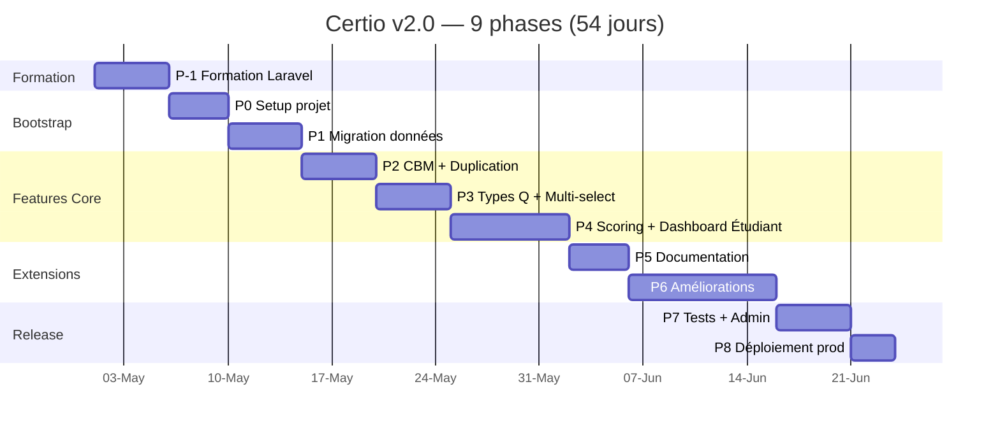

# 🎯 Certio v2.0 — Certainty-Based Assessment Platform

<p align="center">
  
</p>

<p align="center">
  <strong>Plateforme d'évaluation SaaS avec Certainty-Based Marking</strong><br>
  <em>Refonte complète en Laravel 11 + Vue 3 + Inertia + SQLite</em>
</p>

<p align="center">
  <a href="#-vue-densemble"></a>
  <a href="#"></a>
  <a href="#"></a>
  <a href="#"></a>
  <a href="#"></a>
</p>

---

## 📑 Sommaire

- [Vue d'ensemble](#-vue-densemble)
- [Vision produit](#-vision-produit)
- [Features v2.0](#-features-v20)
- [Stack technique](#-stack-technique)
- [Structure du projet](#-structure-du-projet)
- [Documentation](#-documentation)
- [Roadmap](#-roadmap)
- [Comment démarrer](#-comment-démarrer)
- [Licence](#-licence)

---

## 🎯 Vue d'ensemble

**Certio v2.0** est la refonte complète de l'ancienne plateforme IPSSI Examens, transformée en un produit SaaS multi-écoles professionnel avec une feature phare unique dans le paysage francophone : le **Certainty-Based Marking (CBM)**.

### 📊 Chiffres clés

| Métrique | Valeur |
|---|---|
| **Durée de développement** | 54 jours actifs (~4.5 mois) |
| **Nombre de phases** | 9 phases (P-1 à P8) |
| **Période cible** | Mai → Octobre 2026 |
| **Lignes de code estimées** | ~20 000 |
| **Tests Pest cibles** | 325+ |
| **Features majeures** | 12 |
| **Budget externe** | ~225€ (dont Laracasts Pro 90€) |

### 🎭 Utilisateurs cibles

- **🏫 Écoles** : IPSSI (client actuel) + autres écoles francophones
- **👨‍🏫 Enseignants** : profs qui veulent évaluer avec finesse pédagogique
- **👨‍🎓 Étudiants** : apprenants qui veulent progresser via le feedback

---

## 🌟 Vision produit

### 💡 "De l'évaluation à l'apprentissage"

Certio n'est pas juste un outil de QCM — c'est une **plateforme d'apprentissage active** qui :

1. **Évalue avec justesse** grâce au CBM (hasard éliminé)
2. **Enseigne par l'erreur** via les corrections détaillées
3. **Respecte le prof** avec un contrôle total (paramétrable)
4. **Valorise l'étudiant** avec un dashboard personnel et un historique

### 🎯 Différenciateurs uniques

| Feature | Certio v2.0 | Moodle | Wooclap | Google Forms |
|---|:-:|:-:|:-:|:-:|
| **CBM 100% paramétrable** | ✅ | ❌ | ❌ | ❌ |
| **Multi-tenant Workspaces** | ✅ | ✅ | ❌ | ❌ |
| **Dashboard étudiant** | ✅ | ⚠️ | ❌ | ❌ |
| **Corrections riches (pièges + refs)** | ✅ | ⚠️ | ❌ | ❌ |
| **Banque communautaire** | ✅ | ❌ | ❌ | ❌ |
| **Anti-triche IA** | ✅ | ⚠️ | ❌ | ❌ |
| **PWA + offline mode** | ✅ | ❌ | ⚠️ | ❌ |
| **Génération IA (v2.1)** | 🔜 | ❌ | ❌ | ❌ |

---

## 🚀 Features v2.0

### 🎯 Core (Scope confirmé v2.0)

#### 🎲 Certainty-Based Marking (CBM)
- Matrice 100% paramétrable (2-10 niveaux de certitude)
- Presets réutilisables
- Calibration automatique (over/underconfidence detection)
- Import/Export JSON de matrices

#### 📝 7 types de questions
- Vrai/Faux
- QCM N options choix unique (4, 5, ou N configurable)
- QCM N options choix multiple (4, 5, ou N configurable)
- 3 modes de scoring multi-réponses (all-or-nothing, proportional, normalized)

#### 🎓 Dashboard Étudiant + Corrections riches *(FEATURE CLÉ)*
- Historique complet avec filtres
- KPIs personnels (score moyen, calibration CBM, thèmes)
- Graphiques progression (line chart, radar)
- **Corrections détaillées** : explication + pièges (why_wrong) + ressources cours
- Publication manuelle par le prof (paramétrable)
- Notifications email automatiques

#### 🔧 Productivité prof
- **Multi-select rapide** de questions (filtres + bulk actions)
- **Duplication d'examen** avec options
- Éditeur question enrichi (why_wrong, reference)
- Analytics (distracteurs, radar étudiant, calibration classe)

#### 🏫 Multi-tenant
- Workspaces isolés par école
- SSO Google + Microsoft via Socialite
- Branding par workspace
- Plans (free/pro/enterprise)

#### 🔐 Sécurité
- 2FA TOTP via Fortify (Google Authenticator)
- Audit log complet via Spatie ActivityLog
- Anti-triche avec score de confiance
- Chiffrement clés API (v2.1)

#### 📤 Intégrations LMS
- Import Moodle XML, Word Aiken, Excel
- Export SCORM 1.2 + 2004 + xAPI
- LTI 1.3 compatible
- OpenAPI 3.1 + Swagger UI

#### 🌍 Accessibilité & i18n
- WCAG AA complet (axe-core validated)
- Traduction FR/EN via Vue-i18n
- PWA installable (mobile + desktop)
- Mode hors-ligne pour passages

#### 🌐 Banque communautaire
- Publication avec licences CC (BY, BY-SA, BY-NC, CC-0)
- Fork avec attribution
- Rating + flag system
- Modération super-admin
- 100+ questions seed initial

#### 📚 Documentation interactive
- Markdown parsing (league/commonmark)
- RBAC strict (admin/prof/student)
- 20+ pages initiales (admin/prof/student/shared)
- Recherche full-text FTS5
- Placeholders (diagrams Mermaid, images, videos)

### 🔜 Reporté en v2.1

- 🤖 **Générateur IA hybride** (BYOK + Pay-per-Use)
- 💳 Stripe integration pour crédits
- 🎥 Support YouTube transcripts
- 📊 Mode adaptatif IRT
- 👁️ Proctoring webcam léger

---

## 🛠️ Stack technique

### Backend

```
Laravel 11.x                     # Framework PHP moderne
├── PHP 8.3                      # Strict types
├── Eloquent ORM                 # Database abstraction
├── Laravel Fortify              # Auth + 2FA TOTP natif
├── Laravel Socialite            # SSO OAuth (Google, Microsoft)
├── Laravel Sanctum              # API tokens
├── Laravel Scout                # Full-text search (avec SQLite FTS5)
├── Spatie Permission            # RBAC roles & permissions
├── Spatie ActivityLog           # Audit log
├── Spatie Backup                # Backups automatisés
├── Spatie Browsershot           # PDF via Chrome headless
├── Spatie QueryBuilder          # Filtres API avancés
├── Maatwebsite Excel            # Import/export Excel
├── League CommonMark            # Markdown parsing
├── Filament                     # Admin panel
└── Pest + Larastan              # Tests + analyse statique
```

### Frontend

```
Vue 3.x                          # Framework UI réactif
├── Inertia.js v2                # SPA sans API REST séparée
├── Vite 5                       # Build ultra-rapide
├── Tailwind CSS 3               # Utility-first CSS
├── shadcn-vue                   # Composants UI pro
├── VueUse                       # Composables utilitaires
├── Pinia                        # State management
├── Vue-i18n                     # Internationalisation
├── KaTeX                        # Rendu LaTeX
├── Chart.js                     # Graphiques
├── marked.js + DOMPurify        # Markdown safe rendering
└── Vitest                       # Tests unit frontend
```

### Infrastructure

```
VPS Ubuntu 22.04 LTS (OVH)
├── Nginx 1.24                   # Reverse proxy + TLS
├── PHP 8.3-FPM                  # FastCGI Process Manager
├── SQLite 3.45+ (WAL mode)      # Base de données (fichier)
├── Redis 7 (optionnel)          # Cache + queues
├── Supervisor                   # Queues workers
├── Certbot                      # SSL Let's Encrypt
├── UFW + Fail2ban               # Firewall + anti-bruteforce
└── GitHub Actions               # CI/CD automatisé
```

---

## 📂 Structure du projet

### 🗂️ Structure actuelle (cadrage)

```
Certio_v2/
├── README.md                           # 👈 Ce fichier
├── docs/                               # 📚 Documentation de cadrage (6 documents)
│   ├── 01_NOTE_DE_CADRAGE_LARAVEL.md       # Vision + architecture
│   ├── 02_PLANNING_LARAVEL_REVISE.md       # Planning 9 phases détaillé
│   ├── 03_PROMPTS_VSCODE_LARAVEL_P-1_P4.md # Prompts IA phases P-1 à P4
│   ├── 04_PROMPTS_VSCODE_LARAVEL_P5_P8.md  # Prompts IA phases P5 à P8
│   ├── 05_ADDENDUM_DASHBOARD_ETUDIANT.md   # Spec Dashboard étudiant
│   └── 06_PROMPT_DASHBOARD_ETUDIANT.md     # Prompt IA pour cette feature
├── assets/                             # 🎨 Assets design (à créer)
│   ├── logo.svg                        # Logo Certio (placeholder)
│   ├── favicon.ico                     # Favicon
│   └── branding.md                     # Guide de branding
└── src/                                # 💻 Futur code Laravel (à créer en P0)
    └── README.md                       # Instructions pour l'installation
```

### 🎯 Structure cible après P0 (Bootstrap Laravel)

```
Certio_v2/
├── README.md
├── docs/                               # Documentation
├── assets/                             # Assets design partagés
└── src/                                # Projet Laravel complet
    ├── app/
    │   ├── Actions/                    # Actions métier (Spatie pattern)
    │   ├── Enums/                      # QuestionType, ExamStatus, etc.
    │   ├── Http/
    │   │   ├── Controllers/
    │   │   ├── Middleware/
    │   │   └── Requests/
    │   ├── Models/                     # Eloquent models
    │   ├── Policies/
    │   ├── Services/                   # Services métier complexes
    │   └── Providers/
    ├── database/
    │   ├── factories/
    │   ├── migrations/
    │   ├── seeders/
    │   └── database.sqlite             # 💾 Base de données
    ├── public/
    ├── resources/
    │   ├── css/
    │   ├── js/
    │   │   ├── Components/             # Vue components
    │   │   ├── Layouts/
    │   │   └── Pages/                  # Pages Inertia
    │   ├── lang/                       # Traductions FR/EN
    │   ├── markdown/                   # Documentation interactive
    │   └── views/
    ├── routes/
    ├── tests/
    │   ├── Feature/
    │   └── Unit/
    ├── .env
    ├── composer.json
    ├── package.json
    └── vite.config.js
```

---

## 📚 Documentation

Le cadrage complet est dans le dossier `docs/`. **Toujours commencer par là** :

### 📋 [01 — Note de cadrage Laravel](./docs/01_NOTE_DE_CADRAGE_LARAVEL.md)
Document fondateur avec :
- Vision et objectifs stratégiques
- Scope détaillé v2.0
- Architecture technique complète
- Modèle de données (migrations Laravel)
- Stratégie de transition v1 → v2
- Risques et mitigations
- Budget et planning haut niveau

### 📅 [02 — Planning 9 phases révisé](./docs/02_PLANNING_LARAVEL_REVISE.md)
Planning opérationnel avec :
- Diagramme de Gantt Mermaid
- Détail jour par jour des 9 phases (54 jours)
- Stratégie Git (branches, tags, workflow)
- Checkpoints de validation
- Gestion des imprévus

### 🎯 [03 — Prompts VS Code P-1 à P4](./docs/03_PROMPTS_VSCODE_LARAVEL_P-1_P4.md)
Prompts autosuffisants pour :
- P-1 : Formation Laravel + POC (5j)
- P0 : Bootstrap projet (4j)
- P1 : Migration données v1 → v2 (5j)
- P2 : CBM Core + Duplication examen (5j)
- P3 : 7 types questions + Multi-select (5j)
- P4 : Scoring & Analytics (5j)

### 🎯 [04 — Prompts VS Code P5 à P8](./docs/04_PROMPTS_VSCODE_LARAVEL_P5_P8.md)
Prompts pour :
- P5 : Documentation interactive (4j)
- P6 : Améliorations en 5 sous-phases (10j)
  - 6A: Sécurité (2FA, audit, anti-cheat)
  - 6B: Multi-tenant + SSO
  - 6C: Intégrations LMS
  - 6D: A11y + i18n + PWA
  - 6E: Banque communautaire
- P7 : Tests + Admin Filament (5j)
- P8 : Migration + Déploiement (3j)

### 🎓 [05 — Addendum Dashboard Étudiant](./docs/05_ADDENDUM_DASHBOARD_ETUDIANT.md)
Spec complète de la feature Dashboard Étudiant :
- Vision "de l'évaluation à l'apprentissage"
- Architecture technique
- Workflow prof/étudiant
- Impact planning (+3j en P4)
- Differenciateur marketing

### 🎓 [06 — Prompt VS Code Dashboard Étudiant](./docs/06_PROMPT_DASHBOARD_ETUDIANT.md)
Prompt complet pour implémenter cette feature :
- 12 tâches détaillées
- Code PHP Laravel complet
- Code Vue 3 complet
- Email templates
- Tests à écrire

---

## 🗺️ Roadmap

### 🎯 v2.0 (Septembre-Octobre 2026)

**Focus** : Release production multi-écoles avec Dashboard Étudiant et toutes les features core.

#### Phases de développement



### 🔜 v2.1 (Q4 2026 / Q1 2027)

**Focus** : Générateur IA hybride — feature différenciante

- Mode BYOK (prof fournit sa clé API)
- Mode Pay-per-Use via Certio (0.10€/question, partage obligatoire)
- Support 3 providers : Anthropic, OpenAI, Google
- Upload multi-formats (PDF, Word, URL, YouTube)
- Historique complet + analytics
- Stripe integration

### 🎁 v2.2 et au-delà

- Mode adaptatif IRT
- App mobile native (React Native ou Flutter)
- Proctoring webcam avec ML
- Plans tarifaires (Free/Pro/Enterprise)
- Webhooks externes
- Marketplace premium

---

## 🚀 Comment démarrer

### 🎓 Option 1 : Tu démarres le développement

1. **Lire** [01_NOTE_DE_CADRAGE_LARAVEL.md](./docs/01_NOTE_DE_CADRAGE_LARAVEL.md) en entier
2. **Parcourir** [02_PLANNING_LARAVEL_REVISE.md](./docs/02_PLANNING_LARAVEL_REVISE.md) pour comprendre la roadmap
3. **Ouvrir** [03_PROMPTS_VSCODE_LARAVEL_P-1_P4.md](./docs/03_PROMPTS_VSCODE_LARAVEL_P-1_P4.md)
4. **Copier** le premier prompt (Phase P-1 Formation Laravel)
5. **Coller** dans Claude Code / Cursor
6. **Suivre** les instructions étape par étape

### 🔍 Option 2 : Tu consultes le cadrage

Tous les documents sont en Markdown, lisibles directement sur GitHub :

👉 **[Voir le cadrage complet sur GitHub](https://github.com/melafrit/maths_IA_niveau_1/tree/main/Certio_v2)**

### 🛠️ Option 3 : Tu veux ajuster le cadrage

Si tu veux modifier des aspects :
- Scope features : édite `01_NOTE_DE_CADRAGE_LARAVEL.md`
- Planning : édite `02_PLANNING_LARAVEL_REVISE.md`
- Prompts : édite `03_*.md` ou `04_*.md`

---

## 👥 Équipe

| Rôle | Personne |
|---|---|
| **Product Owner** | Mohamed EL AFRIT |
| **Tech Lead / Dev** | Mohamed EL AFRIT |
| **Designer** | Mohamed EL AFRIT |
| **Support** | mohamed@elafrit.com |

Dev solo assisté par **Claude Code / Cursor / GitHub Copilot**.

---

## 🔗 Liens utiles

### 📖 Documentation externe
- [Laravel 11 Docs](https://laravel.com/docs/11.x)
- [Vue 3 Docs](https://vuejs.org/guide/introduction.html)
- [Inertia.js Docs](https://inertiajs.com/)
- [Tailwind CSS](https://tailwindcss.com/)
- [Pest PHP](https://pestphp.com/)
- [Laracasts](https://laracasts.com/) (formation recommandée)

### 🎓 Ressources pédagogiques
- [Certainty-Based Marking research](https://en.wikipedia.org/wiki/Certainty_Based_Marking)
- [Bloom's Taxonomy](https://en.wikipedia.org/wiki/Bloom%27s_taxonomy)
- [Metacognition research](https://en.wikipedia.org/wiki/Metacognition)

### 🏢 Infrastructure
- [OVH VPS](https://www.ovhcloud.com/fr/vps/) (hébergement)
- [OVH Email Pro](https://www.ovhcloud.com/fr/emails/) (emails transactionnels)
- [GitHub Actions](https://github.com/features/actions) (CI/CD)

---

## 📊 Suivi d'avancement

Suivre le projet sur GitHub Issues et Projects :

- **Issues** : [github.com/melafrit/maths_IA_niveau_1/issues](https://github.com/melafrit/maths_IA_niveau_1/issues)
- **Milestones** : v2.0.0-alpha.1, v2.0.0-beta.1, v2.0.0-rc.1, v2.0.0
- **Projects** : Certio v2.0 Roadmap

---

## 🙏 Crédits

### 💻 Technologies
- [Laravel](https://laravel.com) — Taylor Otwell et la communauté
- [Vue.js](https://vuejs.org) — Evan You et le core team
- [Inertia.js](https://inertiajs.com) — Jonathan Reinink

### 📚 Packages importants
- [Spatie](https://spatie.be) — pour leurs excellents packages Laravel
- [Filament](https://filamentphp.com) — pour l'admin panel

### 🎨 Inspiration
- Research papers sur le Certainty-Based Marking
- Communautés éducatives francophones

---

## 📜 Licence

Ce projet est distribué sous licence **Creative Commons BY-NC-SA 4.0**.

[](https://creativecommons.org/licenses/by-nc-sa/4.0/)

**Vous pouvez** :
- ✅ Partager le code
- ✅ Adapter / forker
- ✅ Utiliser en contexte éducatif

**Vous devez** :
- ℹ️ Créditer l'auteur original (Mohamed EL AFRIT)
- 🚫 Ne pas l'utiliser à des fins commerciales sans autorisation
- 🔄 Partager vos modifications sous la même licence

---

## 💬 Contact

**Mohamed EL AFRIT**  
📧 mohamed@elafrit.com  
🏫 IPSSI  
📅 2025-2026

> *"La vraie mesure d'une connaissance, c'est la conscience qu'on en a."*

---

<p align="center">
  <strong>🚀 Let's build something amazing!</strong>
</p>

<p align="center">
  © 2026 Mohamed EL AFRIT — CC BY-NC-SA 4.0
</p>
